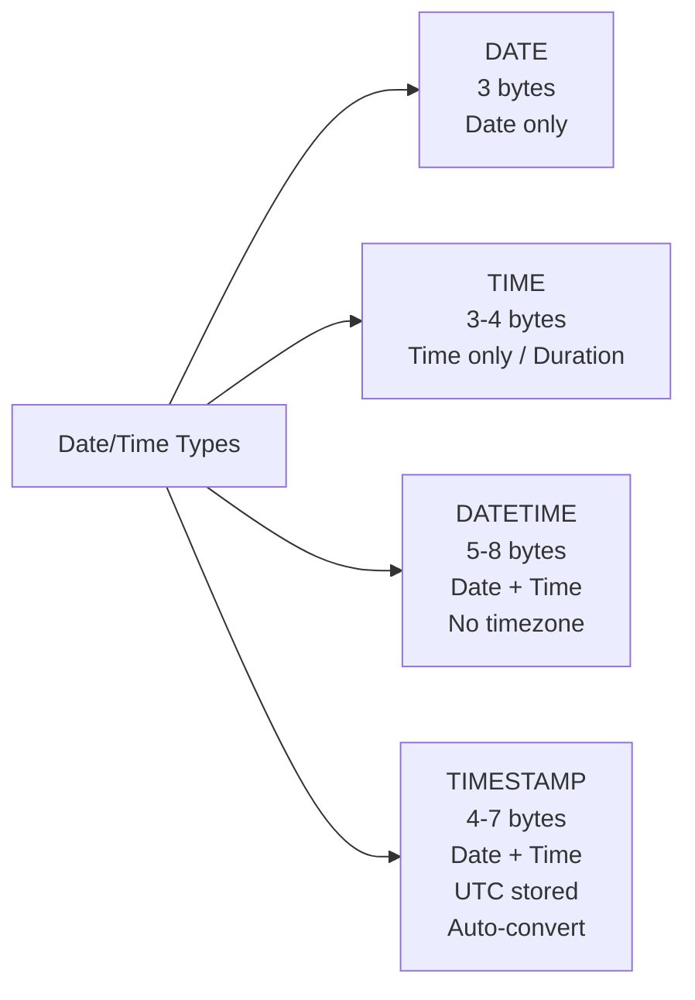
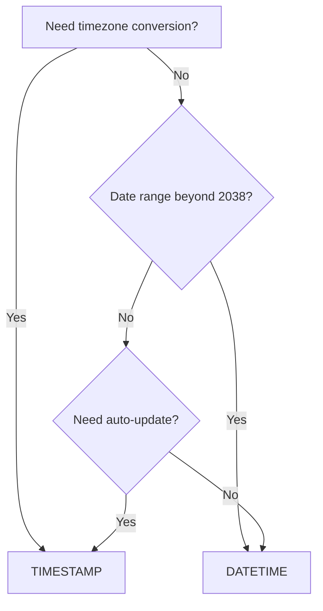

# How to Use DATE, TIME, DATETIME, TIMESTAMP in MySQL

Author: [nawazdhandala](https://www.github.com/nawazdhandala)

Tags: MySQL, SQL, Date, DateTime, Database

Description: Learn how to use MySQL date and time data types DATE, TIME, DATETIME, and TIMESTAMP, their storage, ranges, timezone behavior, and practical examples.

---

## Date and Time Types Overview

MySQL provides four primary date and time types. Choosing the right one depends on whether you need date-only, time-only, or combined date-time values, and whether timezone conversion matters.



## Type Comparison

| Type | Storage | Range | Timezone Aware |
|---|---|---|---|
| `DATE` | 3 bytes | 1000-01-01 to 9999-12-31 | No |
| `TIME` | 3 bytes (+ fractional) | -838:59:59 to 838:59:59 | No |
| `DATETIME` | 5 bytes (+ fractional) | 1000-01-01 00:00:00 to 9999-12-31 23:59:59 | No |
| `TIMESTAMP` | 4 bytes (+ fractional) | 1970-01-01 00:00:01 UTC to 2038-01-19 03:14:07 UTC | Yes |

All four types support fractional seconds up to 6 decimal places with additional storage (0-3 extra bytes).

## DATE

Stores a calendar date without time. Use for birthdates, event dates, and any value where the time of day is irrelevant.

```sql
CREATE TABLE employees (
    id          INT AUTO_INCREMENT PRIMARY KEY,
    name        VARCHAR(100) NOT NULL,
    birth_date  DATE NOT NULL,
    hire_date   DATE NOT NULL,
    termination_date DATE
);

INSERT INTO employees (name, birth_date, hire_date) VALUES
('Alice Smith',  '1990-04-15', '2018-06-01'),
('Bob Johnson',  '1985-11-22', '2020-03-10'),
('Carol Lee',    '1993-07-30', '2022-09-15');

-- Age and tenure calculation
SELECT name,
       birth_date,
       hire_date,
       TIMESTAMPDIFF(YEAR, birth_date, CURDATE())  AS age_years,
       TIMESTAMPDIFF(MONTH, hire_date, CURDATE())  AS tenure_months
FROM employees;
```

```text
+--------------+------------+------------+-----------+---------------+
| name         | birth_date | hire_date  | age_years | tenure_months |
+--------------+------------+------------+-----------+---------------+
| Alice Smith  | 1990-04-15 | 2018-06-01 |        35 |            81 |
| Bob Johnson  | 1985-11-22 | 2020-03-10 |        40 |            60 |
| Carol Lee    | 1993-07-30 | 2022-09-15 |        32 |            42 |
+--------------+------------+------------+-----------+---------------+
```

## TIME

Stores a time-of-day value or a duration. Useful for schedules, session durations, and time elapsed.

```sql
CREATE TABLE class_schedule (
    id          INT AUTO_INCREMENT PRIMARY KEY,
    class_name  VARCHAR(100) NOT NULL,
    day_of_week TINYINT UNSIGNED NOT NULL,  -- 1=Monday to 7=Sunday
    start_time  TIME NOT NULL,
    end_time    TIME NOT NULL,
    duration    TIME GENERATED ALWAYS AS (TIMEDIFF(end_time, start_time)) STORED
);

INSERT INTO class_schedule (class_name, day_of_week, start_time, end_time) VALUES
('Math 101',    1, '09:00:00', '10:30:00'),
('English 201', 2, '14:00:00', '15:30:00'),
('Science Lab', 3, '13:00:00', '16:00:00');

SELECT class_name, start_time, end_time, duration FROM class_schedule;
```

```text
+-------------+------------+----------+----------+
| class_name  | start_time | end_time | duration |
+-------------+------------+----------+----------+
| Math 101    | 09:00:00   | 10:30:00 | 01:30:00 |
| English 201 | 14:00:00   | 15:30:00 | 01:30:00 |
| Science Lab | 13:00:00   | 16:00:00 | 03:00:00 |
+-------------+------------+----------+----------+
```

## DATETIME

Stores date and time without any timezone conversion. The value you insert is the value you get back, regardless of the server's timezone setting. Use for application-level timestamps where timezone is handled in the application.

```sql
CREATE TABLE calendar_events (
    id           INT AUTO_INCREMENT PRIMARY KEY,
    title        VARCHAR(200) NOT NULL,
    starts_at    DATETIME NOT NULL,
    ends_at      DATETIME NOT NULL,
    created_at   DATETIME NOT NULL DEFAULT CURRENT_TIMESTAMP
);

INSERT INTO calendar_events (title, starts_at, ends_at) VALUES
('Team Meeting',     '2025-04-10 09:00:00', '2025-04-10 10:00:00'),
('Product Launch',   '2025-05-01 00:00:00', '2025-05-01 23:59:59'),
('Annual Review',    '2025-12-15 14:00:00', '2025-12-15 15:30:00');

-- Find upcoming events
SELECT title, starts_at, ends_at
FROM calendar_events
WHERE starts_at >= NOW()
ORDER BY starts_at;
```

## DATETIME with Fractional Seconds

```sql
CREATE TABLE performance_traces (
    id           BIGINT UNSIGNED AUTO_INCREMENT PRIMARY KEY,
    trace_id     CHAR(32) NOT NULL,
    span_name    VARCHAR(200) NOT NULL,
    started_at   DATETIME(6) NOT NULL,    -- microsecond precision
    ended_at     DATETIME(6) NOT NULL,
    duration_us  BIGINT GENERATED ALWAYS AS
                 (TIMESTAMPDIFF(MICROSECOND, started_at, ended_at)) STORED
);

INSERT INTO performance_traces (trace_id, span_name, started_at, ended_at) VALUES
('abc123', 'db_query', '2025-04-10 12:00:00.123456', '2025-04-10 12:00:00.456789');
```

## TIMESTAMP

`TIMESTAMP` stores date-time as UTC internally and converts to/from the session's timezone on read/write. It also auto-initializes and auto-updates.

```sql
CREATE TABLE audit_log (
    id          BIGINT UNSIGNED AUTO_INCREMENT PRIMARY KEY,
    table_name  VARCHAR(64) NOT NULL,
    record_id   BIGINT UNSIGNED NOT NULL,
    action      ENUM('INSERT', 'UPDATE', 'DELETE') NOT NULL,
    changed_by  VARCHAR(100) NOT NULL,
    changed_at  TIMESTAMP NOT NULL DEFAULT CURRENT_TIMESTAMP,
    INDEX (table_name, record_id)
);

INSERT INTO audit_log (table_name, record_id, action, changed_by) VALUES
('orders', 5001, 'INSERT', 'alice'),
('orders', 5001, 'UPDATE', 'bob');
```

## TIMESTAMP Auto-Update

```sql
CREATE TABLE posts (
    id          INT AUTO_INCREMENT PRIMARY KEY,
    title       VARCHAR(200) NOT NULL,
    body        TEXT NOT NULL,
    created_at  TIMESTAMP NOT NULL DEFAULT CURRENT_TIMESTAMP,
    updated_at  TIMESTAMP NOT NULL DEFAULT CURRENT_TIMESTAMP ON UPDATE CURRENT_TIMESTAMP
);

INSERT INTO posts (title, body) VALUES ('My First Post', 'Hello world!');
-- created_at and updated_at are set automatically

UPDATE posts SET body = 'Updated content.' WHERE id = 1;
-- updated_at is automatically refreshed
```

## DATETIME vs TIMESTAMP



| Scenario | Use |
|---|---|
| Audit timestamps (UTC stored, local displayed) | `TIMESTAMP` |
| Event scheduling with no timezone math | `DATETIME` |
| Birth dates, event dates (no time) | `DATE` |
| Session durations, time-of-day schedules | `TIME` |
| Historical records before 1970 or after 2038 | `DATETIME` |

## Timezone Behavior

```sql
-- Set session timezone and observe TIMESTAMP conversion
SET time_zone = '+00:00';
INSERT INTO audit_log (table_name, record_id, action, changed_by)
VALUES ('users', 999, 'UPDATE', 'system');

SET time_zone = '+05:30';
SELECT changed_at FROM audit_log WHERE record_id = 999;
-- TIMESTAMP is displayed in +05:30 offset

-- DATETIME is unaffected by timezone changes
SELECT NOW() AS server_now, UTC_TIMESTAMP() AS utc_now;
```

## Common Date/Time Functions

```sql
SELECT
    NOW()                               AS current_datetime,
    CURDATE()                           AS current_date,
    CURTIME()                           AS current_time,
    DATE_FORMAT(NOW(), '%Y-%m-%d')      AS formatted_date,
    DATE_ADD(CURDATE(), INTERVAL 30 DAY) AS thirty_days_out,
    DATEDIFF('2025-12-31', CURDATE())   AS days_to_year_end;
```

## Best Practices

- Use `TIMESTAMP` for audit columns (`created_at`, `updated_at`) to automatically track when records change in UTC.
- Use `DATETIME` when you need dates beyond 2038 or when timezone-aware conversion must be handled by the application.
- Use `DATE` for calendar dates (birthdates, event dates) where the time is irrelevant.
- Use `TIME` for recurring schedules, session durations, and time-of-day values.
- Store all `TIMESTAMP` columns in UTC; convert to local time in the application layer.
- Add fractional seconds (e.g., `DATETIME(3)`) for performance tracing and high-precision logging.

## Summary

MySQL's four date/time types serve distinct purposes: `DATE` stores date-only values (3 bytes), `TIME` stores time or duration (3-4 bytes), `DATETIME` stores date+time without timezone conversion (5-8 bytes), and `TIMESTAMP` stores date+time in UTC with automatic conversion to the session timezone (4-7 bytes). Use `TIMESTAMP` for audit columns, `DATETIME` for application-controlled timestamps, and `DATE` or `TIME` when only part of the date-time is needed.
