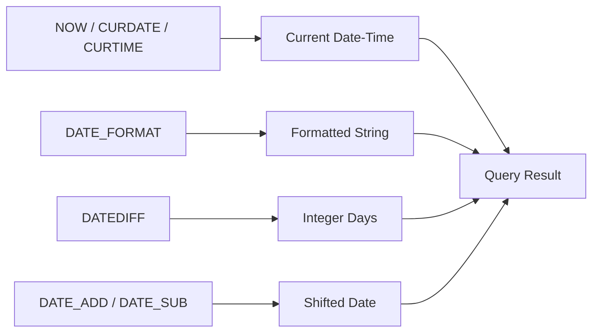

# How to Use MySQL Date and Time Functions (NOW, DATE_FORMAT, DATEDIFF)

Author: [nawazdhandala](https://www.github.com/nawazdhandala)

Tags: MySQL, SQL, Date Function, Time Function, Database

Description: Learn how to use MySQL date and time functions including NOW, DATE_FORMAT, and DATEDIFF to query, format, and calculate date values.

---

## How MySQL Date and Time Functions Work

MySQL stores dates and times using dedicated data types such as `DATE`, `TIME`, `DATETIME`, and `TIMESTAMP`. The built-in date and time functions let you retrieve the current moment, format values for display, and compute intervals between dates - all within a SQL query.



## Setup: Sample Table

```sql
CREATE TABLE orders (
    id           INT AUTO_INCREMENT PRIMARY KEY,
    customer     VARCHAR(100),
    order_date   DATETIME NOT NULL,
    ship_date    DATE,
    total_amount DECIMAL(10,2)
);

INSERT INTO orders (customer, order_date, ship_date, total_amount) VALUES
('Alice',   '2025-12-01 09:15:00', '2025-12-03', 249.99),
('Bob',     '2026-01-15 14:30:00', '2026-01-18', 89.50),
('Charlie', '2026-02-20 08:00:00', NULL,          315.00),
('Diana',   '2026-03-10 17:45:00', '2026-03-12', 59.99);
```

## NOW, CURDATE, CURTIME

`NOW()` returns the current date and time as a `DATETIME` value. `CURDATE()` returns only the date portion and `CURTIME()` returns only the time portion.

```sql
SELECT
    NOW()     AS current_datetime,
    CURDATE() AS current_date,
    CURTIME() AS current_time;
```

```text
+---------------------+--------------+--------------+
| current_datetime    | current_date | current_time |
+---------------------+--------------+--------------+
| 2026-03-31 10:22:05 | 2026-03-31   | 10:22:05     |
+---------------------+--------------+--------------+
```

**Example - find orders placed today:**

```sql
SELECT * FROM orders
WHERE DATE(order_date) = CURDATE();
```

## DATE_FORMAT

`DATE_FORMAT` converts a date or datetime value into a formatted string using a format specifier pattern. This is the MySQL equivalent of `strftime`.

**Syntax:**

```sql
DATE_FORMAT(date, format)
```

**Common format specifiers:**

```text
%Y  - 4-digit year        (2026)
%y  - 2-digit year        (26)
%m  - Month number 01-12  (03)
%M  - Month name          (March)
%d  - Day of month 01-31  (31)
%D  - Day with suffix     (31st)
%H  - Hour 00-23          (10)
%i  - Minutes 00-59       (22)
%s  - Seconds 00-59       (05)
%W  - Weekday name        (Monday)
```

**Example - format order dates for a report:**

```sql
SELECT
    customer,
    DATE_FORMAT(order_date, '%W, %M %D %Y') AS formatted_date,
    DATE_FORMAT(order_date, '%d/%m/%Y')     AS short_date
FROM orders;
```

```text
+----------+-------------------------------+------------+
| customer | formatted_date                | short_date |
+----------+-------------------------------+------------+
| Alice    | Monday, December 1st 2025     | 01/12/2025 |
| Bob      | Thursday, January 15th 2026   | 15/01/2026 |
| Charlie  | Friday, February 20th 2026    | 20/02/2026 |
| Diana    | Tuesday, March 10th 2026      | 10/03/2026 |
+----------+-------------------------------+------------+
```

## DATEDIFF

`DATEDIFF` returns the number of days between two date expressions. The result is positive when the first argument is later than the second.

**Syntax:**

```sql
DATEDIFF(date1, date2)
```

**Example - days since each order was placed:**

```sql
SELECT
    customer,
    order_date,
    DATEDIFF(CURDATE(), order_date) AS days_since_order
FROM orders
ORDER BY days_since_order DESC;
```

**Example - find orders placed more than 30 days ago:**

```sql
SELECT customer, order_date
FROM orders
WHERE DATEDIFF(CURDATE(), order_date) > 30;
```

## DATE_ADD and DATE_SUB

These functions shift a date by a given interval. They accept interval types such as DAY, WEEK, MONTH, YEAR, HOUR, MINUTE, and SECOND.

**Syntax:**

```sql
DATE_ADD(date, INTERVAL value unit)
DATE_SUB(date, INTERVAL value unit)
```

**Example - calculate expected delivery date (5 days after order):**

```sql
SELECT
    customer,
    order_date,
    DATE_ADD(order_date, INTERVAL 5 DAY) AS expected_delivery
FROM orders;
```

**Example - find orders from the last 90 days:**

```sql
SELECT * FROM orders
WHERE order_date >= DATE_SUB(CURDATE(), INTERVAL 90 DAY);
```

## YEAR, MONTH, DAY

These functions extract numeric components from a date.

```sql
SELECT
    customer,
    YEAR(order_date)  AS order_year,
    MONTH(order_date) AS order_month,
    DAY(order_date)   AS order_day
FROM orders;
```

**Example - group orders by month:**

```sql
SELECT
    YEAR(order_date)  AS yr,
    MONTH(order_date) AS mo,
    COUNT(*)          AS order_count,
    SUM(total_amount) AS revenue
FROM orders
GROUP BY yr, mo
ORDER BY yr, mo;
```

## TIMESTAMPDIFF

`TIMESTAMPDIFF` measures the difference between two datetime values in the specified unit.

```sql
SELECT
    customer,
    order_date,
    ship_date,
    TIMESTAMPDIFF(DAY, order_date, ship_date) AS processing_days
FROM orders
WHERE ship_date IS NOT NULL;
```

## Best Practices

- Always store dates in `DATE` or `DATETIME` columns rather than VARCHAR to enable index use and date arithmetic.
- Use `DATE()` to strip the time portion when comparing a `DATETIME` column against a bare date literal.
- Be aware that `DATEDIFF` only counts calendar days - it ignores the time component.
- Prefer `DATE_ADD` / `DATE_SUB` over manual arithmetic to correctly handle month-end and leap-year edge cases.
- Set `time_zone` consistently on your MySQL server and application connection to avoid subtle timezone bugs.

## Summary

MySQL date and time functions make it straightforward to work with temporal data in SQL. `NOW()` and `CURDATE()` retrieve the current moment. `DATE_FORMAT` converts dates to human-readable strings using flexible format patterns. `DATEDIFF` computes the number of days between two dates. `DATE_ADD` and `DATE_SUB` shift dates by arbitrary intervals. Combined, these functions cover the vast majority of date-handling tasks without requiring post-processing in application code.
