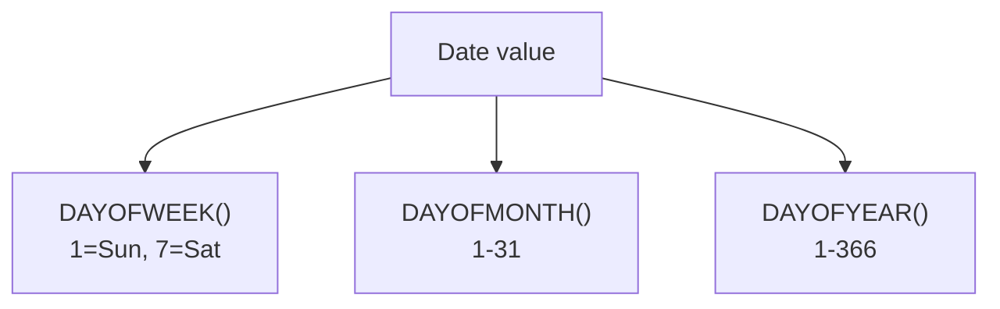

# How to Use DAYOFWEEK(), DAYOFMONTH(), DAYOFYEAR() in MySQL

Author: [nawazdhandala](https://www.github.com/nawazdhandala)

Tags: MySQL, SQL, Date Function, Database

Description: Learn how MySQL DAYOFWEEK(), DAYOFMONTH(), and DAYOFYEAR() return numeric day positions within a week, month, or year from a date value.

---

## Overview

MySQL provides three functions to extract the numeric position of a day within different calendar scopes:

- `DAYOFWEEK()` - returns the weekday index (1 = Sunday, 7 = Saturday)
- `DAYOFMONTH()` - returns the day of the month (1-31)
- `DAYOFYEAR()` - returns the day of the year (1-366)

All three return `NULL` if the input is `NULL`.

---

## DAYOFWEEK() Function

Returns the weekday index for a date, using the ODBC convention where Sunday = 1.

**Syntax:**

```sql
DAYOFWEEK(date)
```

| Return Value | Weekday   |
|--------------|-----------|
| 1            | Sunday    |
| 2            | Monday    |
| 3            | Tuesday   |
| 4            | Wednesday |
| 5            | Thursday  |
| 6            | Friday    |
| 7            | Saturday  |

```sql
SELECT DAYOFWEEK('2026-03-31');
-- Returns: 3  (Tuesday)

SELECT DAYOFWEEK('2026-03-29');
-- Returns: 1  (Sunday)

SELECT DAYOFWEEK('2026-03-28');
-- Returns: 7  (Saturday)
```

---

## DAYOFMONTH() Function

Returns the day of the month (1-31).

**Syntax:**

```sql
DAYOFMONTH(date)
```

`DAY()` is an alias for `DAYOFMONTH()`.

```sql
SELECT DAYOFMONTH('2026-03-31');
-- Returns: 31

SELECT DAYOFMONTH('2026-03-01');
-- Returns: 1

SELECT DAY('2026-03-15');
-- Returns: 15

SELECT DAYOFMONTH('2026-02-28');
-- Returns: 28
```

---

## DAYOFYEAR() Function

Returns the day number within the year, from 1 to 366.

**Syntax:**

```sql
DAYOFYEAR(date)
```

```sql
SELECT DAYOFYEAR('2026-01-01');
-- Returns: 1

SELECT DAYOFYEAR('2026-03-31');
-- Returns: 90

SELECT DAYOFYEAR('2026-12-31');
-- Returns: 365

-- Leap year
SELECT DAYOFYEAR('2024-12-31');
-- Returns: 366
```

---

## How the Three Functions Relate



---

## Practical Examples

### Weekend Detection

```sql
CREATE TABLE orders (
    id INT AUTO_INCREMENT PRIMARY KEY,
    order_date DATETIME,
    amount DECIMAL(10, 2)
);

-- Find all weekend orders
SELECT id, order_date, amount
FROM orders
WHERE DAYOFWEEK(order_date) IN (1, 7);  -- Sunday or Saturday
```

### Filter First Week of Month

```sql
-- Orders placed in the first 7 days of any month
SELECT id, order_date
FROM orders
WHERE DAYOFMONTH(order_date) <= 7;
```

### Seasonal Filtering by Day of Year

```sql
-- Orders placed in the first quarter (days 1-90)
SELECT id, order_date
FROM orders
WHERE DAYOFYEAR(order_date) BETWEEN 1 AND 90
  AND YEAR(order_date) = 2026;
```

---

## Comparing DAYOFWEEK() vs WEEKDAY()

Both return a weekday number, but they use different starting points:

| Function      | Monday | Tuesday | ... | Sunday |
|---------------|--------|---------|-----|--------|
| `DAYOFWEEK()` | 2      | 3       | ... | 1      |
| `WEEKDAY()`   | 0      | 1       | ... | 6      |

```sql
SELECT DAYOFWEEK('2026-03-31');  -- 3  (Tuesday, ODBC style)
SELECT WEEKDAY('2026-03-31');    -- 1  (Tuesday, ISO/MySQL style: 0=Monday)
```

Use `WEEKDAY()` when you need Monday = 0 (common in ISO week calculations), and `DAYOFWEEK()` when you need Sunday = 1 (ODBC convention).

---

## Day of Year Progress Calculation

```sql
-- Percentage through the year
SELECT
    DAYOFYEAR(CURDATE())                              AS current_day,
    DAYOFYEAR(LAST_DAY(CONCAT(YEAR(CURDATE()), '-12-01'))) AS days_in_year,
    ROUND(DAYOFYEAR(CURDATE()) / 365.0 * 100, 1)     AS pct_through_year;
```

---

## Grouping Orders by Day of Week

```sql
SELECT
    DAYOFWEEK(order_date)         AS dow_num,
    DAYNAME(order_date)           AS dow_name,
    COUNT(*)                      AS orders,
    SUM(amount)                   AS revenue
FROM orders
GROUP BY DAYOFWEEK(order_date), DAYNAME(order_date)
ORDER BY dow_num;
```

---

## Grouping by Day of Month (for Monthly Patterns)

```sql
-- Identify which days of the month have the most orders
SELECT
    DAYOFMONTH(order_date) AS day_of_month,
    COUNT(*)               AS order_count
FROM orders
GROUP BY DAYOFMONTH(order_date)
ORDER BY order_count DESC
LIMIT 5;
```

---

## NULL Handling

```sql
SELECT DAYOFWEEK(NULL);   -- NULL
SELECT DAYOFMONTH(NULL);  -- NULL
SELECT DAYOFYEAR(NULL);   -- NULL
```

---

## Index and Performance

All three functions prevent index use when applied to indexed columns in `WHERE` conditions. For frequent day-of-week or day-of-month filtering, use stored generated columns:

```sql
ALTER TABLE orders
ADD COLUMN order_dow TINYINT GENERATED ALWAYS AS (DAYOFWEEK(order_date)) STORED,
ADD INDEX idx_order_dow (order_dow);

SELECT * FROM orders WHERE order_dow IN (1, 7);
```

---

## Summary

`DAYOFWEEK()`, `DAYOFMONTH()`, and `DAYOFYEAR()` provide numeric positions of a date within a week (1-7, Sunday-based), month (1-31), and year (1-366) respectively. `DAYOFMONTH()` has the alias `DAY()`. Use `DAYOFWEEK()` for weekend detection and weekday routing, `DAYOFMONTH()` for day-of-month business rules, and `DAYOFYEAR()` for seasonal or year-progress calculations. For performance on large indexed tables, store precomputed values in generated columns.
