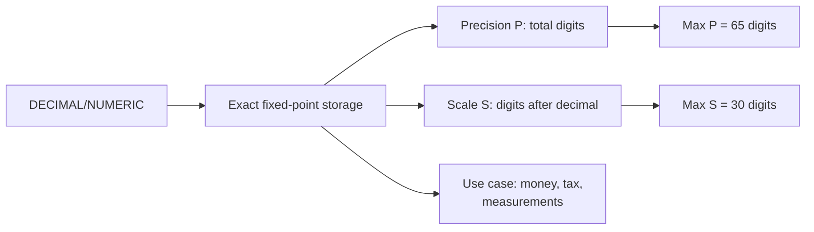

# How to Use DECIMAL and NUMERIC Data Types in MySQL

Author: [nawazdhandala](https://www.github.com/nawazdhandala)

Tags: MySQL, SQL, Data Type, Decimal, Database

Description: Learn how to use DECIMAL and NUMERIC data types in MySQL for exact fixed-point arithmetic, including precision, scale, storage, and financial use cases.

---

## What Are DECIMAL and NUMERIC

`DECIMAL` and `NUMERIC` are synonymous in MySQL. Both store **exact fixed-point** numbers, making them the correct choice whenever rounding errors are unacceptable -- financial calculations, tax amounts, measurements, and scientific data. Unlike `FLOAT` or `DOUBLE`, a `DECIMAL` value is stored as a string-like representation internally, guaranteeing that `1.10 + 2.20 = 3.30` exactly.



## Syntax

```sql
column_name DECIMAL [(precision [, scale])] [UNSIGNED] [NOT NULL] [DEFAULT value]
-- NUMERIC is identical:
column_name NUMERIC [(precision [, scale])] [UNSIGNED] [NOT NULL] [DEFAULT value]
```

- **precision** (`P`): total number of significant decimal digits (default 10, max 65).
- **scale** (`S`): digits to the right of the decimal point (default 0, max 30, must be <= P).

## Storage

MySQL stores `DECIMAL` values packed into 4-byte groups. The formula is:

- Every 9 digits on either side of the decimal point uses 4 bytes.
- Leftover digits use 1-4 bytes (1 digit = 1 byte, 2 digits = 1 byte, 3 digits = 2 bytes, etc.).

For `DECIMAL(10, 2)`: 8 integer digits + 2 fractional digits = 5 bytes.

## Basic Usage

```sql
CREATE TABLE products (
    id          INT AUTO_INCREMENT PRIMARY KEY,
    name        VARCHAR(100) NOT NULL,
    price       DECIMAL(10, 2) NOT NULL,  -- up to 99999999.99
    tax_rate    DECIMAL(5, 4) NOT NULL,   -- e.g., 0.0825
    weight_kg   DECIMAL(8, 3)             -- e.g., 1234.567
);

INSERT INTO products (name, price, tax_rate, weight_kg) VALUES
('Laptop',    1299.99, 0.0825, 2.100),
('Headphones',  79.95, 0.0825, 0.350),
('Desk',       449.00, 0.0825, 15.800);
```

## Exact Arithmetic

```sql
SELECT name,
       price,
       tax_rate,
       ROUND(price * tax_rate, 2) AS tax_amount,
       price + ROUND(price * tax_rate, 2) AS total
FROM products;
```

```text
+------------+---------+----------+------------+---------+
| name       | price   | tax_rate | tax_amount | total   |
+------------+---------+----------+------------+---------+
| Laptop     | 1299.99 |   0.0825 |     107.25 | 1407.24 |
| Headphones |   79.95 |   0.0825 |       6.60 |   86.55 |
| Desk       |  449.00 |   0.0825 |      37.04 |  486.04 |
+------------+---------+----------+------------+---------+
```

## Financial Ledger Example

```sql
CREATE TABLE account_ledger (
    id          BIGINT UNSIGNED AUTO_INCREMENT PRIMARY KEY,
    account_id  INT NOT NULL,
    description VARCHAR(200) NOT NULL,
    debit       DECIMAL(15, 2) NOT NULL DEFAULT 0.00,
    credit      DECIMAL(15, 2) NOT NULL DEFAULT 0.00,
    balance     DECIMAL(15, 2) NOT NULL,
    entry_date  DATE NOT NULL
);

INSERT INTO account_ledger (account_id, description, debit, credit, balance, entry_date) VALUES
(1001, 'Opening balance',    0.00,  5000.00,  5000.00, '2025-01-01'),
(1001, 'Rent payment',    1200.00,     0.00,  3800.00, '2025-01-05'),
(1001, 'Client invoice',     0.00,  2500.00,  6300.00, '2025-01-10');
```

## Comparing DECIMAL to FLOAT

```sql
-- Floating point rounding
SELECT 0.1 + 0.2 AS float_result;
-- Result: 0.30000000000000004 (imprecise)

-- Exact fixed-point
SELECT CAST(0.1 AS DECIMAL(5,1)) + CAST(0.2 AS DECIMAL(5,1)) AS decimal_result;
-- Result: 0.3 (exact)
```

## DECIMAL with UNSIGNED

```sql
CREATE TABLE inventory (
    product_id   INT NOT NULL PRIMARY KEY,
    unit_cost    DECIMAL(10, 2) UNSIGNED NOT NULL,  -- cannot be negative
    list_price   DECIMAL(10, 2) UNSIGNED NOT NULL
);
```

## Choosing Precision and Scale

| Use Case | Recommended Type |
|---|---|
| Currency (USD, EUR) | `DECIMAL(15, 2)` |
| Cryptocurrency (BTC) | `DECIMAL(20, 8)` |
| Tax / interest rates | `DECIMAL(7, 4)` |
| Scientific measurement | `DECIMAL(18, 6)` |
| Percentage | `DECIMAL(5, 2)` |

## Overflow and Rounding

```sql
-- Inserting a value with more fractional digits than scale (rounds)
INSERT INTO products (name, price, tax_rate, weight_kg)
VALUES ('Cable', 9.999, 0.0825, 0.050);
-- price 9.999 is rounded to 10.00 in DECIMAL(10,2)

-- Inserting a value exceeding precision: error in strict mode
INSERT INTO products (name, price, tax_rate, weight_kg)
VALUES ('Server', 99999999.99, 0.0825, 50.000);
-- price 99999999.99 = 10 digits before decimal, exceeds DECIMAL(10,2) limit
-- ERROR 1264 (22003): Out of range value for column 'price'
```

## Aggregation

```sql
SELECT
    SUM(price)              AS total_revenue,
    AVG(price)              AS avg_price,
    MAX(price)              AS max_price,
    MIN(price)              AS min_price
FROM products;
```

## Best Practices

- Always use `DECIMAL` (not `FLOAT` or `DOUBLE`) for monetary values, tax rates, and any calculation that cannot tolerate rounding errors.
- Set precision high enough for future growth; `DECIMAL(15, 2)` handles amounts up to 9,999,999,999,999.99 and is suitable for most financial systems.
- Use `DECIMAL(20, 8)` for cryptocurrencies like Bitcoin where 8 decimal places are standard.
- Avoid over-specifying precision; unnecessarily large precision increases storage cost.
- Apply `ROUND()` explicitly when displaying computed values to ensure predictable output.

## Summary

`DECIMAL` (and its synonym `NUMERIC`) stores exact fixed-point numbers in MySQL, making it mandatory for financial data. The declaration `DECIMAL(P, S)` specifies `P` total digits with `S` after the decimal point. Arithmetic on `DECIMAL` columns is always exact, unlike `FLOAT` or `DOUBLE`. Use `DECIMAL(15, 2)` for standard currency columns and scale the precision up for cryptocurrencies or high-precision scientific measurements.
