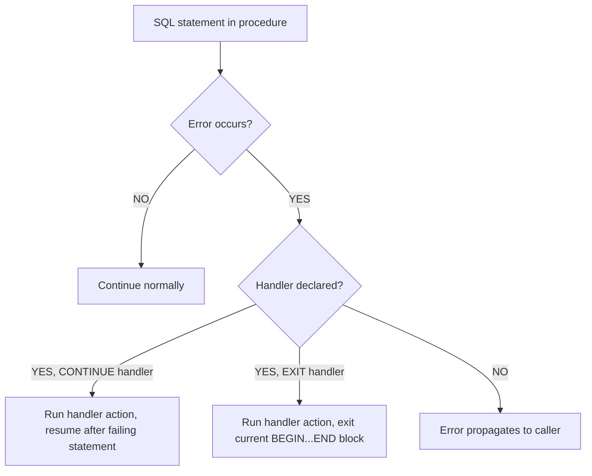

# How to Handle Errors with DECLARE HANDLER in MySQL

Author: [nawazdhandala](https://www.github.com/nawazdhandala)

Tags: MySQL, Stored Procedure, Error Handling, SQL, Database

Description: Learn how to use DECLARE HANDLER in MySQL stored procedures to catch SQL errors, warnings, and custom conditions, with examples for CONTINUE and EXIT handlers.

---

## Error Handling in Stored Procedures

Without error handling, any SQL error inside a stored procedure propagates to the caller and terminates the procedure. `DECLARE HANDLER` lets you intercept errors and control what happens next.



## DECLARE HANDLER Syntax

```sql
DECLARE {CONTINUE | EXIT} HANDLER
    FOR {condition_value [, condition_value ...]}
    handler_action;
```

Where `condition_value` can be:
- `SQLSTATE 'value'` - a 5-character SQLSTATE code
- `mysql_error_code` - a numeric MySQL error number
- `condition_name` - a named condition declared with `DECLARE CONDITION`
- `SQLWARNING` - shorthand for SQLSTATE codes starting with `01`
- `NOT FOUND` - shorthand for SQLSTATE codes starting with `02`
- `SQLEXCEPTION` - shorthand for all SQLSTATE codes not starting with `00`, `01`, or `02`

## Handler Types

- `CONTINUE` - after the handler action runs, execution resumes with the statement after the one that caused the error.
- `EXIT` - after the handler action runs, execution exits the current `BEGIN...END` block (the procedure or the innermost block).

## Setup: Sample Tables

```sql
CREATE TABLE orders (
    id         INT PRIMARY KEY AUTO_INCREMENT,
    customer   VARCHAR(100) NOT NULL,
    amount     DECIMAL(10,2),
    status     VARCHAR(20) DEFAULT 'pending'
);

CREATE TABLE error_log (
    id         INT PRIMARY KEY AUTO_INCREMENT,
    proc_name  VARCHAR(100),
    error_msg  VARCHAR(500),
    logged_at  DATETIME DEFAULT CURRENT_TIMESTAMP
);

INSERT INTO orders (customer, amount, status) VALUES
    ('Alice', 250.00, 'pending'),
    ('Bob',   180.00, 'pending');
```

## CONTINUE Handler: Log and Keep Going

The CONTINUE handler runs the action and then resumes from the statement after the error.

```sql
DELIMITER $$

CREATE PROCEDURE BulkInsertOrders (
    IN p_customer VARCHAR(100)
)
BEGIN
    DECLARE v_error_count INT DEFAULT 0;

    DECLARE CONTINUE HANDLER FOR SQLEXCEPTION
    BEGIN
        SET v_error_count = v_error_count + 1;
        INSERT INTO error_log (proc_name, error_msg)
        VALUES ('BulkInsertOrders', CONCAT('Insert failed for customer: ', p_customer));
    END;

    -- This will succeed
    INSERT INTO orders (customer, amount) VALUES (p_customer, 100.00);

    -- Simulate a duplicate key or constraint violation
    INSERT INTO orders (id, customer, amount) VALUES (1, p_customer, 200.00);

    -- This still executes because handler is CONTINUE
    INSERT INTO orders (customer, amount) VALUES (p_customer, 300.00);

    SELECT CONCAT(v_error_count, ' error(s) occurred') AS result;
END$$

DELIMITER ;
```

```sql
CALL BulkInsertOrders('Carol');
SELECT * FROM error_log;
```

## EXIT Handler: Rollback on Error

Use EXIT with a transaction to roll back all changes if any step fails.

```sql
DELIMITER $$

CREATE PROCEDURE SafeTransfer (
    IN  p_from_id INT,
    IN  p_to_id   INT,
    IN  p_amount  DECIMAL(10,2),
    OUT p_status  VARCHAR(100)
)
BEGIN
    DECLARE v_exit_flag INT DEFAULT 0;

    DECLARE EXIT HANDLER FOR SQLEXCEPTION
    BEGIN
        ROLLBACK;
        SET p_status = 'FAILED: Transaction rolled back';
    END;

    START TRANSACTION;

    UPDATE orders SET amount = amount - p_amount WHERE id = p_from_id;
    UPDATE orders SET amount = amount + p_amount WHERE id = p_to_id;

    COMMIT;
    SET p_status = 'SUCCESS';
END$$

DELIMITER ;
```

```sql
CALL SafeTransfer(1, 2, 50.00, @status);
SELECT @status;
```

## DECLARE CONDITION: Named Error Codes

Give meaningful names to specific error codes for readability.

```sql
DELIMITER $$

CREATE PROCEDURE InsertUniqueOrder (
    IN p_customer VARCHAR(100),
    IN p_amount   DECIMAL(10,2)
)
BEGIN
    DECLARE duplicate_key CONDITION FOR SQLSTATE '23000';

    DECLARE CONTINUE HANDLER FOR duplicate_key
    BEGIN
        INSERT INTO error_log (proc_name, error_msg)
        VALUES ('InsertUniqueOrder', CONCAT('Duplicate key for customer: ', p_customer));
    END;

    INSERT INTO orders (customer, amount) VALUES (p_customer, p_amount);
END$$

DELIMITER ;
```

## GET DIAGNOSTICS: Read Error Details

In MySQL 5.6+, use `GET DIAGNOSTICS` inside a handler to retrieve the SQLSTATE and error message.

```sql
DELIMITER $$

CREATE PROCEDURE SafeInsert (
    IN p_customer VARCHAR(100),
    IN p_amount   DECIMAL(10,2)
)
BEGIN
    DECLARE v_sqlstate CHAR(5) DEFAULT '00000';
    DECLARE v_message  VARCHAR(500);

    DECLARE CONTINUE HANDLER FOR SQLEXCEPTION
    BEGIN
        GET DIAGNOSTICS CONDITION 1
            v_sqlstate = RETURNED_SQLSTATE,
            v_message  = MESSAGE_TEXT;

        INSERT INTO error_log (proc_name, error_msg)
        VALUES ('SafeInsert', CONCAT('SQLSTATE=', v_sqlstate, ' MSG=', v_message));
    END;

    INSERT INTO orders (customer, amount) VALUES (p_customer, p_amount);
END$$

DELIMITER ;
```

## SQLWARNING Handler

Catch warnings without stopping execution.

```sql
DELIMITER $$

CREATE PROCEDURE DivideValues (
    IN  p_numerator   DECIMAL(10,2),
    IN  p_denominator DECIMAL(10,2),
    OUT p_result      DECIMAL(10,4)
)
BEGIN
    DECLARE v_warning INT DEFAULT 0;

    DECLARE CONTINUE HANDLER FOR SQLWARNING
        SET v_warning = 1;

    IF p_denominator = 0 THEN
        SET p_result = NULL;
    ELSE
        SET p_result = p_numerator / p_denominator;
    END IF;
END$$

DELIMITER ;
```

## Handler Precedence and Nesting

Inner BEGIN...END blocks can override handlers from outer blocks. The innermost matching handler takes precedence.

```sql
DELIMITER $$

CREATE PROCEDURE NestedHandlers ()
BEGIN
    -- Outer handler
    DECLARE CONTINUE HANDLER FOR SQLEXCEPTION
        INSERT INTO error_log (proc_name, error_msg) VALUES ('outer', 'Outer caught');

    BEGIN
        -- Inner handler overrides the outer one for this block
        DECLARE EXIT HANDLER FOR SQLEXCEPTION
            INSERT INTO error_log (proc_name, error_msg) VALUES ('inner', 'Inner caught');

        -- Error here is caught by the inner EXIT handler
        INSERT INTO orders (id, customer, amount) VALUES (1, 'Test', 0);
    END;

    -- Execution continues here after the inner block exits
    INSERT INTO error_log (proc_name, error_msg) VALUES ('outer', 'Continued after inner block');
END$$

DELIMITER ;
```

## Best Practices

- Always combine EXIT handlers with `ROLLBACK` inside transactions to maintain data integrity.
- Use `GET DIAGNOSTICS` to capture the actual SQLSTATE and message for logging.
- Place `DECLARE HANDLER` after all variable and cursor declarations - MySQL requires this order.
- Use specific SQLSTATE codes or error numbers rather than the broad `SQLEXCEPTION` when you want to handle only a specific error class.
- Avoid swallowing errors silently; always log them with enough context to diagnose the problem.

## Summary

`DECLARE HANDLER` in MySQL stored procedures intercepts SQL errors, warnings, and custom conditions. `CONTINUE` handlers resume execution after the failing statement; `EXIT` handlers terminate the current block after the handler action runs. Use `DECLARE CONDITION` for named error conditions, `GET DIAGNOSTICS` to read error details, and always pair EXIT handlers with transaction ROLLBACK to keep data consistent when errors occur.
