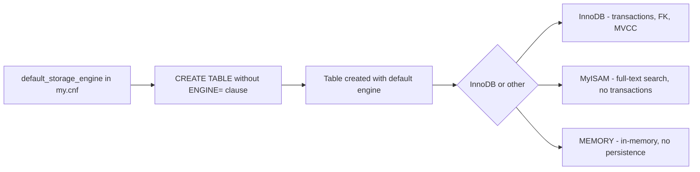

# How to Set the Default Storage Engine in MySQL

Author: [nawazdhandala](https://www.github.com/nawazdhandala)

Tags: MySQL, Configuration, Storage Engine, InnoDB, Administration

Description: Set the MySQL default storage engine in my.cnf, compare InnoDB and MyISAM, and verify or change the engine of existing tables.

---

## How It Works

MySQL supports multiple storage engines that handle how data is stored, indexed, and retrieved. The default storage engine is set with the `default_storage_engine` variable in `my.cnf`. Every `CREATE TABLE` statement that does not specify `ENGINE=` uses this default. MySQL 8.0 defaults to InnoDB, which provides ACID transactions and foreign key support.



## View the Current Default Storage Engine

```sql
SHOW VARIABLES LIKE 'default_storage_engine';
```

```text
+------------------------+--------+
| Variable_name          | Value  |
+------------------------+--------+
| default_storage_engine | InnoDB |
+------------------------+--------+
```

## View All Available Storage Engines

```sql
SHOW ENGINES;
```

```text
+--------------------+---------+------------------------------+
| Engine             | Support | Comment                      |
+--------------------+---------+------------------------------+
| InnoDB             | DEFAULT | Supports transactions, FK    |
| MyISAM             | YES     | Non-transactional engine     |
| MEMORY             | YES     | Hash-based, in-memory table  |
| BLACKHOLE          | YES     | /dev/null storage engine     |
| CSV                | YES     | Stores tables as CSV files   |
| ARCHIVE            | YES     | Archive storage engine       |
| PERFORMANCE_SCHEMA | YES     | Performance Schema           |
| MRG_MYISAM         | YES     | Collection of MyISAM tables  |
| FEDERATED          | NO      | Federated MySQL storage      |
+--------------------+---------+------------------------------+
```

## Setting the Default Engine in my.cnf

Edit the MySQL configuration file.

```bash
# Ubuntu / Debian
sudo nano /etc/mysql/mysql.conf.d/mysqld.cnf

# RHEL-based
sudo nano /etc/my.cnf
```

```ini
[mysqld]
default_storage_engine = InnoDB
```

Restart MySQL.

```bash
sudo systemctl restart mysql
```

Verify.

```sql
SHOW VARIABLES LIKE 'default_storage_engine';
```

## Specifying the Engine Per Table

The `ENGINE=` clause overrides the server default for that specific table.

```sql
CREATE TABLE orders (
    id         INT UNSIGNED AUTO_INCREMENT PRIMARY KEY,
    customer   VARCHAR(100) NOT NULL,
    total      DECIMAL(10,2),
    created_at DATETIME DEFAULT CURRENT_TIMESTAMP
) ENGINE=InnoDB;

CREATE TABLE search_cache (
    id      INT AUTO_INCREMENT PRIMARY KEY,
    keyword VARCHAR(200),
    results MEDIUMTEXT,
    FULLTEXT KEY ft_keyword (keyword)
) ENGINE=MyISAM;

CREATE TABLE session_data (
    session_id  VARCHAR(64) PRIMARY KEY,
    data        BLOB,
    expires_at  DATETIME
) ENGINE=MEMORY;
```

## Checking the Storage Engine of Existing Tables

```sql
SELECT TABLE_NAME, ENGINE
FROM information_schema.TABLES
WHERE TABLE_SCHEMA = 'myapp';
```

```text
+------------+--------+
| TABLE_NAME | ENGINE |
+------------+--------+
| orders     | InnoDB |
| users      | InnoDB |
| search_cache | MyISAM |
+------------+--------+
```

Or per table:

```sql
SHOW TABLE STATUS LIKE 'orders'\G
```

## Converting a Table to InnoDB

```sql
ALTER TABLE mytable ENGINE=InnoDB;
```

This rebuilds the table and can be slow on large tables. For tables in production, use `pt-online-schema-change` from Percona Toolkit or MySQL's built-in Online DDL.

## Converting All MyISAM Tables to InnoDB

Generate the ALTER statements.

```sql
SELECT CONCAT('ALTER TABLE `', TABLE_SCHEMA, '`.`', TABLE_NAME, '` ENGINE=InnoDB;')
FROM information_schema.TABLES
WHERE ENGINE = 'MyISAM'
  AND TABLE_SCHEMA NOT IN ('mysql', 'information_schema', 'performance_schema', 'sys');
```

## InnoDB vs MyISAM Comparison

| Feature | InnoDB | MyISAM |
|---|---|---|
| Transactions | Yes (ACID) | No |
| Foreign keys | Yes | No |
| Row-level locking | Yes | No (table lock) |
| Crash recovery | Automatic | Manual repair |
| Full-text search | Yes (MySQL 5.6+) | Yes |
| MVCC | Yes | No |
| Auto_increment | Per-table | Per-table |

**Recommendation**: Use InnoDB for all tables in modern MySQL installations. MyISAM has no advantages that InnoDB does not also provide as of MySQL 5.7+.

## Summary

MySQL 8.0 defaults to InnoDB, which is the correct choice for virtually all workloads due to its transaction support, foreign key constraints, MVCC, and automatic crash recovery. Set `default_storage_engine = InnoDB` in `my.cnf` to make this explicit. When creating tables, you can specify `ENGINE=` to override the default. Migrate any legacy MyISAM tables to InnoDB using `ALTER TABLE ... ENGINE=InnoDB` to gain crash safety and row-level locking.
