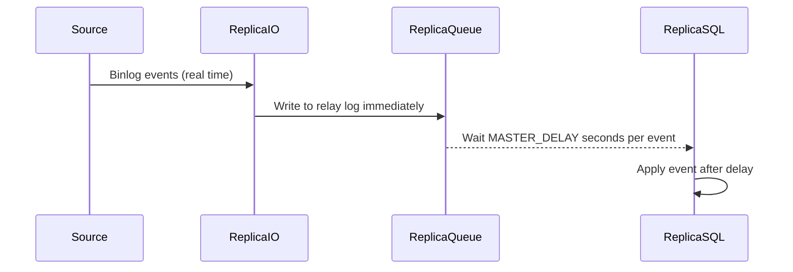
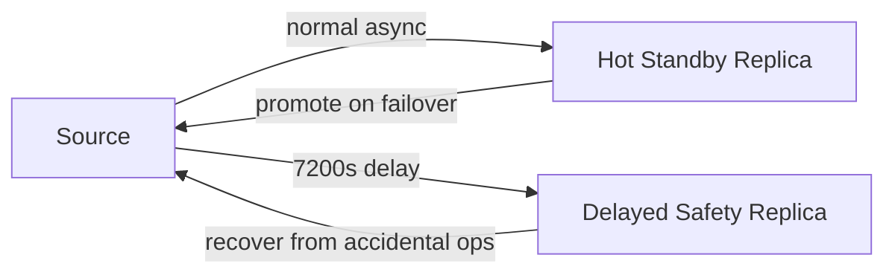

# How to Set Up MySQL Delayed Replication

Author: [nawazdhandala](https://www.github.com/nawazdhandala)

Tags: MySQL, Replication, Delayed Replication, Recovery, Database

Description: Learn how to configure MySQL delayed replication to keep a replica intentionally behind the source, enabling point-in-time recovery without a full backup restore.

---

## Introduction

MySQL delayed replication instructs a replica to apply binary log events only after a specified delay has elapsed since they were committed on the source. The replica receives events in real time but queues them and waits before applying each one.

**Primary use case:** Create a safety net. If a DBA accidentally drops a table at 14:00, a replica with a 2-hour delay still has the data intact until 16:00, allowing recovery by stopping the replica before the bad event is applied.

## How delayed replication works



## Configuring the delay

```sql
-- Set a 2-hour delay (7200 seconds)
CHANGE REPLICATION SOURCE TO SOURCE_DELAY = 7200;

-- Start replication
START REPLICA;

-- Verify
SHOW REPLICA STATUS\G
/*
...
SQL_Delay: 7200
SQL_Remaining_Delay: 6834
Replica_SQL_Running_State: Waiting until SOURCE_DELAY seconds after source executed event
...
*/
```

## Changing the delay without re-initializing

```sql
-- Temporarily pause the SQL thread
STOP REPLICA SQL_THREAD;

-- Change the delay to 4 hours
CHANGE REPLICATION SOURCE TO SOURCE_DELAY = 14400;

-- Restart the SQL thread
START REPLICA SQL_THREAD;
```

## Removing the delay (set back to 0)

```sql
STOP REPLICA SQL_THREAD;
CHANGE REPLICATION SOURCE TO SOURCE_DELAY = 0;
START REPLICA SQL_THREAD;
```

## Point-in-time recovery using a delayed replica

The power of delayed replication is the ability to recover from accidental data destruction by stopping the replica just before the bad event:

```bash
# Step 1: Identify the time of the bad event from the source binlog
mysqlbinlog /var/log/mysql/mysql-bin.000042 \
  --start-datetime="2026-03-31 13:55:00" \
  --stop-datetime="2026-03-31 14:05:00" | grep -A 5 "DROP TABLE"
```

```sql
-- Step 2: On the delayed replica, stop the SQL thread immediately
STOP REPLICA SQL_THREAD;

-- Step 3: Use START REPLICA UNTIL to replay events up to just before the bad one
START REPLICA SQL_THREAD UNTIL
  SQL_BEFORE_GTIDS = 'source_uuid:bad_gtid_number';

-- Or, using a datetime stop point:
-- START REPLICA SQL_THREAD UNTIL SQL_BEFORE_GTIDS is preferred with GTIDs.
-- Without GTIDs, stop at a binlog position:
START REPLICA SQL_THREAD UNTIL
  RELAY_LOG_FILE = 'replica-relay-bin.000011',
  RELAY_LOG_POS  = 45678;

-- Step 4: Wait for SHOW REPLICA STATUS to show SQL thread stopped at the target
SHOW REPLICA STATUS\G

-- Step 5: Export the recovered table from the delayed replica
```

```bash
# Step 6: Dump the recovered table
mysqldump -u root -p delayed_replica_db orders > orders_recovered.sql

# Step 7: Import on the source (or a production replica)
mysql -u root -p production_db < orders_recovered.sql
```

## Monitoring the delay in real time

```sql
-- SQL_Remaining_Delay shows seconds until the next queued event will be applied
SHOW REPLICA STATUS\G
-- Look for:
-- SQL_Delay: 7200
-- SQL_Remaining_Delay: 3412

-- Performance Schema view
SELECT
  CHANNEL_NAME,
  SQL_DELAY,
  SQL_REMAINING_DELAY,
  SERVICE_STATE
FROM performance_schema.replication_applier_status
WHERE CHANNEL_NAME = '';
```

## Combining delayed replication with GTID

```ini
# /etc/mysql/mysql.conf.d/mysqld.cnf (replica)

[mysqld]
server-id                = 3
gtid_mode                = ON
enforce_gtid_consistency = ON
read_only                = ON
log_replica_updates      = ON
```

```sql
CHANGE REPLICATION SOURCE TO
  SOURCE_HOST          = '192.168.1.10',
  SOURCE_USER          = 'repl',
  SOURCE_PASSWORD      = 'strong_password',
  SOURCE_AUTO_POSITION = 1,
  SOURCE_DELAY         = 7200;

START REPLICA;
```

## Recommended delay values

| Protection goal | Suggested delay |
|---|---|
| Accidental DROP / TRUNCATE | 1-4 hours |
| Logical data corruption | 12-24 hours |
| Ransomware / mass delete | 24-48 hours |
| Audit trail only | No delay needed; use binlog directly |

## Delayed replica in a larger topology



## Important limitations

- The IO thread is not delayed; events arrive in real time. Only the SQL thread is delayed.
- `SHOW REPLICA STATUS` `Seconds_Behind_Source` includes the configured delay, so a `SQL_Remaining_Delay` value is normal.
- Do not use a delayed replica as a hot standby for automatic failover; it will be behind by design.
- The delay is per-event, not per-transaction time. Very large transactions may appear to apply earlier than expected in relative terms.

## Summary

MySQL delayed replication is configured with `CHANGE REPLICATION SOURCE TO SOURCE_DELAY = N` (where N is seconds). The replica IO thread continues to receive events in real time while the SQL applier thread waits the configured delay before applying each event. This creates a rolling safety window: stop the SQL thread before a catastrophic event reaches it, dump the intact data from the delayed replica, and import it back to production. The delay can be changed at runtime without re-initializing replication by stopping and restarting the SQL thread.
