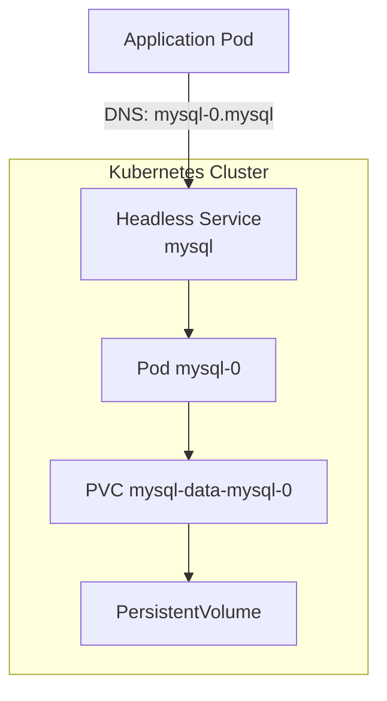

# How to Deploy MySQL on Kubernetes with StatefulSet

Author: [nawazdhandala](https://www.github.com/nawazdhandala)

Tags: MySQL, Kubernetes, StatefulSet, Database, DevOps, Persistent Volume

Description: Deploy MySQL on Kubernetes using a StatefulSet with persistent storage, a headless Service, ConfigMap, and Secret for production-ready configuration.

---

## How It Works

Kubernetes StatefulSets are designed for stateful applications that require stable network identities and persistent storage. Unlike Deployments, each StatefulSet Pod gets a predictable hostname (`mysql-0`, `mysql-1`) and its own PersistentVolumeClaim that survives Pod restarts and rescheduling.



## Prerequisites

- A running Kubernetes cluster (minikube, kind, or cloud)
- `kubectl` configured to point to the cluster
- A StorageClass that supports dynamic provisioning

## Step 1 - Create a Secret for MySQL Credentials

Store the root password in a Kubernetes Secret. The value must be base64-encoded.

```bash
kubectl create secret generic mysql-secret \
  --from-literal=MYSQL_ROOT_PASSWORD=SuperSecret123 \
  --from-literal=MYSQL_PASSWORD=AppSecret456
```

Verify the secret was created.

```bash
kubectl get secret mysql-secret
```

## Step 2 - Create a ConfigMap for MySQL Configuration

Define a minimal `my.cnf` override as a ConfigMap.

```yaml
apiVersion: v1
kind: ConfigMap
metadata:
  name: mysql-config
data:
  my.cnf: |
    [mysqld]
    innodb_buffer_pool_size = 256M
    max_connections         = 200
    slow_query_log          = 1
    long_query_time         = 1
```

Apply it.

```bash
kubectl apply -f mysql-config.yaml
```

## Step 3 - Create the Headless Service

A headless Service (clusterIP: None) gives each Pod a stable DNS name.

```yaml
apiVersion: v1
kind: Service
metadata:
  name: mysql
  labels:
    app: mysql
spec:
  clusterIP: None
  selector:
    app: mysql
  ports:
    - name: mysql
      port: 3306
      targetPort: 3306
```

Apply it.

```bash
kubectl apply -f mysql-service.yaml
```

## Step 4 - Create the StatefulSet

The StatefulSet defines the MySQL Pod template and its VolumeClaimTemplate for automatic PVC creation.

```yaml
apiVersion: apps/v1
kind: StatefulSet
metadata:
  name: mysql
spec:
  serviceName: mysql
  replicas: 1
  selector:
    matchLabels:
      app: mysql
  template:
    metadata:
      labels:
        app: mysql
    spec:
      containers:
        - name: mysql
          image: mysql:8.0
          ports:
            - containerPort: 3306
              name: mysql
          env:
            - name: MYSQL_ROOT_PASSWORD
              valueFrom:
                secretKeyRef:
                  name: mysql-secret
                  key: MYSQL_ROOT_PASSWORD
            - name: MYSQL_DATABASE
              value: myapp
            - name: MYSQL_USER
              value: appuser
            - name: MYSQL_PASSWORD
              valueFrom:
                secretKeyRef:
                  name: mysql-secret
                  key: MYSQL_PASSWORD
          volumeMounts:
            - name: mysql-data
              mountPath: /var/lib/mysql
            - name: mysql-config
              mountPath: /etc/mysql/conf.d
          resources:
            requests:
              memory: "512Mi"
              cpu: "250m"
            limits:
              memory: "1Gi"
              cpu: "500m"
          livenessProbe:
            exec:
              command:
                - mysqladmin
                - ping
                - -h
                - localhost
            initialDelaySeconds: 30
            periodSeconds: 10
          readinessProbe:
            exec:
              command:
                - mysql
                - -u
                - root
                - -p$(MYSQL_ROOT_PASSWORD)
                - -e
                - "SELECT 1"
            initialDelaySeconds: 30
            periodSeconds: 5
      volumes:
        - name: mysql-config
          configMap:
            name: mysql-config
  volumeClaimTemplates:
    - metadata:
        name: mysql-data
      spec:
        accessModes: ["ReadWriteOnce"]
        resources:
          requests:
            storage: 10Gi
```

Apply the StatefulSet.

```bash
kubectl apply -f mysql-statefulset.yaml
```

## Step 5 - Verify the Deployment

Check that the Pod is running and the PVC is bound.

```bash
kubectl get statefulset mysql
kubectl get pods -l app=mysql
kubectl get pvc
```

Expected output:

```text
NAME    READY   AGE
mysql   1/1     2m

NAME      READY   STATUS    RESTARTS   AGE
mysql-0   1/1     Running   0          2m

NAME                        STATUS   VOLUME                                     CAPACITY   STORAGECLASS
mysql-data-mysql-0          Bound    pvc-abc12345-...                           10Gi       standard
```

## Step 6 - Connect to MySQL

Open an interactive shell in the Pod to connect to MySQL.

```bash
kubectl exec -it mysql-0 -- mysql -u root -p
```

## Exposing MySQL to Applications

Other Pods in the same namespace connect using the DNS name `mysql-0.mysql` or simply `mysql` for any healthy Pod behind the service.

```yaml
env:
  - name: DB_HOST
    value: mysql-0.mysql
  - name: DB_PORT
    value: "3306"
  - name: DB_NAME
    value: myapp
```

## Best Practices

- Use Secrets for all credentials; never hardcode passwords in YAML manifests.
- Set resource requests and limits to prevent the MySQL Pod from starving other workloads.
- Add liveness and readiness probes so Kubernetes restarts unresponsive MySQL Pods and withholds traffic until MySQL is fully started.
- Use a StorageClass with `reclaimPolicy: Retain` in production to prevent accidental data loss when a PVC is deleted.
- For production high-availability, consider MySQL Group Replication or the MySQL Operator rather than a single-replica StatefulSet.

## Summary

Deploying MySQL on Kubernetes with a StatefulSet provides stable Pod identity, a dedicated PersistentVolumeClaim per replica, and predictable DNS-based discovery through a headless Service. By pairing the StatefulSet with a Secret for credentials, a ConfigMap for tuning parameters, and proper liveness and readiness probes, you get a reliable MySQL deployment that survives Pod restarts and node failures while maintaining data durability.
