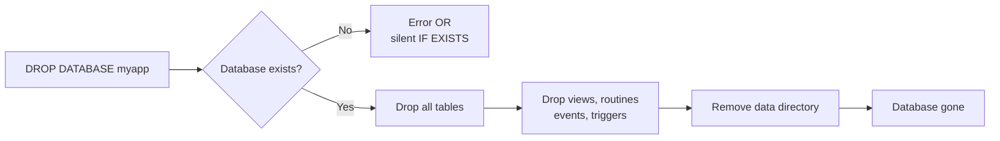

# How to Drop a Database in MySQL

Author: [nawazdhandala](https://www.github.com/nawazdhandala)

Tags: MySQL, SQL, DDL, Database, Administration

Description: Drop a MySQL database with DROP DATABASE, understand what gets deleted, use IF EXISTS to prevent errors, and take precautions before dropping production databases.

---

## How It Works

`DROP DATABASE` permanently removes the database and all its objects - tables, views, stored procedures, functions, triggers, and events. MySQL deletes the corresponding directory from the data directory on disk. This operation cannot be undone without a backup.



## Syntax

```sql
DROP DATABASE [IF EXISTS] database_name;
```

`DROP SCHEMA` is a synonym for `DROP DATABASE`.

```sql
DROP SCHEMA [IF EXISTS] database_name;
```

## Basic Example

```sql
DROP DATABASE myapp;
```

If the database does not exist, MySQL returns an error.

```text
ERROR 1008 (HY000): Can't drop database 'myapp'; database doesn't exist
```

## Using IF EXISTS

`IF EXISTS` suppresses the error when the database does not exist. Use this in scripts and migrations.

```sql
DROP DATABASE IF EXISTS myapp;
```

If the database does not exist, MySQL returns a warning instead of an error.

```text
Query OK, 0 rows affected, 1 warning (0.00 sec)
```

## Verifying What Will Be Dropped

Before dropping a production database, always check what is inside it.

```sql
-- Count tables
SELECT COUNT(*) AS table_count
FROM information_schema.tables
WHERE table_schema = 'myapp'
  AND table_type = 'BASE TABLE';

-- List all tables with row counts
SELECT table_name, table_rows
FROM information_schema.tables
WHERE table_schema = 'myapp'
  AND table_type = 'BASE TABLE'
ORDER BY table_name;
```

```text
+------------+-----------+
| table_name | table_rows|
+------------+-----------+
| orders     |      5423 |
| products   |       312 |
| users      |      1897 |
+------------+-----------+
```

## Taking a Backup Before Dropping

Always take a backup before dropping a database.

```bash
mysqldump -u root -p --single-transaction --routines --triggers \
  myapp > myapp_backup_$(date +%Y%m%d_%H%M%S).sql
```

Verify the dump file is not empty.

```bash
wc -l myapp_backup_*.sql
```

## Revoking Grants Before Dropping

Dropping a database does not automatically remove grants on it. Clean up orphaned privileges to keep the grant tables tidy.

```sql
REVOKE ALL PRIVILEGES ON myapp.* FROM 'appuser'@'localhost';
FLUSH PRIVILEGES;
DROP DATABASE myapp;
```

## Recreating a Database from a Backup

If you need to restore after an accidental drop, recreate the database and import the dump.

```sql
CREATE DATABASE myapp
    CHARACTER SET utf8mb4
    COLLATE utf8mb4_unicode_ci;
```

```bash
mysql -u root -p myapp < myapp_backup_20240601_120000.sql
```

## Dropping Multiple Databases in a Script

```sql
DROP DATABASE IF EXISTS myapp_test;
DROP DATABASE IF EXISTS myapp_staging;
```

## Checking Current Database Before Dropping

If your session has a current database selected, MySQL will not prevent you from dropping it. The session's `DATABASE()` will return NULL after the drop.

```sql
SELECT DATABASE();
DROP DATABASE myapp;
SELECT DATABASE();
```

```text
+------------+
| DATABASE() |
+------------+
| myapp      |
+------------+

Query OK, 3 rows affected (0.12 sec)

+------------+
| DATABASE() |
+------------+
| NULL       |
+------------+
```

## Permissions Required

To drop a database, the user needs the `DROP` privilege.

```sql
GRANT DROP ON myapp.* TO 'appuser'@'localhost';
```

For most application users, it is safer to not grant `DROP` at all so accidental `DROP DATABASE` statements in application code cannot execute.

## Best Practices

- Always take a `mysqldump` backup before running `DROP DATABASE` in any environment.
- Never grant the `DROP` privilege to application users.
- Use `IF EXISTS` in migration scripts to make them idempotent and safe to re-run.
- After dropping, clean up orphaned grants with `REVOKE` and `FLUSH PRIVILEGES`.
- In production, require a two-person review and a confirmed backup before executing a `DROP DATABASE`.

## Summary

`DROP DATABASE` permanently deletes a database and everything inside it. Use `IF EXISTS` in scripts to prevent errors when the database is already absent. Before executing a drop in production, list the tables, record the row counts, take a `mysqldump` backup, and verify it is complete. Revoke application user grants after the drop to prevent orphaned privilege entries in the grant tables.
