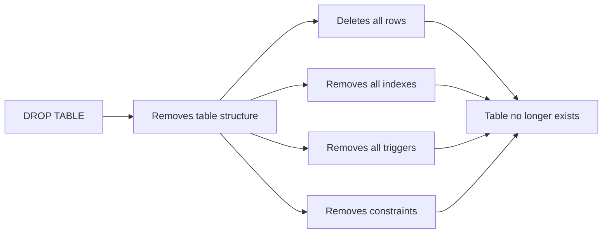
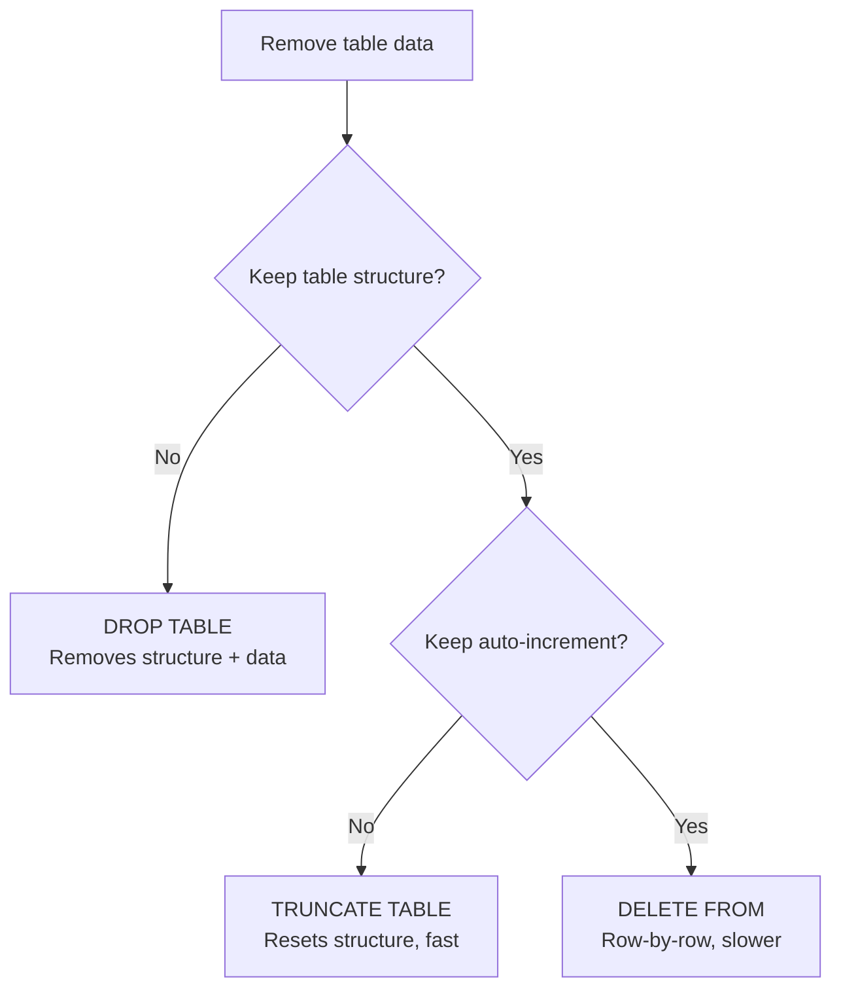

# How to Drop a Table in MySQL

Author: [nawazdhandala](https://www.github.com/nawazdhandala)

Tags: MySQL, SQL, DDL, Table, Database

Description: Learn how to drop tables in MySQL using DROP TABLE, handle foreign key constraints, use IF EXISTS safely, and drop multiple tables in a single statement.

---

## What Is DROP TABLE

`DROP TABLE` permanently removes a table and all its data, indexes, triggers, and constraints from the database. The operation cannot be rolled back in MySQL (DDL statements cause an implicit commit).



## Syntax

```sql
DROP TABLE [IF EXISTS] table_name [, table_name2, ...]
    [RESTRICT | CASCADE];
```

## Basic DROP TABLE

```sql
DROP TABLE old_session_tokens;
```

If the table does not exist, MySQL returns an error:

```text
ERROR 1051 (42S02): Unknown table 'myapp.old_session_tokens'
```

## IF EXISTS: Safe Deletion

Use `IF EXISTS` in scripts and migrations to avoid errors when the table may or may not exist:

```sql
DROP TABLE IF EXISTS old_session_tokens;
```

If the table does not exist, MySQL issues a warning instead of an error, and execution continues.

```text
Query OK, 0 rows affected, 1 warning (0.00 sec)
Note: 1051 Unknown table 'myapp.old_session_tokens'
```

## Dropping Multiple Tables

You can drop several tables in one statement:

```sql
DROP TABLE IF EXISTS
    temp_import_data,
    staging_orders,
    legacy_users;
```

All listed tables are dropped atomically in one DDL statement.

## Checking Before Drop

```sql
-- Verify the table exists before dropping
SHOW TABLES LIKE 'old_%';
```

```text
+---------------------+
| Tables_in_myapp (old_%) |
+---------------------+
| old_session_tokens  |
| old_audit_log       |
+---------------------+
```

```sql
DROP TABLE IF EXISTS old_session_tokens, old_audit_log;
```

## Dropping Tables with Foreign Keys

If another table has a foreign key referencing the table you want to drop, MySQL will raise an error:

```sql
CREATE TABLE departments (
    id   INT UNSIGNED AUTO_INCREMENT PRIMARY KEY,
    name VARCHAR(100) NOT NULL
);

CREATE TABLE employees (
    id            INT UNSIGNED AUTO_INCREMENT PRIMARY KEY,
    department_id INT UNSIGNED NOT NULL,
    FOREIGN KEY (department_id) REFERENCES departments (id)
);

-- Attempting to drop the referenced table
DROP TABLE departments;
-- ERROR 3730 (HY000): Cannot drop table 'departments' referenced by
-- a foreign key constraint 'employees_ibfk_1' on table 'employees'
```

### Solution 1: Drop the referencing table first

```sql
DROP TABLE employees;
DROP TABLE departments;
```

### Solution 2: Temporarily disable foreign key checks

```sql
SET FOREIGN_KEY_CHECKS = 0;
DROP TABLE departments;
SET FOREIGN_KEY_CHECKS = 1;
```

Use this approach cautiously; it leaves orphaned rows in `employees`.

### Solution 3: Drop both tables together

```sql
DROP TABLE IF EXISTS employees, departments;
```

MySQL resolves dependencies automatically when multiple tables are listed in one `DROP TABLE` statement.

## Dropping a Table in Another Database

```sql
DROP TABLE IF EXISTS myapp_backup.old_users;
```

## Comparing DROP TABLE, TRUNCATE TABLE, and DELETE



| Operation | Removes Structure | Removes Data | Resets AUTO_INCREMENT | Transactional |
|---|---|---|---|---|
| `DROP TABLE` | Yes | Yes | N/A | No (DDL) |
| `TRUNCATE TABLE` | No | Yes | Yes | No (DDL) |
| `DELETE FROM` | No | Yes (all rows) | No | Yes |

## Checking Dependencies Before Drop

```sql
-- Find tables referencing a table via foreign keys
SELECT constraint_name,
       table_name AS referencing_table,
       column_name,
       referenced_table_name,
       referenced_column_name
FROM information_schema.key_column_usage
WHERE referenced_table_schema = DATABASE()
  AND referenced_table_name = 'departments';
```

```text
+---------------------+-------------------+-------------+-----------------------+------------------------+
| constraint_name     | referencing_table | column_name | referenced_table_name | referenced_column_name |
+---------------------+-------------------+-------------+-----------------------+------------------------+
| employees_ibfk_1    | employees         | department_id | departments          | id                     |
+---------------------+-------------------+-------------+-----------------------+------------------------+
```

## DROP TABLE in a Migration Script

```sql
-- Migration: remove deprecated tables
START TRANSACTION;

-- Disable foreign key checks for the duration of migration
SET FOREIGN_KEY_CHECKS = 0;

DROP TABLE IF EXISTS legacy_user_tokens;
DROP TABLE IF EXISTS legacy_sessions;
DROP TABLE IF EXISTS cache_invalidation_log;

SET FOREIGN_KEY_CHECKS = 1;

COMMIT;
```

Note: Although DDL in MySQL is non-transactional, wrapping in a transaction is still common practice for organizing migration steps.

## Best Practices

- Always use `IF EXISTS` in migration scripts to make them idempotent.
- Check for foreign key dependencies with `information_schema.key_column_usage` before dropping a table.
- Drop the referencing (child) table before the referenced (parent) table, or drop both in one statement.
- Do not rely on `SET FOREIGN_KEY_CHECKS = 0` in production unless you are certain no orphaned rows will result.
- Make a backup before running `DROP TABLE` on production data.
- Prefer renaming a table (`RENAME TABLE foo TO foo_deprecated`) as a reversible intermediate step before the final drop.

## Summary

`DROP TABLE` permanently removes a table and all its contents. Use `IF EXISTS` to avoid errors in scripts when the table may not exist. Dropping multiple tables in a single statement resolves foreign key dependency ordering automatically. Always check for referencing foreign keys before dropping a parent table. Unlike `DELETE`, `DROP TABLE` cannot be rolled back, so take a backup first in production environments.
