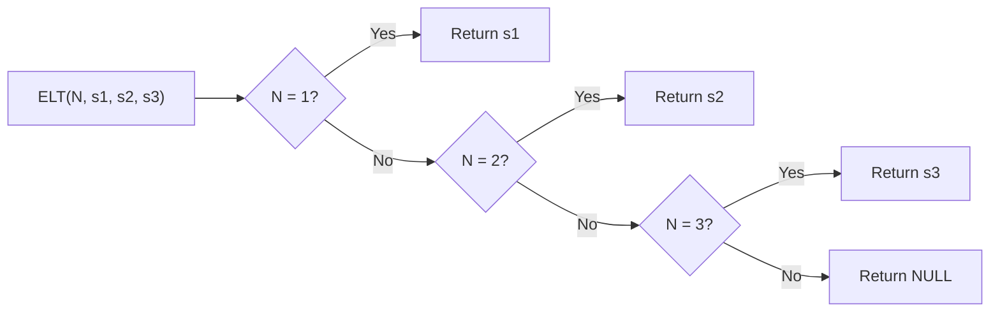

# How to Use ELT() Function in MySQL

Author: [nawazdhandala](https://www.github.com/nawazdhandala)

Tags: MySQL, SQL, String Function, Database

Description: Learn how to use the MySQL ELT() function to retrieve a string from a list by index position, and how it pairs with FIELD() for label lookups.

---

## What Is the ELT() Function?

`ELT()` (Element) returns the string at position `N` from a list of string arguments. It is the inverse of `FIELD()`: where `FIELD()` tells you the index of a value, `ELT()` tells you the value at a given index.

**Syntax:**

```sql
ELT(N, str1, str2, str3, ...)
```

- Returns `str1` when `N = 1`, `str2` when `N = 2`, and so on.
- Returns `NULL` if `N` is `0`, negative, or greater than the number of strings provided.

---

## Basic Examples

```sql
SELECT ELT(1, 'apple', 'banana', 'cherry');
-- Returns: apple

SELECT ELT(3, 'red', 'green', 'blue');
-- Returns: blue

SELECT ELT(0, 'a', 'b', 'c');
-- Returns: NULL

SELECT ELT(10, 'x', 'y', 'z');
-- Returns: NULL
```

---

## NULL Handling

```sql
SELECT ELT(NULL, 'a', 'b', 'c');
-- Returns: NULL

SELECT ELT(2, NULL, 'b', 'c');
-- Returns: b  (NULL is a valid placeholder in the list)
```

---

## How ELT() Works



---

## Using ELT() as a Lookup Table

A common use case is mapping stored numeric codes to human-readable labels.

```sql
CREATE TABLE orders (
    id INT AUTO_INCREMENT PRIMARY KEY,
    customer VARCHAR(100),
    status_code INT
);

INSERT INTO orders (customer, status_code) VALUES
('Alice', 1),
('Bob', 3),
('Carol', 2),
('Dave', 4);

-- Translate numeric codes to labels
SELECT
    customer,
    status_code,
    ELT(status_code, 'Pending', 'Processing', 'Shipped', 'Delivered') AS status_label
FROM orders;
```

Result:

| customer | status_code | status_label |
|----------|-------------|--------------|
| Alice    | 1           | Pending      |
| Bob      | 3           | Shipped      |
| Carol    | 2           | Processing   |
| Dave     | 4           | Delivered    |

---

## ELT() Combined with FIELD()

`ELT()` and `FIELD()` are natural complements. Use `FIELD()` to find an index and `ELT()` to translate it back.

```sql
-- Find the position of 'Shipped', then retrieve the same element
SELECT ELT(FIELD('Shipped', 'Pending', 'Processing', 'Shipped', 'Delivered'),
           'Pending', 'Processing', 'Shipped', 'Delivered') AS result;
-- Returns: Shipped
```

This pattern is useful when remapping values dynamically.

---

## Using ELT() with Column Values

```sql
CREATE TABLE products (
    id INT AUTO_INCREMENT PRIMARY KEY,
    name VARCHAR(100),
    category_id INT
);

INSERT INTO products (name, category_id) VALUES
('Widget', 2),
('Gadget', 1),
('Doohickey', 3),
('Thingamajig', 2);

SELECT
    name,
    ELT(category_id, 'Electronics', 'Hardware', 'Software') AS category
FROM products;
```

---

## Using ELT() for Day and Month Names

Although MySQL has built-in `DAYNAME()` and `MONTHNAME()`, `ELT()` can provide custom translations or abbreviations.

```sql
-- Custom abbreviated weekday names (1 = Sunday in MySQL's DAYOFWEEK)
SELECT
    order_date,
    ELT(DAYOFWEEK(order_date), 'Sun', 'Mon', 'Tue', 'Wed', 'Thu', 'Fri', 'Sat') AS day_abbr
FROM orders;
```

---

## ELT() in UPDATE Statements

```sql
-- Promote all status_code 1 to 2 and relabel
UPDATE orders
SET status_code = status_code + 1
WHERE status_code = 1;

SELECT customer, ELT(status_code, 'Pending', 'Processing', 'Shipped', 'Delivered') AS status
FROM orders;
```

---

## Performance Notes

- `ELT()` evaluates its argument list at parse time, so the list is fixed per query.
- For dynamic label sets (e.g., stored in a reference table), a `JOIN` or `CASE` expression is more maintainable.
- `ELT()` is best suited for small, static enumerations.

```mermaid
flowchart TD
    A[Query uses ELT(column, ...)] --> B[MySQL reads column value N per row]
    B --> C{N in valid range?}
    C -- Yes --> D[Return string at position N]
    C -- No --> E[Return NULL]
```

---

## Differences: ELT() vs CASE vs FIELD()

| Approach     | Best For                                              |
|--------------|-------------------------------------------------------|
| `ELT()`      | Translating a numeric index to a static string list   |
| `CASE WHEN`  | Complex conditional logic with arbitrary conditions   |
| `FIELD()`    | Finding the numeric index of a string in a list       |

```sql
-- ELT approach
SELECT ELT(2, 'Low', 'Medium', 'High');   -- Medium

-- CASE approach
SELECT CASE 2
    WHEN 1 THEN 'Low'
    WHEN 2 THEN 'Medium'
    WHEN 3 THEN 'High'
END;                                       -- Medium
```

---

## Summary

`ELT()` provides a compact way to convert a numeric index into a corresponding string from a predefined list. It works well for translating stored integer codes into readable labels within a `SELECT` statement, and pairs naturally with `FIELD()` when you need bidirectional index-to-value lookups. For larger or dynamic label sets, prefer a reference table join for maintainability.
