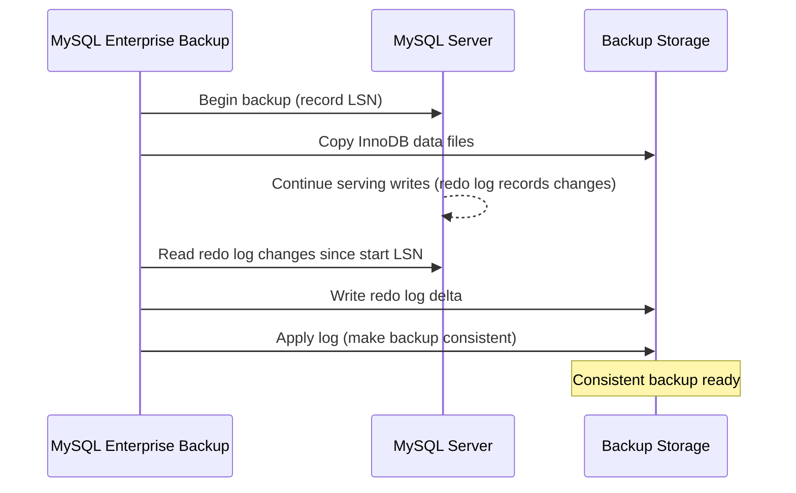

# How to Use MySQL Enterprise Backup for Hot Backups

Author: [nawazdhandala](https://www.github.com/nawazdhandala)

Tags: MySQL, Backup, Enterprise, Hot Backup, InnoDB

Description: Learn how to use MySQL Enterprise Backup (MEB) to perform online hot backups of MySQL databases without downtime, including full, incremental, and compressed backups.

---

## How MySQL Enterprise Backup Works

MySQL Enterprise Backup (MEB) is a commercial backup tool included with MySQL Enterprise Edition. It performs physical (file-level) hot backups by copying the InnoDB data files while the server is running. Unlike `mysqldump`, MEB does not block writes during the backup.

The backup process works in two phases:
1. **Data copy phase** - copies InnoDB tablespace files and other data files
2. **Apply log phase** - applies InnoDB redo log changes made during the copy to produce a consistent backup



## Prerequisites

MySQL Enterprise Backup requires:
- MySQL Enterprise Edition subscription
- MEB binary downloaded from My Oracle Support (MOS)

Install MEB:

```bash
# Extract the MEB package
tar -xzf meb-8.0.32-linux-glibc2.17-x86-64bit.tar.gz -C /opt/
ln -s /opt/meb-8.0.32-linux-glibc2.17-x86-64bit/bin/mysqlbackup /usr/local/bin/mysqlbackup
```

Create a backup user in MySQL with the required privileges:

```sql
CREATE USER 'meb_user'@'localhost' IDENTIFIED BY 'MebPass123!';
GRANT SELECT, RELOAD, REPLICATION CLIENT, SUPER,
      BACKUP_ADMIN, INNODB_REDO_LOG_ARCHIVE
      ON *.* TO 'meb_user'@'localhost';
FLUSH PRIVILEGES;
```

## Full Backup

Perform a full online backup to the specified directory:

```bash
mysqlbackup \
    --host=localhost \
    --user=meb_user \
    --password=MebPass123! \
    --backup-dir=/backups/mysql/full_$(date +%Y%m%d) \
    backup-and-apply-log
```

The `backup-and-apply-log` command runs both phases in one step, producing a consistent, ready-to-restore backup directory.

## Incremental Backup

After a full backup, subsequent incremental backups only copy data that changed since the last backup. This is much faster and uses less storage.

### Step 1 - First Full Backup

```bash
mysqlbackup \
    --host=localhost \
    --user=meb_user \
    --password=MebPass123! \
    --backup-dir=/backups/mysql/full_20260331 \
    backup-and-apply-log
```

### Step 2 - First Incremental Backup

```bash
mysqlbackup \
    --host=localhost \
    --user=meb_user \
    --password=MebPass123! \
    --incremental \
    --incremental-base=dir:/backups/mysql/full_20260331 \
    --backup-dir=/backups/mysql/incr_20260401 \
    backup
```

### Step 3 - Apply the Incremental to the Full Backup

Before restore, apply incremental backups to the full backup directory:

```bash
# Apply first incremental
mysqlbackup \
    --incremental \
    --incremental-backup-dir=/backups/mysql/incr_20260401 \
    --backup-dir=/backups/mysql/full_20260331 \
    apply-incremental-backup
```

## Compressed Backup

Compress the backup to save disk space:

```bash
mysqlbackup \
    --host=localhost \
    --user=meb_user \
    --password=MebPass123! \
    --compress \
    --backup-dir=/backups/mysql/compressed_$(date +%Y%m%d) \
    backup-and-apply-log
```

## Encrypted Backup

Encrypt the backup with AES:

```bash
mysqlbackup \
    --host=localhost \
    --user=meb_user \
    --password=MebPass123! \
    --encrypt \
    --key=0123456789ABCDEF0123456789ABCDEF \
    --backup-dir=/backups/mysql/encrypted_$(date +%Y%m%d) \
    backup-and-apply-log
```

## Restoring a Backup

### Step 1 - Stop MySQL

```bash
sudo systemctl stop mysql
```

### Step 2 - Clear the Data Directory

```bash
sudo rm -rf /var/lib/mysql/*
```

### Step 3 - Restore

```bash
mysqlbackup \
    --defaults-file=/etc/mysql/mysql.conf.d/mysqld.cnf \
    --backup-dir=/backups/mysql/full_20260331 \
    --datadir=/var/lib/mysql \
    copy-back
```

### Step 4 - Fix Permissions and Start MySQL

```bash
sudo chown -R mysql:mysql /var/lib/mysql
sudo systemctl start mysql
```

## Backup Verification

Validate a backup without restoring it:

```bash
mysqlbackup \
    --backup-dir=/backups/mysql/full_20260331 \
    validate
```

## Automating with a Script

```bash
#!/bin/bash
BACKUP_BASE="/backups/mysql"
DATE=$(date +%Y%m%d_%H%M%S)
FULL_DIR="$BACKUP_BASE/full_$DATE"

mysqlbackup \
    --host=localhost \
    --user=meb_user \
    --password=MebPass123! \
    --compress \
    --backup-dir="$FULL_DIR" \
    backup-and-apply-log

if [ $? -eq 0 ]; then
    echo "Backup succeeded: $FULL_DIR"
else
    echo "Backup FAILED" >&2
    exit 1
fi

# Retain only last 7 full backups
ls -dt "$BACKUP_BASE"/full_* | tail -n +8 | xargs rm -rf
```

## Best Practices

- Use `backup-and-apply-log` for immediate consistency; use separate `backup` and `apply-log` for speed-sensitive windows.
- Run incremental backups hourly or every few hours between daily full backups.
- Use `--compress` to reduce backup size by 60-80% for typical datasets.
- Test restores quarterly - validate the entire restore process, not just the backup tool output.
- Store backups on remote storage; replicate to at least one offsite location.
- Encrypt backups containing sensitive data using `--encrypt`.

## Summary

MySQL Enterprise Backup provides fast, online physical backups that do not block database writes. The `backup-and-apply-log` command performs a consistent full backup in one step. Incremental backups reduce backup windows and storage. Before restoring, apply any incremental backups to the full backup directory, then use `copy-back` to restore data files to the MySQL data directory.
