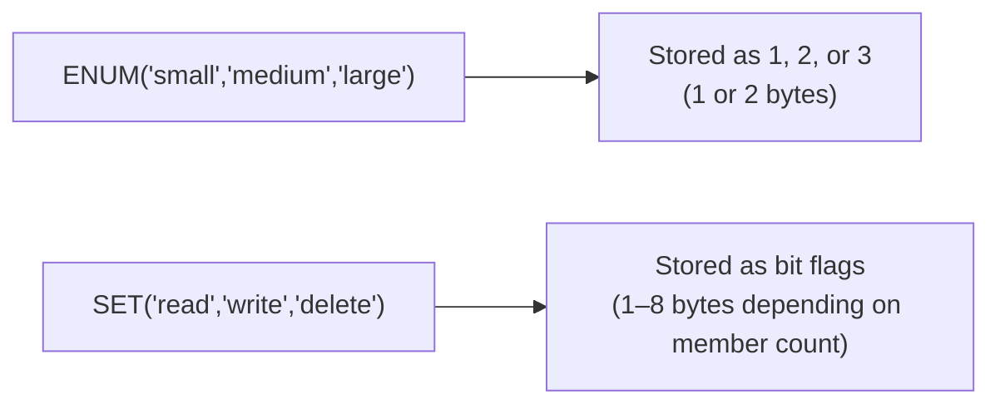

# How to Use ENUM and SET Data Types in MySQL

Author: [nawazdhandala](https://www.github.com/nawazdhandala)

Tags: MySQL, SQL, DDL, ENUM, SET, Data Type, Schema

Description: Use MySQL ENUM for single-choice columns and SET for multi-choice columns, understand storage, sorting, and the trade-offs of each type.

---

## How It Works

`ENUM` and `SET` are string types that restrict a column to a predefined list of values. MySQL stores them internally as integers mapped to the list position, which makes storage compact and comparisons fast.



## ENUM - Single Choice

An `ENUM` column accepts exactly one value from a predefined list.

### Syntax

```sql
column_name ENUM('value1', 'value2', ...) [NOT NULL] [DEFAULT 'value']
```

### Example - Order Status

```sql
CREATE TABLE orders (
    id         INT UNSIGNED AUTO_INCREMENT PRIMARY KEY,
    user_id    INT UNSIGNED NOT NULL,
    status     ENUM('pending', 'processing', 'shipped', 'delivered', 'cancelled')
                           NOT NULL DEFAULT 'pending',
    created_at DATETIME     NOT NULL DEFAULT CURRENT_TIMESTAMP
);

INSERT INTO orders (user_id, status) VALUES
    (1, 'pending'),
    (2, 'shipped'),
    (3, 'delivered');

SELECT id, user_id, status FROM orders;
```

```text
+----+---------+-----------+
| id | user_id | status    |
+----+---------+-----------+
|  1 |       1 | pending   |
|  2 |       2 | shipped   |
|  3 |       3 | delivered |
+----+---------+-----------+
```

### Inserting an Invalid ENUM Value

In strict mode (the default in MySQL 5.7+), inserting a value not in the list raises an error.

```sql
INSERT INTO orders (user_id, status) VALUES (4, 'refunded');
```

```text
ERROR 1265 (01000): Data truncated for column 'status' at row 1
```

### ENUM Sorting

ENUM values sort by their internal numeric index, not alphabetically.

```sql
SELECT status, COUNT(*) AS cnt
FROM orders
GROUP BY status
ORDER BY status;
```

The sort order follows the definition order: `pending`, `processing`, `shipped`, `delivered`, `cancelled`.

### ENUM Storage

- 1 to 255 members: 1 byte
- 256 to 65,535 members: 2 bytes

## SET - Multiple Choices

A `SET` column stores zero or more values from a predefined list. Multiple values are stored as a comma-separated string but internally represented as a bitmap.

### Syntax

```sql
column_name SET('value1', 'value2', ...) [NOT NULL] [DEFAULT '']
```

### Example - User Permissions

```sql
CREATE TABLE user_roles (
    id          INT UNSIGNED AUTO_INCREMENT PRIMARY KEY,
    username    VARCHAR(50)  NOT NULL,
    permissions SET('read', 'write', 'delete', 'admin')
                             NOT NULL DEFAULT 'read'
);

INSERT INTO user_roles (username, permissions) VALUES
    ('alice',  'read,write,delete'),
    ('bob',    'read'),
    ('carol',  'read,write,delete,admin');

SELECT username, permissions FROM user_roles;
```

```text
+----------+---------------------------+
| username | permissions               |
+----------+---------------------------+
| alice    | read,write,delete         |
| bob      | read                      |
| carol    | read,write,delete,admin   |
+----------+---------------------------+
```

### Finding Rows with a Specific SET Member

Use `FIND_IN_SET()` or bitwise operations to query SET columns.

```sql
-- Find users with 'admin' permission
SELECT username FROM user_roles
WHERE FIND_IN_SET('admin', permissions) > 0;
```

```text
+----------+
| username |
+----------+
| carol    |
+----------+
```

```sql
-- Find users with both 'write' and 'delete' permissions
SELECT username FROM user_roles
WHERE permissions & (1 << 1) AND permissions & (1 << 2);
```

### SET Storage

SET storage depends on the number of members.

```text
 1-8  members: 1 byte
 9-16 members: 2 bytes
17-24 members: 3 bytes
25-32 members: 4 bytes
33-64 members: 8 bytes
```

Maximum of 64 members per SET column.

## Modifying ENUM and SET Definitions

You can add new values to the end of the list with `ALTER TABLE`. Adding to the middle or removing values requires a full table rebuild.

```sql
-- Add a new status (appended to the end - fast, no table rebuild in MySQL 5.7+)
ALTER TABLE orders
    MODIFY COLUMN status
        ENUM('pending','processing','shipped','delivered','cancelled','refunded')
        NOT NULL DEFAULT 'pending';
```

## ENUM vs SET vs Lookup Table

| Criteria | ENUM | SET | Lookup Table |
|---|---|---|---|
| Single value only | Yes | No | Yes |
| Multiple values | No | Yes | Yes (junction table) |
| Add values without rebuild | End only | End only | Any time |
| Query with indexes | Yes | Limited | Full index support |
| Normalised | No | No | Yes |
| Best for | Stable short lists | Bitmask flags | Frequently changing lists |

## Best Practices

- Use `ENUM` for stable, mutually exclusive states (status, priority, direction).
- Use a lookup table instead of `ENUM` when the list of values changes frequently or is managed by users.
- Avoid removing values from an `ENUM` definition; mark them deprecated instead to avoid a full table rebuild.
- Do not use `SET` for more than 8-16 members; a junction table is cleaner and more queryable.
- Always set a sensible `DEFAULT` on `ENUM` columns so inserts without that column do not store an empty string.

## Summary

`ENUM` enforces a single-value constraint from a predefined list with compact 1-2 byte storage. `SET` allows multiple simultaneous values from a list, stored as a bitmap. Both are useful for stable, predefined categorical values but require an `ALTER TABLE` to change the member list. For frequently changing or user-managed lists, a normalised lookup table with a foreign key is the better long-term design.
