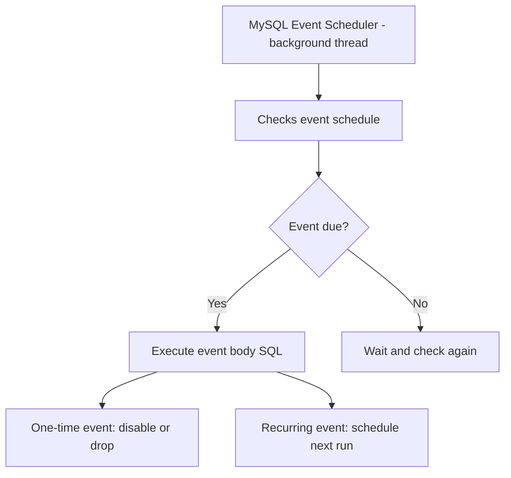

# How to Use MySQL Events (Scheduled Jobs)

Author: [nawazdhandala](https://www.github.com/nawazdhandala)

Tags: MySQL, SQL, Event, Scheduler, Scheduled Job, Database, Automation

Description: Learn how to create and manage MySQL events to schedule recurring SQL tasks like cleanup jobs, report generation, and data aggregation.

---

## How MySQL Events Work

MySQL Events (also called the Event Scheduler) allow you to schedule SQL statements to run automatically at a specific time or on a repeating schedule. Events are MySQL's built-in alternative to cron jobs for database-level scheduled tasks.



## Prerequisites: Enable the Event Scheduler

```sql
-- Check if scheduler is running
SHOW VARIABLES LIKE 'event_scheduler';

-- Enable it (runtime)
SET GLOBAL event_scheduler = ON;

-- Enable permanently in my.cnf
-- [mysqld]
-- event_scheduler = ON
```

## Syntax

```sql
-- One-time event
CREATE EVENT event_name
ON SCHEDULE AT 'YYYY-MM-DD HH:MM:SS'
DO SQL_statement;

-- Recurring event
CREATE EVENT event_name
ON SCHEDULE EVERY N {SECOND | MINUTE | HOUR | DAY | WEEK | MONTH}
[STARTS 'start_datetime']
[ENDS 'end_datetime']
DO SQL_statement;

-- With BEGIN/END block
CREATE EVENT event_name
ON SCHEDULE EVERY 1 DAY
DO BEGIN
    -- multiple SQL statements
END;
```

## Examples

### Setup: Create Sample Tables

```sql
CREATE TABLE user_sessions (
    id INT PRIMARY KEY AUTO_INCREMENT,
    user_id INT NOT NULL,
    session_token VARCHAR(64),
    created_at DATETIME DEFAULT CURRENT_TIMESTAMP,
    expires_at DATETIME
);

CREATE TABLE daily_sales_summary (
    summary_date DATE PRIMARY KEY,
    total_orders INT,
    total_revenue DECIMAL(12, 2),
    created_at DATETIME DEFAULT CURRENT_TIMESTAMP
);

CREATE TABLE orders (
    id INT PRIMARY KEY AUTO_INCREMENT,
    customer_id INT,
    amount DECIMAL(10, 2),
    order_date DATE DEFAULT (CURDATE())
);

CREATE TABLE event_log (
    id INT PRIMARY KEY AUTO_INCREMENT,
    event_name VARCHAR(100),
    run_at DATETIME DEFAULT CURRENT_TIMESTAMP,
    rows_affected INT,
    notes TEXT
);

INSERT INTO user_sessions (user_id, session_token, expires_at) VALUES
    (1, 'tok_abc123', NOW() - INTERVAL 2 HOUR),
    (2, 'tok_def456', NOW() + INTERVAL 1 HOUR),
    (3, 'tok_ghi789', NOW() - INTERVAL 1 DAY);

INSERT INTO orders (customer_id, amount, order_date) VALUES
    (1, 150.00, CURDATE()),
    (2, 220.00, CURDATE()),
    (3,  75.00, CURDATE() - INTERVAL 1 DAY);
```

### Event 1: Delete Expired Sessions Every Hour

```sql
DELIMITER $$

CREATE EVENT evt_cleanup_expired_sessions
ON SCHEDULE EVERY 1 HOUR
STARTS NOW()
DO BEGIN
    DELETE FROM user_sessions WHERE expires_at < NOW();
    INSERT INTO event_log (event_name, notes)
    VALUES ('cleanup_sessions', CONCAT(ROW_COUNT(), ' sessions deleted'));
END$$

DELIMITER ;
```

### Event 2: Daily Sales Summary at Midnight

```sql
DELIMITER $$

CREATE EVENT evt_daily_sales_summary
ON SCHEDULE EVERY 1 DAY
STARTS CONCAT(CURDATE() + INTERVAL 1 DAY, ' 00:05:00')
DO BEGIN
    INSERT INTO daily_sales_summary (summary_date, total_orders, total_revenue)
    SELECT
        order_date,
        COUNT(*),
        SUM(amount)
    FROM orders
    WHERE order_date = CURDATE() - INTERVAL 1 DAY
    ON DUPLICATE KEY UPDATE
        total_orders = VALUES(total_orders),
        total_revenue = VALUES(total_revenue);

    INSERT INTO event_log (event_name, notes)
    VALUES ('daily_sales_summary', CONCAT('Summarized orders for ', CURDATE() - INTERVAL 1 DAY));
END$$

DELIMITER ;
```

### Event 3: One-Time Event

Run a one-time data migration at a specific time.

```sql
CREATE EVENT evt_one_time_migration
ON SCHEDULE AT '2026-04-01 02:00:00'
ON COMPLETION NOT PRESERVE
DO UPDATE orders SET amount = ROUND(amount, 2) WHERE amount != ROUND(amount, 2);
```

`ON COMPLETION NOT PRESERVE` automatically drops the event after it runs (default behavior for one-time events). Use `ON COMPLETION PRESERVE` to keep it in the disabled state for auditing.

### Event 4: Weekly Archive

Archive orders older than 1 year to an archive table every Sunday at 3 AM.

```sql
CREATE TABLE orders_archive LIKE orders;

DELIMITER $$

CREATE EVENT evt_weekly_archive
ON SCHEDULE EVERY 1 WEEK
STARTS '2026-04-05 03:00:00'  -- first Sunday
DO BEGIN
    INSERT INTO orders_archive
    SELECT * FROM orders WHERE order_date < CURDATE() - INTERVAL 1 YEAR;

    DELETE FROM orders WHERE order_date < CURDATE() - INTERVAL 1 YEAR;

    INSERT INTO event_log (event_name, rows_affected)
    VALUES ('weekly_archive', ROW_COUNT());
END$$

DELIMITER ;
```

### Managing Events

```sql
-- List all events
SHOW EVENTS FROM your_database;

-- View event definition
SHOW CREATE EVENT evt_cleanup_expired_sessions;

-- Disable an event (keep it, just pause)
ALTER EVENT evt_daily_sales_summary DISABLE;

-- Re-enable an event
ALTER EVENT evt_daily_sales_summary ENABLE;

-- Modify an event schedule
ALTER EVENT evt_cleanup_expired_sessions
ON SCHEDULE EVERY 30 MINUTE;

-- Drop an event
DROP EVENT IF EXISTS evt_one_time_migration;
```

### Monitoring Event Execution

```sql
-- View recent event logs
SELECT * FROM event_log ORDER BY run_at DESC LIMIT 10;

-- Check event status in information_schema
SELECT event_name, status, last_executed, event_definition
FROM information_schema.EVENTS
WHERE event_schema = DATABASE();
```

## Best Practices

- Always enable the event scheduler in my.cnf for persistence across restarts.
- Use `BEGIN/END` blocks with event logging so you can audit when events ran and how many rows were affected.
- Design idempotent event bodies - if an event runs twice (e.g., after a failover), it should not double-process data. Use `ON DUPLICATE KEY UPDATE` or timestamp-based guards.
- Avoid long-running events that hold locks. Break large batch operations into smaller chunks.
- On replicated setups, events fire on each server independently. Use `log_slave_updates` or restrict events to the primary node to avoid duplication.
- Monitor `information_schema.EVENTS.LAST_EXECUTED` to confirm events are running as expected.

## Summary

MySQL Events provide a built-in scheduler for recurring database tasks. Enable the event scheduler with `SET GLOBAL event_scheduler = ON`, then create events using `CREATE EVENT` with EVERY or AT schedules. Events are ideal for session cleanup, data archival, summary table population, and other maintenance jobs. Always log event execution, design idempotent operations, and monitor `LAST_EXECUTED` to ensure events are running reliably.
