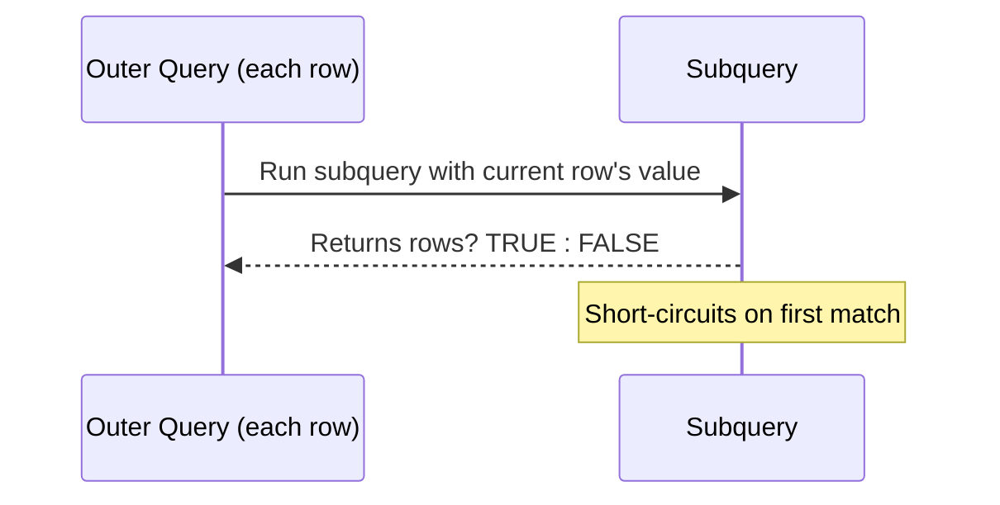

# How to Use EXISTS and NOT EXISTS in MySQL

Author: [nawazdhandala](https://www.github.com/nawazdhandala)

Tags: MySQL, SQL, Subquery, EXISTS, Database, Query

Description: Learn how to use EXISTS and NOT EXISTS in MySQL to efficiently check for the presence or absence of rows in a correlated subquery.

---

## How EXISTS and NOT EXISTS Work

`EXISTS` returns TRUE if the correlated subquery returns at least one row. `NOT EXISTS` returns TRUE if the subquery returns no rows. MySQL short-circuits evaluation as soon as one matching row is found, making these operators efficient for existence checks on large tables.



Unlike `IN`, which collects all values first, `EXISTS` stops at the first match per outer row.

## Syntax

```sql
-- EXISTS: keep outer rows where subquery finds at least one match
SELECT columns
FROM outer_table ot
WHERE EXISTS (
    SELECT 1
    FROM inner_table it
    WHERE it.column = ot.column
);

-- NOT EXISTS: keep outer rows where subquery finds NO match
SELECT columns
FROM outer_table ot
WHERE NOT EXISTS (
    SELECT 1
    FROM inner_table it
    WHERE it.column = ot.column
);
```

The inner SELECT typically uses `SELECT 1` because only the existence of rows matters, not the actual values.

## Examples

### Setup: Create Sample Tables

```sql
CREATE TABLE customers (
    id INT PRIMARY KEY AUTO_INCREMENT,
    name VARCHAR(100) NOT NULL,
    email VARCHAR(150)
);

CREATE TABLE orders (
    id INT PRIMARY KEY AUTO_INCREMENT,
    customer_id INT,
    amount DECIMAL(10, 2),
    status VARCHAR(20),
    order_date DATE
);

CREATE TABLE order_items (
    id INT PRIMARY KEY AUTO_INCREMENT,
    order_id INT,
    product_name VARCHAR(100),
    quantity INT
);

INSERT INTO customers (name, email) VALUES
    ('Alice', 'alice@example.com'),
    ('Bob', 'bob@example.com'),
    ('Carol', 'carol@example.com'),
    ('Dave', 'dave@example.com');

INSERT INTO orders (customer_id, amount, status, order_date) VALUES
    (1, 150.00, 'completed', '2026-01-10'),
    (1, 200.00, 'pending',   '2026-02-15'),
    (2, 75.00,  'completed', '2026-01-20'),
    (3, 300.00, 'cancelled', '2026-03-01');

INSERT INTO order_items (order_id, product_name, quantity) VALUES
    (1, 'Laptop Bag', 1),
    (1, 'USB Hub',    2),
    (2, 'Monitor',    1),
    (3, 'Keyboard',   1);
```

### EXISTS: Find Customers Who Have Placed at Least One Order

```sql
SELECT c.name, c.email
FROM customers c
WHERE EXISTS (
    SELECT 1
    FROM orders o
    WHERE o.customer_id = c.id
);
```

```text
+-------+-------------------+
| name  | email             |
+-------+-------------------+
| Alice | alice@example.com |
| Bob   | bob@example.com   |
| Carol | carol@example.com |
+-------+-------------------+
```

Dave has no orders and is excluded.

### NOT EXISTS: Find Customers Who Have Never Ordered

```sql
SELECT c.name, c.email
FROM customers c
WHERE NOT EXISTS (
    SELECT 1
    FROM orders o
    WHERE o.customer_id = c.id
);
```

```text
+------+------------------+
| name | email            |
+------+------------------+
| Dave | dave@example.com |
+------+------------------+
```

### EXISTS with Multiple Conditions

Find customers who have at least one completed order.

```sql
SELECT c.name
FROM customers c
WHERE EXISTS (
    SELECT 1
    FROM orders o
    WHERE o.customer_id = c.id
      AND o.status = 'completed'
);
```

```text
+-------+
| name  |
+-------+
| Alice |
| Bob   |
+-------+
```

### NOT EXISTS for Deletion - Delete Orders with No Items

Use NOT EXISTS in a DELETE to clean up orphaned records.

```sql
DELETE FROM orders
WHERE NOT EXISTS (
    SELECT 1
    FROM order_items oi
    WHERE oi.order_id = orders.id
);
```

### EXISTS vs IN: Performance Comparison

For large tables, EXISTS is usually faster than IN when the subquery matches many rows, because it short-circuits. IN must evaluate all matching values first.

```sql
-- Using IN (collects all customer_ids first)
SELECT name FROM customers
WHERE id IN (SELECT customer_id FROM orders);

-- Using EXISTS (short-circuits on first match per outer row)
SELECT name FROM customers c
WHERE EXISTS (SELECT 1 FROM orders o WHERE o.customer_id = c.id);
```

Both return the same result, but EXISTS scales better when the inner table is large.

### NOT EXISTS vs LEFT JOIN Anti-Join

`NOT EXISTS` and the LEFT JOIN anti-join pattern produce the same results. MySQL often executes them with similar plans, but the syntax differs:

```sql
-- NOT EXISTS approach
SELECT c.name FROM customers c
WHERE NOT EXISTS (SELECT 1 FROM orders o WHERE o.customer_id = c.id);

-- LEFT JOIN anti-join approach
SELECT c.name FROM customers c
LEFT JOIN orders o ON c.id = o.customer_id
WHERE o.id IS NULL;
```

## Best Practices

- Use `SELECT 1` (not `SELECT *`) in the subquery - only row existence matters, not data retrieval.
- Add the correlated condition inside the subquery's WHERE clause to keep it tightly scoped.
- Index the inner table's join column (e.g., `orders.customer_id`) for fast existence checks.
- Prefer EXISTS over IN when the inner query result set is large or unconstrained.
- Use NOT EXISTS for finding orphaned records as a safer alternative to NOT IN, which behaves unexpectedly when the inner result contains NULL values.
- NOT IN returns no rows at all when any value in the list is NULL; NOT EXISTS handles NULLs correctly.

## Summary

EXISTS and NOT EXISTS are efficient tools for conditional row filtering in MySQL. EXISTS returns TRUE as soon as the subquery finds a single match, making it faster than IN on large datasets. NOT EXISTS is the preferred way to find records with no related rows, as it handles NULLs correctly unlike NOT IN. Both operators are commonly used in SELECT, UPDATE, and DELETE statements to check for the presence or absence of related data.
