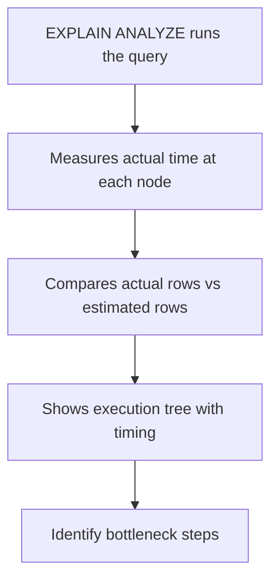

# How to Use EXPLAIN ANALYZE in MySQL 8.0+

Author: [nawazdhandala](https://www.github.com/nawazdhandala)

Tags: MySQL, SQL, EXPLAIN ANALYZE, Query Performance, MySQL 8.0, Database

Description: Learn how to use EXPLAIN ANALYZE in MySQL 8.0+ to measure actual query execution times and row counts, going beyond the estimates provided by EXPLAIN.

---

## How EXPLAIN ANALYZE Works

`EXPLAIN ANALYZE` actually executes the query and measures real execution time and row counts at each step, then displays the results alongside the optimizer's estimates. This lets you see where the optimizer's estimates were wrong (misestimates can lead to bad query plans) and which steps are taking the most time.

Unlike regular `EXPLAIN` (which shows estimates only), `EXPLAIN ANALYZE` runs the query - do not use it on INSERT, UPDATE, or DELETE in production without caution.



## Syntax

```sql
EXPLAIN ANALYZE SELECT ...;

-- Can also specify FORMAT=TREE (default for ANALYZE)
EXPLAIN FORMAT=TREE ANALYZE SELECT ...;
```

`EXPLAIN ANALYZE` is available in MySQL 8.0.18+.

## Reading the Output

The output is a tree showing each step with:

```text
-> Step description (actual time=start..end rows=N loops=L)
```

- `actual time=start..end` - time in milliseconds to first and last row
- `rows=N` - actual rows returned by this step
- `loops=L` - how many times this step was executed (e.g., once per outer join row)
- Estimated values appear in parentheses for comparison

## Examples

### Setup: Create Sample Tables

```sql
CREATE TABLE products (
    id INT PRIMARY KEY AUTO_INCREMENT,
    name VARCHAR(100) NOT NULL,
    category VARCHAR(50),
    price DECIMAL(10, 2),
    in_stock TINYINT(1) DEFAULT 1
);

CREATE TABLE order_items (
    id INT PRIMARY KEY AUTO_INCREMENT,
    product_id INT NOT NULL,
    quantity INT,
    sale_price DECIMAL(10, 2),
    order_date DATE
);

CREATE INDEX idx_category ON products (category);
CREATE INDEX idx_product_id ON order_items (product_id);

-- Insert test data
INSERT INTO products (name, category, price, in_stock)
SELECT
    CONCAT('Product ', n),
    ELT(1 + (n MOD 4), 'Electronics', 'Furniture', 'Clothing', 'Books'),
    ROUND(10 + RAND() * 990, 2),
    IF(n MOD 5 = 0, 0, 1)
FROM (
    SELECT (a.n + b.n * 10 + c.n * 100 + 1) AS n
    FROM (SELECT 0 n UNION SELECT 1 UNION SELECT 2 UNION SELECT 3 UNION SELECT 4
          UNION SELECT 5 UNION SELECT 6 UNION SELECT 7 UNION SELECT 8 UNION SELECT 9) a
    CROSS JOIN (SELECT 0 n UNION SELECT 1 UNION SELECT 2 UNION SELECT 3 UNION SELECT 4
               UNION SELECT 5 UNION SELECT 6 UNION SELECT 7 UNION SELECT 8 UNION SELECT 9) b
    CROSS JOIN (SELECT 0 n UNION SELECT 1 UNION SELECT 2) c
) nums
WHERE n <= 300;

INSERT INTO order_items (product_id, quantity, sale_price, order_date)
SELECT
    1 + (n MOD 300),
    1 + (n MOD 10),
    ROUND(10 + RAND() * 500, 2),
    DATE_SUB(CURDATE(), INTERVAL (n MOD 365) DAY)
FROM (
    SELECT (a.n + b.n * 10 + c.n * 100 + 1) AS n
    FROM (SELECT 0 n UNION SELECT 1 UNION SELECT 2 UNION SELECT 3 UNION SELECT 4
          UNION SELECT 5 UNION SELECT 6 UNION SELECT 7 UNION SELECT 8 UNION SELECT 9) a
    CROSS JOIN (SELECT 0 n UNION SELECT 1 UNION SELECT 2 UNION SELECT 3 UNION SELECT 4
               UNION SELECT 5 UNION SELECT 6 UNION SELECT 7 UNION SELECT 8 UNION SELECT 9) b
    CROSS JOIN (SELECT 0 n UNION SELECT 1 UNION SELECT 2 UNION SELECT 3 UNION SELECT 4
               UNION SELECT 5 UNION SELECT 6 UNION SELECT 7 UNION SELECT 8 UNION SELECT 9) c
) nums
WHERE n <= 1000;
```

### Running EXPLAIN ANALYZE on a Simple Query

```sql
EXPLAIN ANALYZE
SELECT id, name, price
FROM products
WHERE category = 'Electronics'
ORDER BY price DESC
LIMIT 10;
```

Example output:

```text
-> Limit: 10 row(s)  (actual time=0.412..0.413 rows=10 loops=1)
    -> Sort: products.price DESC, limit input to 10 row(s) per chunk  (actual time=0.410..0.411 rows=10 loops=1)
        -> Filter: (products.category = 'Electronics')  (actual time=0.075..0.363 rows=75 loops=1)
            -> Index lookup on products using idx_category (category='Electronics')  (actual time=0.073..0.348 rows=75 loops=1)
```

Reading bottom-up:
1. Index lookup finds 75 Electronics rows (fast, using idx_category)
2. Filter applies (all 75 pass the category filter)
3. Sort by price descending
4. Limit to 10 rows

### Spotting a Misestimate

When the optimizer's row estimate is far off from the actual count, the plan may be suboptimal.

```sql
EXPLAIN ANALYZE
SELECT p.name, SUM(oi.quantity * oi.sale_price) AS revenue
FROM products p
INNER JOIN order_items oi ON p.id = oi.product_id
WHERE p.category = 'Books'
GROUP BY p.id, p.name
ORDER BY revenue DESC;
```

```text
-> Sort: revenue DESC  (actual time=5.231..5.234 rows=75 loops=1)
    -> Table scan on <temporary>  (actual time=5.210..5.219 rows=75 loops=1)
        -> Aggregate using temporary table  (actual time=5.200..5.207 rows=75 loops=1)
            -> Nested loop inner join  (actual time=0.421..4.980 rows=250 loops=1)
                -> Index lookup on p using idx_category (category='Books')  (cost=27.00 rows=75) (actual time=0.085..0.188 rows=75 loops=1)
                -> Index lookup on oi using idx_product_id (product_id=p.id)  (cost=0.91 rows=3) (actual time=0.050..0.062 rows=3 loops=75)
```

The estimated rows=3 per product matches actual rows=3 - the optimizer has accurate statistics here.

### Finding Slow Steps

In real-world output, look for steps where `actual time` is high relative to other steps. The outermost `actual time` represents total query time.

```sql
EXPLAIN ANALYZE
SELECT p.category, AVG(p.price) AS avg_price
FROM products p
GROUP BY p.category;
```

```text
-> Table scan on <temporary>  (actual time=0.080..0.081 rows=4 loops=1)
    -> Aggregate using temporary table  (actual time=0.050..0.065 rows=4 loops=1)
        -> Table scan on products  (actual time=0.020..0.040 rows=300 loops=1)
```

Total time is sub-millisecond on 300 rows. On millions of rows, `Table scan on products` would grow significantly - that is the step to optimize.

## Best Practices

- Use EXPLAIN ANALYZE on staging environments with production-like data volumes for realistic results.
- Compare `rows=` (actual) vs the estimated rows from regular EXPLAIN - large differences indicate stale statistics or missing indexes. Run `ANALYZE TABLE table_name` to update statistics.
- Read the output bottom-up: the innermost (deepest) step executes first.
- `loops=N` multiplied by `actual time` gives the total time for that step - use this to find the most expensive operations.
- Do not run EXPLAIN ANALYZE on mutating statements (INSERT/UPDATE/DELETE) in production - the changes are actually applied.

## Summary

`EXPLAIN ANALYZE` in MySQL 8.0.18+ executes a query and provides actual timing and row counts alongside the optimizer's estimates. It is the most accurate way to diagnose query performance because it reveals exactly where time is spent, which steps are executing in unexpected ways, and whether the optimizer's row-count estimates are realistic. Use it to validate that indexes are working, find the bottleneck step in complex queries, and confirm that query optimizations actually improved performance.
