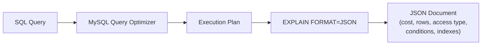

# How to Use MySQL EXPLAIN FORMAT=JSON for Advanced Analysis

Author: [nawazdhandala](https://www.github.com/nawazdhandala)

Tags: MySQL, EXPLAIN, Query Optimization, Performance, JSON

Description: Learn how to use MySQL EXPLAIN FORMAT=JSON to analyze query execution plans in detail, including cost estimates, row estimates, and access type information.

---

## How EXPLAIN FORMAT=JSON Works

MySQL's `EXPLAIN` statement shows the query execution plan. While the default tabular format is compact, `EXPLAIN FORMAT=JSON` provides a hierarchical, detailed JSON document with additional information including:

- Cost estimates for each operation
- Exact access types and index usage
- Attached conditions and WHERE clause predicates
- Materialization and subquery details
- Execution order of nested operations



## Basic Usage

```sql
EXPLAIN FORMAT=JSON
SELECT o.order_id, o.amount, c.name
FROM   orders o
JOIN   customers c ON o.customer_id = c.customer_id
WHERE  o.status = 'pending'
AND    o.created_at > '2026-01-01'\G
```

## Reading the JSON Output

The output is a nested JSON document. Here is an annotated example:

```json
{
  "query_block": {
    "select_id": 1,
    "cost_info": {
      "query_cost": "124.50"      /* total estimated cost for the query */
    },
    "nested_loop": [
      {
        "table": {
          "table_name": "o",
          "access_type": "ref",   /* index lookup, not full scan */
          "possible_keys": ["idx_status_created", "idx_customer_id"],
          "key": "idx_status_created",
          "key_length": "514",
          "ref": ["const", "const"],
          "rows_examined_per_scan": 42,
          "rows_produced_per_join": 42,
          "filtered": "100.00",
          "cost_info": {
            "read_cost": "4.20",
            "eval_cost": "4.20",
            "prefix_cost": "8.40",
            "data_read_per_join": "50K"
          },
          "used_columns": ["order_id", "customer_id", "amount", "status", "created_at"],
          "attached_condition": "(`o`.`created_at` > '2026-01-01')"
        }
      },
      {
        "table": {
          "table_name": "c",
          "access_type": "eq_ref",  /* primary key lookup */
          "possible_keys": ["PRIMARY"],
          "key": "PRIMARY",
          "key_length": "4",
          "ref": ["myapp_db.o.customer_id"],
          "rows_examined_per_scan": 1,
          "rows_produced_per_join": 42,
          "filtered": "100.00",
          "cost_info": {
            "read_cost": "42.00",
            "eval_cost": "4.20",
            "prefix_cost": "54.60",
            "data_read_per_join": "8K"
          }
        }
      }
    ]
  }
}
```

## Key Fields to Focus On

### access_type

The access type shows how MySQL reads rows from the table. From best to worst:

```text
const      - single row by primary key or unique index
eq_ref     - one row per row in the outer table (PK/unique index join)
ref        - multiple rows by non-unique index
range      - index range scan
index      - full index scan
ALL        - full table scan (usually bad)
```

### cost_info.query_cost

The total estimated cost. Lower is better. Compare plans by running EXPLAIN FORMAT=JSON on alternative query formulations:

```sql
-- Option 1
EXPLAIN FORMAT=JSON SELECT * FROM orders WHERE status = 'pending'\G

-- Option 2 (with different index hint)
EXPLAIN FORMAT=JSON SELECT * FROM orders USE INDEX (idx_created) WHERE status = 'pending'\G
```

### rows_examined_per_scan

How many rows MySQL estimates it needs to examine. Ideally close to `rows_produced_per_join` (meaning filtering is efficient).

### filtered

Percentage of rows remaining after applying the WHERE condition. `100.00` = no filtering needed (all examined rows match). Low values (e.g., `1.00`) indicate the index is doing most of the filtering work.

### attached_condition

Shows predicates applied after the index lookup. Conditions here are evaluated row-by-row after an index access:

```json
"attached_condition": "(`o`.`created_at` > '2026-01-01')"
```

This means `created_at` is filtered after `status` index lookup. A composite index `(status, created_at)` would eliminate this.

## Practical Analysis Examples

### Detecting Full Table Scans

```sql
EXPLAIN FORMAT=JSON
SELECT * FROM orders WHERE YEAR(created_at) = 2026\G
```

Look for:

```json
"access_type": "ALL",
"rows_examined_per_scan": 1500000
```

Fix: use a range condition instead of a function on the column:

```sql
EXPLAIN FORMAT=JSON
SELECT * FROM orders
WHERE created_at >= '2026-01-01' AND created_at < '2027-01-01'\G
```

Result:

```json
"access_type": "range",
"key": "idx_created_at",
"rows_examined_per_scan": 45000
```

### Analyzing Subqueries

```sql
EXPLAIN FORMAT=JSON
SELECT *
FROM   orders
WHERE  customer_id IN (
    SELECT customer_id FROM customers WHERE country = 'US'
)\G
```

The JSON output shows a `subquery` or `materialized_from_subquery` node, revealing whether MySQL materializes the subquery or converts it to a JOIN.

### Comparing JOIN Order

```sql
-- Check the join order MySQL chose
EXPLAIN FORMAT=JSON
SELECT o.*, c.name
FROM   orders o, customers c
WHERE  o.customer_id = c.customer_id
AND    c.country = 'US'\G
```

Look at the `nested_loop` array order - the first table is the driving table. If the order seems wrong, use `STRAIGHT_JOIN`:

```sql
EXPLAIN FORMAT=JSON
SELECT STRAIGHT_JOIN o.*, c.name
FROM   customers c, orders o
WHERE  o.customer_id = c.customer_id
AND    c.country = 'US'\G
```

## EXPLAIN ANALYZE (MySQL 8.0.18+)

`EXPLAIN ANALYZE` actually executes the query and shows actual vs. estimated row counts:

```sql
EXPLAIN ANALYZE
SELECT o.order_id, c.name
FROM   orders o
JOIN   customers c ON o.customer_id = c.customer_id
WHERE  o.status = 'pending'\G
```

Output includes:

```text
-> Nested loop inner join  (cost=126.40 rows=42) (actual time=0.234..8.543 rows=38 loops=1)
    -> Index lookup on o using idx_status (status='pending')  (cost=8.40 rows=42) (actual time=0.198..0.712 rows=38 loops=1)
    -> Single-row index lookup on c using PRIMARY (customer_id=o.customer_id)  (cost=0.25 rows=1) (actual time=0.020..0.020 rows=1 loops=38)
```

The `actual time` and `actual rows` reveal estimation errors. A large discrepancy between estimated and actual rows indicates stale statistics.

Update statistics:

```sql
ANALYZE TABLE orders;
ANALYZE TABLE customers;
```

## EXPLAIN FORMAT=TREE (MySQL 8.0.16+)

A human-readable tree format - easier to read than JSON for complex queries:

```sql
EXPLAIN FORMAT=TREE
SELECT o.order_id, c.name
FROM   orders o
JOIN   customers c ON o.customer_id = c.customer_id
WHERE  o.status = 'pending'\G
```

Output:

```text
-> Nested loop inner join  (cost=126.40 rows=42)
    -> Index lookup on o using idx_status (status='pending')  (cost=8.40 rows=42)
    -> Single-row index lookup on c using PRIMARY (customer_id=o.customer_id)  (cost=0.25 rows=1)
```

## Saving EXPLAIN Output for Comparison

Store EXPLAIN output to compare before and after adding an index:

```sql
-- Before: save to a table
CREATE TABLE explain_log (
    id         INT AUTO_INCREMENT PRIMARY KEY,
    label      VARCHAR(100),
    query_hash VARCHAR(64),
    explain_json JSON,
    captured_at DATETIME DEFAULT NOW()
);

INSERT INTO explain_log (label, query_hash, explain_json)
SELECT 'before_index', MD5('SELECT ...'),
       (SELECT JSON_OBJECT('plan', cast(explain_output as JSON)));
```

## Best Practices

- Prefer `EXPLAIN ANALYZE` in development/staging to see actual row counts vs. estimates.
- Use `EXPLAIN FORMAT=JSON` to extract `query_cost` for A/B comparison of query rewrites.
- Look for `access_type: ALL` on large tables as the primary indicator of a missing index.
- Check `attached_condition` to find predicates not covered by the selected index.
- Run `ANALYZE TABLE` when you see large discrepancies between estimated and actual rows.
- Use `EXPLAIN FORMAT=TREE` for a quick visual overview of nested joins and materializations.

## Summary

`EXPLAIN FORMAT=JSON` provides a comprehensive view of MySQL's query execution plan including cost estimates, access types, index usage, filtered percentages, and attached conditions for each table access. The hierarchical JSON structure makes it easy to identify full table scans (`access_type: ALL`), poor row estimation, and inefficient join orders. Combined with `EXPLAIN ANALYZE` in MySQL 8.0.18+, you can compare estimated vs. actual execution to diagnose stale statistics and plan regressions.
