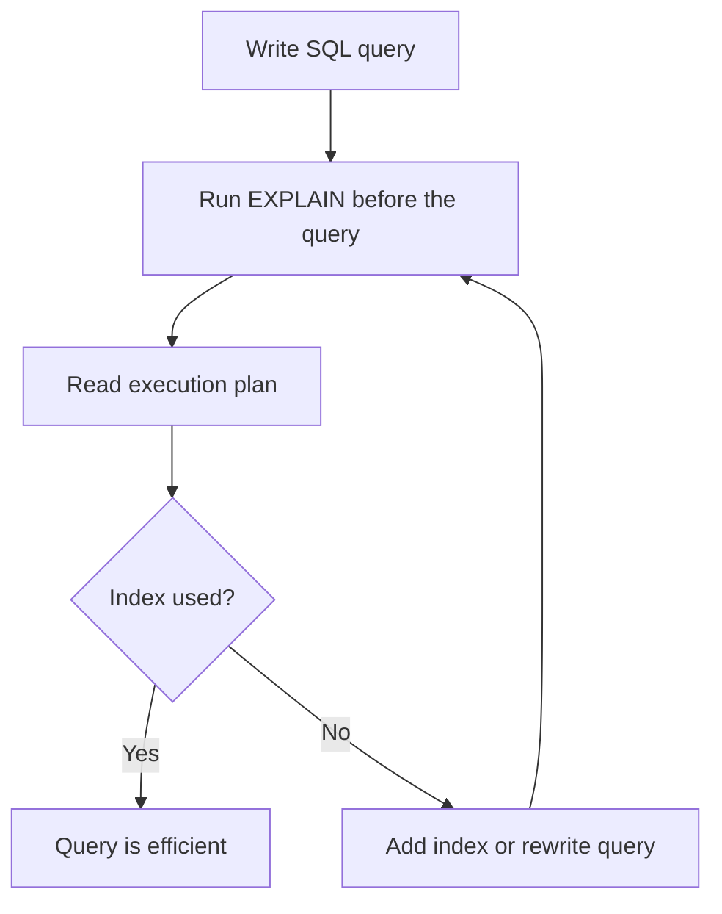

# How to Use EXPLAIN in MySQL to Analyze Query Performance

Author: [nawazdhandala](https://www.github.com/nawazdhandala)

Tags: MySQL, SQL, EXPLAIN, Query Performance, Index, Database

Description: Learn how to use EXPLAIN in MySQL to analyze query execution plans, identify missing indexes, and diagnose slow query performance.

---

## How EXPLAIN Works

`EXPLAIN` shows MySQL's query execution plan - how it intends to execute a SELECT, INSERT, UPDATE, or DELETE. It reveals which tables are accessed, which indexes are used, how many rows MySQL estimates it will examine, and what join type and extra operations are involved. This is the primary tool for diagnosing slow queries.



## Syntax

```sql
EXPLAIN SELECT ...;
EXPLAIN INSERT ...;
EXPLAIN UPDATE ...;
EXPLAIN DELETE ...;

-- JSON format for more details
EXPLAIN FORMAT=JSON SELECT ...;

-- Tree format (MySQL 8.0+)
EXPLAIN FORMAT=TREE SELECT ...;
```

## Key EXPLAIN Columns

| Column | Meaning |
|--------|---------|
| id | Step number. Higher = executed first when nested |
| select_type | SIMPLE, SUBQUERY, DERIVED, UNION, etc. |
| table | Table being accessed |
| type | Join type - ranges from best (system) to worst (ALL) |
| possible_keys | Indexes MySQL considered |
| key | Index MySQL actually chose |
| key_len | Bytes used from the index |
| ref | Column or constant used to match the index |
| rows | Estimated rows MySQL will examine |
| filtered | Estimated % of rows passing the WHERE filter |
| Extra | Additional info: Using index, Using filesort, etc. |

## The type Column: Join Types Ranked

```text
system    - single row table (best)
const     - single row match via primary key or unique index
eq_ref    - one row per combination from previous table
ref       - multiple rows match via non-unique index
range     - index range scan (WHERE col BETWEEN or col > value)
index     - full index scan (better than ALL but still slow)
ALL       - full table scan (worst - add an index)
```

## Examples

### Setup: Create Sample Tables

```sql
CREATE TABLE customers (
    id INT PRIMARY KEY AUTO_INCREMENT,
    name VARCHAR(100) NOT NULL,
    email VARCHAR(150) NOT NULL,
    country VARCHAR(50),
    created_at DATETIME DEFAULT CURRENT_TIMESTAMP
);

CREATE TABLE orders (
    id INT PRIMARY KEY AUTO_INCREMENT,
    customer_id INT NOT NULL,
    amount DECIMAL(10, 2),
    status VARCHAR(20),
    order_date DATE
);

-- No extra indexes yet
INSERT INTO customers (name, email, country) VALUES
    ('Alice', 'alice@example.com', 'US'),
    ('Bob',   'bob@example.com',   'UK'),
    ('Carol', 'carol@example.com', 'US');

INSERT INTO orders (customer_id, amount, status, order_date) VALUES
    (1, 150.00, 'completed', '2026-01-10'),
    (1, 200.00, 'pending',   '2026-02-01'),
    (2,  75.00, 'completed', '2026-01-15');
```

### EXPLAIN on a Full Table Scan

Without indexes, MySQL scans every row.

```sql
EXPLAIN SELECT id, name FROM customers WHERE country = 'US';
```

```text
+----+-------------+-----------+------+---------------+------+---------+------+------+-------------+
| id | select_type | table     | type | possible_keys | key  | key_len | ref  | rows | Extra       |
+----+-------------+-----------+------+---------------+------+---------+------+------+-------------+
| 1  | SIMPLE      | customers | ALL  | NULL          | NULL | NULL    | NULL | 3    | Using where |
+----+-------------+-----------+------+---------------+------+---------+------+------+-------------+
```

`type: ALL` and `key: NULL` = full table scan. Fix: add an index.

```sql
ALTER TABLE customers ADD INDEX idx_country (country);
EXPLAIN SELECT id, name FROM customers WHERE country = 'US';
```

```text
+----+...+------+-------------+---------+...+------+-------------+
|    |   | type | key         | key_len |   | rows | Extra       |
+----+...+------+-------------+---------+...+------+-------------+
| 1  |   | ref  | idx_country | 53      |   | 2    | Using where |
+----+...+------+-------------+---------+...+------+-------------+
```

`type: ref` - MySQL now uses the index, only examining 2 rows.

### EXPLAIN on a JOIN

```sql
EXPLAIN
SELECT c.name, o.amount, o.order_date
FROM customers c
INNER JOIN orders o ON c.id = o.customer_id
WHERE c.country = 'US';
```

```text
+----+...+-----------+------+--------------+-------------+...+------+...
|    |   | table     | type | possible_keys| key         |   | rows |
+----+...+-----------+------+--------------+-------------+...+------+...
| 1  |   | customers | ref  | PRIMARY,     | idx_country |   | 2    |
|    |   |           |      | idx_country  |             |   |      |
| 1  |   | orders    | ALL  | NULL         | NULL        |   | 3    |
+----+...+-----------+------+--------------+-------------+...+------+...
```

The orders table shows `type: ALL` because `customer_id` has no index. Fix:

```sql
ALTER TABLE orders ADD INDEX idx_customer_id (customer_id);
EXPLAIN
SELECT c.name, o.amount, o.order_date
FROM customers c
INNER JOIN orders o ON c.id = o.customer_id
WHERE c.country = 'US';
```

Now the orders table will show `type: ref` with `key: idx_customer_id`.

### EXPLAIN FORMAT=JSON

JSON format provides more details including cost estimates.

```sql
EXPLAIN FORMAT=JSON
SELECT * FROM customers WHERE country = 'US'\G
```

```text
{
  "query_block": {
    "select_id": 1,
    "cost_info": {
      "query_cost": "1.40"
    },
    "table": {
      "table_name": "customers",
      "access_type": "ref",
      "key": "idx_country",
      "rows_examined_per_scan": 2,
      "filtered": "100.00"
    }
  }
}
```

### Diagnosing Extra Column Warnings

The Extra column reveals important additional operations:

```text
Using where       - filtering applied after index lookup (normal)
Using index       - covering index used, no table row access needed
Using filesort    - MySQL sorts rows in memory/disk (no index for ORDER BY)
Using temporary   - MySQL created a temp table (usually for GROUP BY)
Using join buffer - no index on joined column, uses join buffer
```

Fix `Using filesort` by adding an index that covers the ORDER BY columns:

```sql
EXPLAIN SELECT id FROM orders WHERE customer_id = 1 ORDER BY order_date;
-- Extra: Using where; Using filesort

ALTER TABLE orders ADD INDEX idx_customer_date (customer_id, order_date);

EXPLAIN SELECT id FROM orders WHERE customer_id = 1 ORDER BY order_date;
-- Extra: Using index condition  (filesort gone)
```

## Best Practices

- Run EXPLAIN on every slow query before adding indexes - understand the plan first.
- Target `type: ALL` rows first - these are full table scans and usually indicate missing indexes.
- The `rows` column is an estimate; multiply all rows values in a multi-table EXPLAIN to estimate total work.
- Use `EXPLAIN FORMAT=JSON` for more detailed cost information in complex queries.
- Watch the Extra column for `Using filesort` and `Using temporary` - both indicate expensive operations.
- Use `SHOW WARNINGS` after EXPLAIN to see how MySQL rewrote the query internally.

## Summary

EXPLAIN is MySQL's primary tool for understanding query execution plans. It shows the join type, indexes used, estimated rows examined, and extra operations like filesort or temporary tables. The `type` column is the most important indicator: `ALL` means a full table scan (bad on large tables), while `const`, `ref`, and `range` mean index-based access (good). Always run EXPLAIN before and after adding indexes to confirm the optimization took effect.
