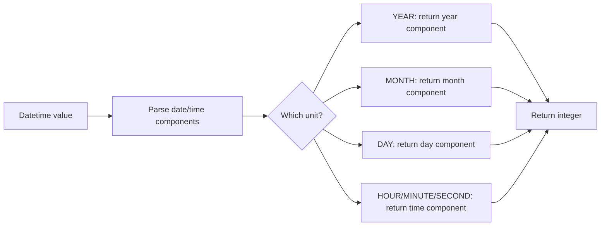

# How to Use EXTRACT() Function in MySQL

Author: [nawazdhandala](https://www.github.com/nawazdhandala)

Tags: MySQL, SQL, Date Function, Database

Description: Learn how to use MySQL EXTRACT() to pull specific date or time parts like year, month, day, hour, and minute from datetime values.

---

## What Is the EXTRACT() Function?

`EXTRACT()` retrieves a specific part of a date or datetime value, such as the year, month, day, hour, minute, second, or week. It returns an integer and follows the SQL standard syntax, making it portable across SQL databases.

**Syntax:**

```sql
EXTRACT(unit FROM date)
```

- `unit` - the date/time component to extract.
- `date` - a `DATE`, `DATETIME`, `TIMESTAMP`, or `TIME` value.
- Returns an integer.
- Returns `NULL` if `date` is `NULL`.

---

## Supported Units

| Unit                | Example Result for '2026-03-15 14:30:45' |
|---------------------|------------------------------------------|
| `MICROSECOND`       | 0                                        |
| `SECOND`            | 45                                       |
| `MINUTE`            | 30                                       |
| `HOUR`              | 14                                       |
| `DAY`               | 15                                       |
| `WEEK`              | 10                                       |
| `MONTH`             | 3                                        |
| `QUARTER`           | 1                                        |
| `YEAR`              | 2026                                     |
| `SECOND_MICROSECOND`| 450000                                   |
| `MINUTE_MICROSECOND`| 3045000000                               |
| `MINUTE_SECOND`     | 3045                                     |
| `HOUR_MICROSECOND`  | 143045000000                             |
| `HOUR_SECOND`       | 143045                                   |
| `HOUR_MINUTE`       | 1430                                     |
| `DAY_MICROSECOND`   | 1514303045000000 (approx)               |
| `DAY_SECOND`        | 15143045 (approx)                        |
| `DAY_MINUTE`        | 151430                                   |
| `DAY_HOUR`          | 1514                                     |
| `YEAR_MONTH`        | 202603                                   |

---

## Basic Examples

```sql
SELECT EXTRACT(YEAR FROM '2026-03-15');
-- Returns: 2026

SELECT EXTRACT(MONTH FROM '2026-03-15');
-- Returns: 3

SELECT EXTRACT(DAY FROM '2026-03-15');
-- Returns: 15

SELECT EXTRACT(HOUR FROM '2026-03-15 14:30:45');
-- Returns: 14

SELECT EXTRACT(MINUTE FROM '2026-03-15 14:30:45');
-- Returns: 30

SELECT EXTRACT(SECOND FROM '2026-03-15 14:30:45');
-- Returns: 45

SELECT EXTRACT(QUARTER FROM '2026-03-15');
-- Returns: 1

SELECT EXTRACT(WEEK FROM '2026-03-15');
-- Returns: 10 (ISO week may vary)

SELECT EXTRACT(YEAR_MONTH FROM '2026-03-15');
-- Returns: 202603
```

---

## EXTRACT() vs Individual Date Functions

```sql
-- These are equivalent
SELECT EXTRACT(YEAR FROM NOW());
SELECT YEAR(NOW());

SELECT EXTRACT(MONTH FROM NOW());
SELECT MONTH(NOW());

SELECT EXTRACT(DAY FROM NOW());
SELECT DAY(NOW());
```

`EXTRACT()` is more SQL-standard compatible; the individual functions like `YEAR()`, `MONTH()`, `DAY()` are MySQL-specific shortcuts.

---

## How EXTRACT() Works



---

## Grouping Data by Date Parts

```sql
CREATE TABLE sales (
    id INT AUTO_INCREMENT PRIMARY KEY,
    sale_date DATETIME,
    amount DECIMAL(10, 2)
);

-- Monthly revenue summary
SELECT
    EXTRACT(YEAR FROM sale_date)  AS year,
    EXTRACT(MONTH FROM sale_date) AS month,
    SUM(amount) AS total_revenue
FROM sales
GROUP BY EXTRACT(YEAR FROM sale_date), EXTRACT(MONTH FROM sale_date)
ORDER BY year, month;
```

---

## Filtering by Date Components

```sql
-- Find all records from Q1 (January through March)
SELECT * FROM sales
WHERE EXTRACT(QUARTER FROM sale_date) = 1
  AND EXTRACT(YEAR FROM sale_date) = 2026;

-- Find records from business hours (9 AM to 5 PM)
SELECT * FROM sales
WHERE EXTRACT(HOUR FROM sale_date) BETWEEN 9 AND 17;

-- Find records from a specific week
SELECT * FROM events
WHERE EXTRACT(WEEK FROM event_date) = 10
  AND EXTRACT(YEAR FROM event_date) = 2026;
```

---

## Using EXTRACT() with TIME Values

```sql
SELECT EXTRACT(HOUR FROM '14:30:45');
-- Returns: 14

SELECT EXTRACT(MINUTE FROM '14:30:45');
-- Returns: 30

SELECT EXTRACT(SECOND FROM '14:30:45');
-- Returns: 45
```

---

## Quarterly Analysis

```sql
SELECT
    EXTRACT(YEAR FROM sale_date)    AS year,
    EXTRACT(QUARTER FROM sale_date) AS quarter,
    COUNT(*)                        AS total_orders,
    SUM(amount)                     AS revenue
FROM sales
GROUP BY
    EXTRACT(YEAR FROM sale_date),
    EXTRACT(QUARTER FROM sale_date)
ORDER BY year, quarter;
```

---

## EXTRACT() with NULL

```sql
SELECT EXTRACT(YEAR FROM NULL);
-- Returns: NULL
```

---

## YEAR_MONTH Combined Extraction

```sql
-- Group sales by year-month as a single integer
SELECT
    EXTRACT(YEAR_MONTH FROM sale_date) AS ym,
    SUM(amount) AS revenue
FROM sales
GROUP BY EXTRACT(YEAR_MONTH FROM sale_date)
ORDER BY ym;
```

Result example:

| ym     | revenue  |
|--------|----------|
| 202601 | 15000.00 |
| 202602 | 18500.00 |
| 202603 | 22000.00 |

---

## Index and Performance Considerations

Using `EXTRACT()` or any function on an indexed column in `WHERE` prevents MySQL from using that index. For date-range filtering, prefer direct comparisons:

```sql
-- Less efficient (cannot use index on sale_date)
SELECT * FROM sales WHERE EXTRACT(YEAR FROM sale_date) = 2026;

-- More efficient (can use index on sale_date)
SELECT * FROM sales WHERE sale_date >= '2026-01-01' AND sale_date < '2027-01-01';
```

---

## Summary

`EXTRACT()` is the SQL-standard function for pulling individual components from date and datetime values. It returns integer values for year, month, day, hour, minute, second, week, and quarter, among others. It works well for grouping and aggregation by time periods but should be avoided in `WHERE` clause predicates on indexed columns, where direct date range comparisons perform better. For MySQL-specific code, the equivalent shorthand functions `YEAR()`, `MONTH()`, `DAY()`, etc., are interchangeable.
