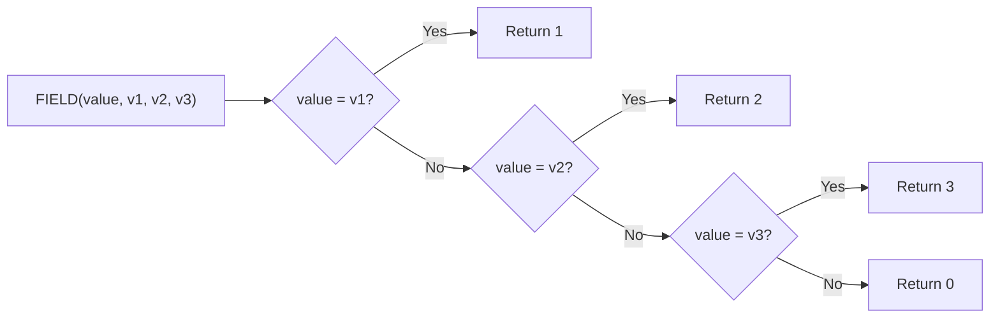

# How to Use FIELD() Function in MySQL

Author: [nawazdhandala](https://www.github.com/nawazdhandala)

Tags: MySQL, SQL, String Function, Database

Description: Learn how to use the MySQL FIELD() function to return the index position of a value in a list, enabling custom sort orders and conditional lookups.

---

## What Is the FIELD() Function?

The `FIELD()` function in MySQL returns the index (1-based) of the first argument in the subsequent list of arguments. If the value is not found, it returns `0`. It is commonly used to impose a custom sort order on query results.

**Syntax:**

```sql
FIELD(value, val1, val2, val3, ...)
```

- Returns `1` if `value = val1`, `2` if `value = val2`, and so on.
- Returns `0` if `value` does not match any item in the list.
- Comparison is case-insensitive for string types.

---

## Basic Usage

```sql
SELECT FIELD('b', 'a', 'b', 'c');
-- Returns: 2

SELECT FIELD('z', 'a', 'b', 'c');
-- Returns: 0

SELECT FIELD(3, 1, 2, 3, 4);
-- Returns: 3
```

---

## NULL Behavior

If the first argument is `NULL`, `FIELD()` returns `0` regardless of the list.

```sql
SELECT FIELD(NULL, 'a', 'b', 'c');
-- Returns: 0

SELECT FIELD('a', NULL, 'a', 'b');
-- Returns: 2
```

---

## Custom Sort Order with FIELD()

One of the most practical uses of `FIELD()` is ordering rows in a specific, non-alphabetical sequence using `ORDER BY`.

```sql
SELECT name, status
FROM orders
ORDER BY FIELD(status, 'urgent', 'pending', 'processing', 'shipped', 'delivered');
```

This query returns orders sorted by a custom priority sequence rather than alphabetical order.

### Example Table and Data

```sql
CREATE TABLE orders (
    id INT AUTO_INCREMENT PRIMARY KEY,
    name VARCHAR(100),
    status VARCHAR(50)
);

INSERT INTO orders (name, status) VALUES
('Order A', 'shipped'),
('Order B', 'urgent'),
('Order C', 'pending'),
('Order D', 'delivered'),
('Order E', 'processing');

SELECT name, status
FROM orders
ORDER BY FIELD(status, 'urgent', 'pending', 'processing', 'shipped', 'delivered');
```

Result:

| name    | status     |
|---------|------------|
| Order B | urgent     |
| Order C | pending    |
| Order E | processing |
| Order A | shipped    |
| Order D | delivered  |

---

## How FIELD() Works Internally



---

## Using FIELD() in WHERE Clauses

You can filter rows to only those matching a set of values at specific positions:

```sql
SELECT name, status
FROM orders
WHERE FIELD(status, 'urgent', 'pending') > 0;
```

This is equivalent to using `IN ('urgent', 'pending')` but also gives you the position.

---

## Using FIELD() in CASE Expressions

```sql
SELECT
    name,
    status,
    CASE FIELD(status, 'urgent', 'pending', 'processing', 'shipped', 'delivered')
        WHEN 1 THEN 'High Priority'
        WHEN 2 THEN 'Normal'
        WHEN 3 THEN 'In Progress'
        WHEN 4 THEN 'Dispatched'
        WHEN 5 THEN 'Done'
        ELSE 'Unknown'
    END AS priority_label
FROM orders;
```

---

## Combining FIELD() with GROUP BY

```sql
SELECT status, COUNT(*) AS total
FROM orders
GROUP BY status
ORDER BY FIELD(status, 'urgent', 'pending', 'processing', 'shipped', 'delivered');
```

---

## Performance Considerations

- `FIELD()` performs a linear scan of the list at runtime. For large datasets, this means MySQL evaluates the function per row.
- Avoid using `FIELD()` on columns with indexes if the list is long, as MySQL cannot use the index for the custom sort.
- For high-performance custom sorting, consider storing a numeric sort key in the table itself.

```mermaid
flowchart TD
    A[Query with ORDER BY FIELD()] --> B[MySQL evaluates FIELD per row]
    B --> C{Is column indexed?}
    C -- Yes --> D[Index not used for sort, filesort applied]
    C -- No --> E[Full table scan + filesort]
    D --> F[Result sorted in custom order]
    E --> F
```

---

## Practical Example: Priority Queue

```sql
CREATE TABLE support_tickets (
    id INT AUTO_INCREMENT PRIMARY KEY,
    subject VARCHAR(200),
    priority VARCHAR(20)
);

INSERT INTO support_tickets (subject, priority) VALUES
('Login broken', 'critical'),
('Typo in docs', 'low'),
('Performance slow', 'high'),
('Feature request', 'medium'),
('Crash on save', 'critical');

-- Retrieve tickets in priority order
SELECT id, subject, priority
FROM support_tickets
ORDER BY FIELD(priority, 'critical', 'high', 'medium', 'low'),
         id ASC;
```

---

## Differences: FIELD() vs IN() vs ELT()

| Function   | Purpose                                          |
|------------|--------------------------------------------------|
| `FIELD()`  | Returns index of a value in a list               |
| `IN()`     | Returns 1 or 0 whether value exists in a set     |
| `ELT()`    | Returns the string at a given index position     |

```sql
-- FIELD: find position of 'b' in list
SELECT FIELD('b', 'a', 'b', 'c');       -- 2

-- IN: does 'b' exist?
SELECT 'b' IN ('a', 'b', 'c');          -- 1

-- ELT: what is at position 2?
SELECT ELT(2, 'a', 'b', 'c');           -- 'b'
```

---

## Summary

The `FIELD()` function is a lightweight but powerful MySQL utility for locating a value's position within a list. Its most common use case is driving custom sort orders with `ORDER BY FIELD(...)`, which allows you to control result sequencing without adding extra columns or complex `CASE` statements. Keep in mind that `FIELD()` performs a per-row evaluation, so it works best on small to medium datasets or when combined with selective filtering.
