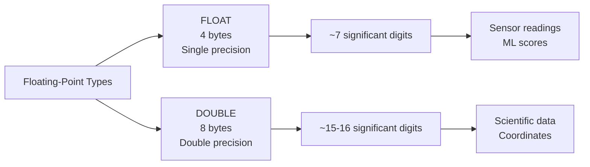
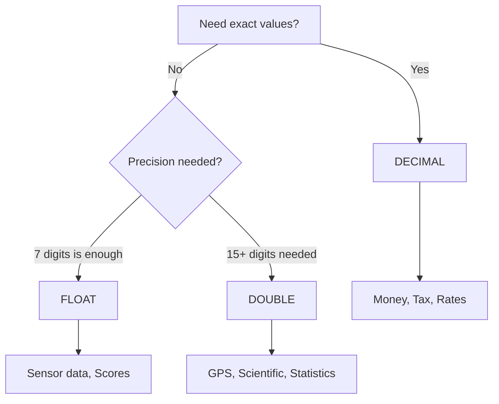

# How to Use FLOAT and DOUBLE Data Types in MySQL

Author: [nawazdhandala](https://www.github.com/nawazdhandala)

Tags: MySQL, SQL, Data Type, Float, Database

Description: Learn how to use FLOAT and DOUBLE data types in MySQL for approximate numeric storage, understand their precision limits, and know when to choose them over DECIMAL.

---

## What Are FLOAT and DOUBLE

`FLOAT` and `DOUBLE` are approximate-value floating-point types in MySQL based on the IEEE 754 standard. They trade exact precision for a much wider range of values, making them appropriate for scientific measurements, sensor readings, and machine-learning scores where a small rounding error is acceptable.



## Storage and Precision

| Type | Storage | Significant Digits | Range |
|---|---|---|---|
| `FLOAT` | 4 bytes | ~7 | -3.4E+38 to 3.4E+38 |
| `DOUBLE` | 8 bytes | ~15-16 | -1.8E+308 to 1.8E+308 |
| `DOUBLE PRECISION` | 8 bytes | ~15-16 | same as DOUBLE |
| `REAL` | 8 bytes | ~15-16 | same as DOUBLE (alias) |

## Syntax

```sql
column_name FLOAT [(precision)] [UNSIGNED] [NOT NULL] [DEFAULT value]
column_name DOUBLE [(precision, scale)] [UNSIGNED] [NOT NULL] [DEFAULT value]
```

In MySQL 8.0, specifying precision in parentheses for `FLOAT` or `DOUBLE` is **deprecated**. Use the bare type names `FLOAT` and `DOUBLE`.

## Basic Usage

```sql
CREATE TABLE sensor_readings (
    id            INT AUTO_INCREMENT PRIMARY KEY,
    device_id     INT NOT NULL,
    temperature   FLOAT NOT NULL,     -- Celsius, ~0.001 accuracy needed
    latitude      DOUBLE NOT NULL,    -- GPS, needs full 15-digit precision
    longitude     DOUBLE NOT NULL,
    signal_rssi   FLOAT NOT NULL,     -- dBm value, typically -120.0 to 0.0
    recorded_at   DATETIME NOT NULL DEFAULT CURRENT_TIMESTAMP
);

INSERT INTO sensor_readings (device_id, temperature, latitude, longitude, signal_rssi)
VALUES
(1, 23.5,   37.774929, -122.419418, -72.3),
(2, -5.1,   51.507351,   -0.127758, -85.0),
(3, 100.0,  35.689487,  139.691706, -60.1);
```

## The Imprecision Problem

```sql
-- FLOAT and DOUBLE are approximate
SELECT 0.1 + 0.2;
-- Result: 0.30000000000000004

-- Use DECIMAL when exact values are required
SELECT CAST(0.1 AS DECIMAL(5,2)) + CAST(0.2 AS DECIMAL(5,2));
-- Result: 0.30
```

## GPS Coordinate Storage

GPS coordinates require at least 6 decimal places for meter-level accuracy. `DOUBLE` provides ~15 significant digits which is sufficient.

```sql
CREATE TABLE locations (
    id          INT AUTO_INCREMENT PRIMARY KEY,
    name        VARCHAR(100) NOT NULL,
    latitude    DOUBLE NOT NULL,   -- range: -90 to 90
    longitude   DOUBLE NOT NULL    -- range: -180 to 180
);

INSERT INTO locations (name, latitude, longitude) VALUES
('Eiffel Tower',    48.858370,   2.294481),
('Statue of Liberty', 40.689247, -74.044502),
('Sydney Opera House', -33.856784, 151.215297);
```

## Machine Learning Scores

```sql
CREATE TABLE model_predictions (
    id             BIGINT UNSIGNED AUTO_INCREMENT PRIMARY KEY,
    model_version  VARCHAR(20) NOT NULL,
    input_hash     CHAR(64) NOT NULL,
    confidence     FLOAT NOT NULL,    -- 0.0 to 1.0
    score          DOUBLE NOT NULL,   -- raw model output
    predicted_at   DATETIME NOT NULL DEFAULT CURRENT_TIMESTAMP
);

INSERT INTO model_predictions (model_version, input_hash, confidence, score)
VALUES
('v1.2', 'abc123', 0.9823, 2.35719846132),
('v1.2', 'def456', 0.4102, -0.98342167823);
```

## Querying Floating-Point Columns

Because floating-point values are approximate, avoid equality comparisons. Use range comparisons instead.

```sql
-- Avoid (unreliable due to imprecision)
SELECT * FROM sensor_readings WHERE temperature = 23.5;

-- Prefer (range-based)
SELECT * FROM sensor_readings
WHERE temperature BETWEEN 23.4 AND 23.6;

-- Or round before comparing
SELECT * FROM sensor_readings
WHERE ROUND(temperature, 1) = 23.5;
```

## FLOAT vs DOUBLE vs DECIMAL Decision Guide



## Aggregate Functions with FLOAT and DOUBLE

```sql
SELECT
    device_id,
    AVG(temperature)  AS avg_temp,
    MIN(temperature)  AS min_temp,
    MAX(temperature)  AS max_temp,
    STDDEV(temperature) AS stddev_temp
FROM sensor_readings
GROUP BY device_id;
```

## UNSIGNED FLOAT and DOUBLE

```sql
CREATE TABLE physical_measurements (
    id          INT AUTO_INCREMENT PRIMARY KEY,
    mass_kg     FLOAT UNSIGNED NOT NULL,     -- cannot be negative
    velocity    DOUBLE UNSIGNED NOT NULL     -- cannot be negative
);
```

## Best Practices

- Never use `FLOAT` or `DOUBLE` for monetary values; use `DECIMAL` instead.
- Use `DOUBLE` rather than `FLOAT` when you need more than 7 significant digits (e.g., GPS coordinates, scientific calculations).
- Always use range comparisons (`BETWEEN`, `>`, `<`) instead of equality (`=`) with floating-point columns.
- If downstream code (Python, Java, JavaScript) expects `DECIMAL` precision, use `DECIMAL` in MySQL and let the driver convert it.
- When storing scientific notation values like `1.5e-12`, `DOUBLE` handles the extreme range without overflow.

## Summary

`FLOAT` (4 bytes, ~7 significant digits) and `DOUBLE` (8 bytes, ~15-16 significant digits) store approximate floating-point numbers in MySQL. They suit sensor readings, GPS coordinates, machine-learning scores, and scientific measurements where small rounding errors are tolerable. For financial data, always use `DECIMAL`. When querying floating-point columns, use range comparisons rather than exact equality to avoid unpredictable results from floating-point imprecision.
