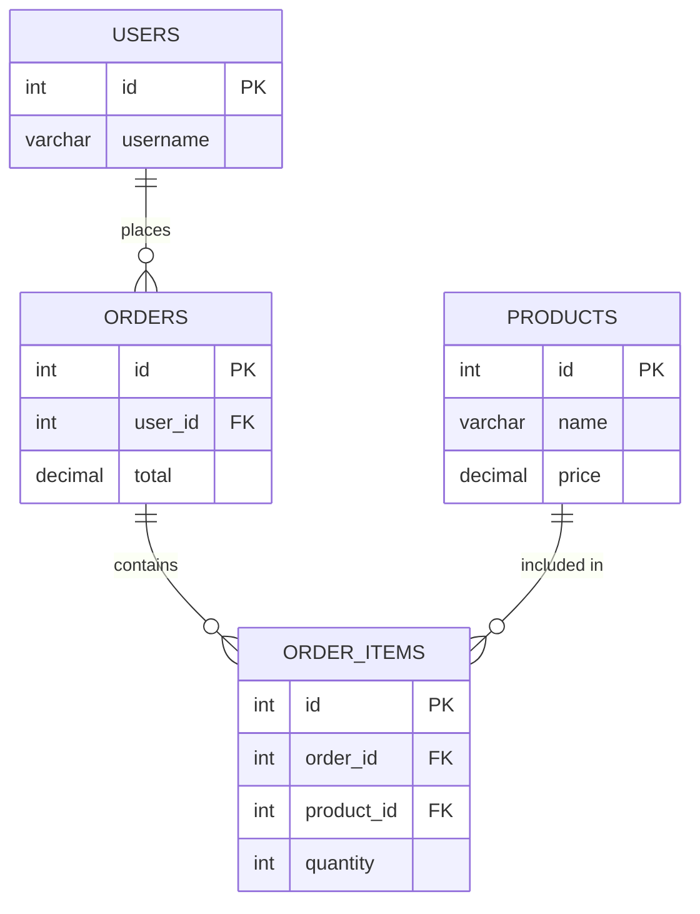

# How to Create a Table with Foreign Key Constraints in MySQL

Author: [nawazdhandala](https://www.github.com/nawazdhandala)

Tags: MySQL, SQL, DDL, Foreign Key, Constraint, Referential Integrity, InnoDB

Description: Create MySQL tables with foreign key constraints to enforce referential integrity, understand ON DELETE and ON UPDATE actions, and manage FK relationships.

---

## How It Works

A foreign key constraint ensures that a value in one table's column corresponds to a value in another table's primary or unique key column. If you try to insert a row that references a non-existent parent row, or delete a parent row that still has children, MySQL enforces the constraint and rejects the operation (by default).



## Requirements for Foreign Keys

- Both tables must use the InnoDB storage engine.
- The referenced column must have a primary key or unique index.
- The foreign key column and referenced column must have the same data type (and sign for integer types).
- Both columns should have the same character set and collation for string types.

## Syntax

```sql
[CONSTRAINT constraint_name]
    FOREIGN KEY (column_name)
    REFERENCES parent_table (parent_column)
    [ON DELETE reference_option]
    [ON UPDATE reference_option]
```

Where `reference_option` is one of:

```text
RESTRICT   - Reject the operation if a matching child row exists (default)
CASCADE    - Propagate the operation to child rows
SET NULL   - Set the child column to NULL (column must be NULLable)
NO ACTION  - Same as RESTRICT in MySQL (checked at statement end)
SET DEFAULT- Not supported by InnoDB; included in standard SQL only
```

## Complete Example

```sql
-- Parent table: users
CREATE TABLE users (
    id         INT UNSIGNED AUTO_INCREMENT PRIMARY KEY,
    username   VARCHAR(50)  NOT NULL UNIQUE,
    email      VARCHAR(255) NOT NULL UNIQUE,
    created_at DATETIME     NOT NULL DEFAULT CURRENT_TIMESTAMP
) ENGINE=InnoDB DEFAULT CHARSET=utf8mb4;

-- Parent table: products
CREATE TABLE products (
    id         INT UNSIGNED AUTO_INCREMENT PRIMARY KEY,
    name       VARCHAR(255) NOT NULL,
    price      DECIMAL(10, 2) NOT NULL,
    created_at DATETIME     NOT NULL DEFAULT CURRENT_TIMESTAMP
) ENGINE=InnoDB DEFAULT CHARSET=utf8mb4;

-- Child table: orders (references users)
CREATE TABLE orders (
    id           INT UNSIGNED AUTO_INCREMENT PRIMARY KEY,
    user_id      INT UNSIGNED  NOT NULL,
    total_amount DECIMAL(10, 2) NOT NULL DEFAULT 0.00,
    created_at   DATETIME      NOT NULL DEFAULT CURRENT_TIMESTAMP,
    CONSTRAINT fk_orders_user
        FOREIGN KEY (user_id)
        REFERENCES users (id)
        ON DELETE RESTRICT
        ON UPDATE CASCADE
) ENGINE=InnoDB DEFAULT CHARSET=utf8mb4;

-- Child table: order_items (references orders and products)
CREATE TABLE order_items (
    id         INT UNSIGNED AUTO_INCREMENT PRIMARY KEY,
    order_id   INT UNSIGNED  NOT NULL,
    product_id INT UNSIGNED  NOT NULL,
    quantity   SMALLINT UNSIGNED NOT NULL DEFAULT 1,
    unit_price DECIMAL(10, 2)    NOT NULL,
    CONSTRAINT fk_items_order
        FOREIGN KEY (order_id)
        REFERENCES orders (id)
        ON DELETE CASCADE
        ON UPDATE CASCADE,
    CONSTRAINT fk_items_product
        FOREIGN KEY (product_id)
        REFERENCES products (id)
        ON DELETE RESTRICT
        ON UPDATE CASCADE
) ENGINE=InnoDB DEFAULT CHARSET=utf8mb4;
```

## Testing Referential Integrity

Insert parent rows first.

```sql
INSERT INTO users (username, email) VALUES ('alice', 'alice@example.com');
INSERT INTO products (name, price) VALUES ('Widget', 9.99);
INSERT INTO orders (user_id, total_amount) VALUES (1, 9.99);
INSERT INTO order_items (order_id, product_id, quantity, unit_price) VALUES (1, 1, 1, 9.99);
```

Try to insert an order for a non-existent user.

```sql
INSERT INTO orders (user_id, total_amount) VALUES (999, 10.00);
```

```text
ERROR 1452 (23000): Cannot add or update a child row: a foreign key constraint fails
(`myapp`.`orders`, CONSTRAINT `fk_orders_user` FOREIGN KEY (`user_id`) REFERENCES `users` (`id`)
ON DELETE RESTRICT ON UPDATE CASCADE)
```

## ON DELETE CASCADE Example

Because `order_items` has `ON DELETE CASCADE` referencing `orders`, deleting an order also deletes its items.

```sql
DELETE FROM orders WHERE id = 1;
-- Also deletes all order_items with order_id = 1
SELECT * FROM order_items WHERE order_id = 1;
-- Empty result set
```

## Viewing Foreign Key Constraints

```sql
SELECT
    CONSTRAINT_NAME,
    TABLE_NAME,
    COLUMN_NAME,
    REFERENCED_TABLE_NAME,
    REFERENCED_COLUMN_NAME
FROM information_schema.KEY_COLUMN_USAGE
WHERE TABLE_SCHEMA = DATABASE()
  AND REFERENCED_TABLE_NAME IS NOT NULL
ORDER BY TABLE_NAME;
```

## Adding a Foreign Key to an Existing Table

```sql
ALTER TABLE orders
    ADD CONSTRAINT fk_orders_user
        FOREIGN KEY (user_id)
        REFERENCES users (id)
        ON DELETE RESTRICT
        ON UPDATE CASCADE;
```

## Dropping a Foreign Key

```sql
ALTER TABLE orders DROP FOREIGN KEY fk_orders_user;
```

## Temporarily Disabling Foreign Key Checks

During bulk data loads or migrations, you may want to disable FK checks temporarily.

```sql
SET FOREIGN_KEY_CHECKS = 0;

-- bulk load or migration steps here

SET FOREIGN_KEY_CHECKS = 1;
```

Never leave this disabled permanently - it bypasses the entire referential integrity system.

## Best Practices

- Always name your foreign key constraints explicitly so they are easy to drop or reference in error messages.
- Add an index on the foreign key column in the child table (MySQL adds one automatically if none exists).
- Use `ON DELETE CASCADE` only when child rows have no meaning without the parent (e.g., order items without an order).
- Use `ON DELETE RESTRICT` (the default) for relationships where you want to prevent orphaning explicitly.
- Avoid `ON DELETE SET NULL` unless the foreign key column is genuinely optional.
- Create parent tables before child tables and drop child tables before parent tables.

## Summary

Foreign key constraints in MySQL enforce referential integrity between tables at the database level. Declare them with `CONSTRAINT ... FOREIGN KEY ... REFERENCES` and choose the appropriate `ON DELETE` and `ON UPDATE` actions. `CASCADE` propagates changes automatically, `RESTRICT` prevents operations that would leave orphan rows, and `SET NULL` clears the reference. Always use InnoDB, name your constraints, and index the foreign key columns in child tables for efficient join and cascade operations.
