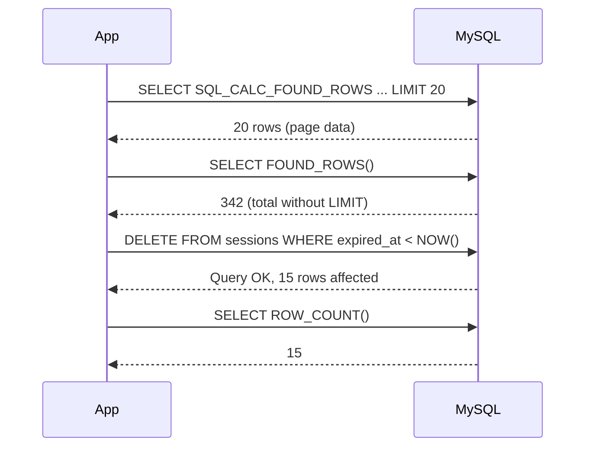
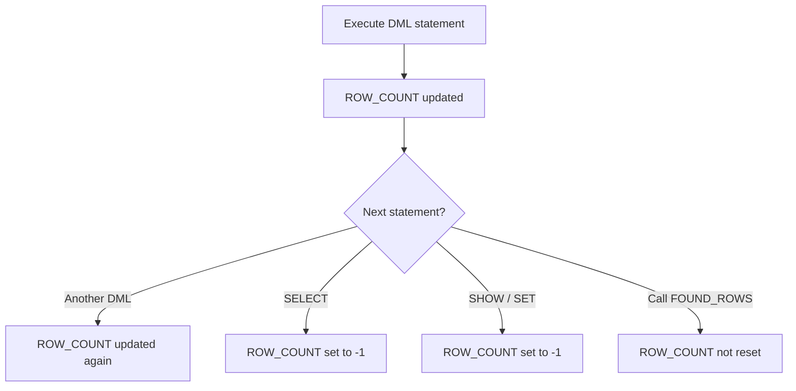

# How to Use FOUND_ROWS() and ROW_COUNT() in MySQL

Author: [OneUptime](https://oneuptime.com)

Tags: MySQL, Function, Row Count, Query, Performance

Description: Learn how to use MySQL FOUND_ROWS() to count pagination rows without a second query, and ROW_COUNT() to check how many rows a DML statement actually changed.

---

## Introduction

Two of MySQL's most useful session-level information functions are `FOUND_ROWS()` and `ROW_COUNT()`. They let you inspect the result of the most recent query without issuing a second round-trip to the database.

- `FOUND_ROWS()` answers: "how many rows would have matched if I had not used `LIMIT`?"
- `ROW_COUNT()` answers: "how many rows did the last INSERT / UPDATE / DELETE actually affect?"

## FOUND_ROWS()

### Classic pagination use case

Before MySQL 8.0.17 the standard pattern combined `SQL_CALC_FOUND_ROWS` with `FOUND_ROWS()` to retrieve both a page of data and the total row count in a single round-trip:

```sql
-- Step 1: run the paginated query with the hint
SELECT SQL_CALC_FOUND_ROWS
  id, username, email
FROM users
WHERE active = 1
ORDER BY created_at DESC
LIMIT 20 OFFSET 40;

-- Step 2: immediately retrieve the total count
SELECT FOUND_ROWS() AS total_rows;
```

`FOUND_ROWS()` returns the number of rows that would have been returned without the `LIMIT` clause.

### Important deprecation notice

`SQL_CALC_FOUND_ROWS` is deprecated as of MySQL 8.0.17 and may be removed in a future release. The recommended replacement is a separate `COUNT(*)` query, often made cheaper by ensuring the `WHERE` clause uses an index:

```sql
-- Preferred modern approach
SELECT id, username, email
FROM users
WHERE active = 1
ORDER BY created_at DESC
LIMIT 20 OFFSET 40;

SELECT COUNT(*) AS total_rows
FROM users
WHERE active = 1;
```

### FOUND_ROWS() after a non-LIMIT query

When the previous `SELECT` had no `LIMIT`, `FOUND_ROWS()` simply equals the number of rows returned:

```sql
SELECT id FROM orders WHERE status = 'pending';
SELECT FOUND_ROWS(); -- same as the row count of the above result
```

## ROW_COUNT()

`ROW_COUNT()` returns the number of rows affected by the last statement that changed data. The return value follows these rules:

| Statement | Return value |
|---|---|
| `INSERT` | Number of rows inserted |
| `INSERT ... ON DUPLICATE KEY UPDATE` | 1 per inserted row, 2 per updated row, 0 per unchanged row |
| `UPDATE` | Number of rows changed (not just matched) |
| `DELETE` | Number of rows deleted |
| `LOAD DATA` | Number of rows inserted |
| `SELECT`, `SHOW` | -1 (not applicable) |
| `CALL` | -1 (use `ROW_COUNT()` inside the procedure) |

### Basic examples

```sql
-- After DELETE
DELETE FROM sessions WHERE expired_at < NOW();
SELECT ROW_COUNT() AS rows_deleted;

-- After UPDATE
UPDATE products SET stock = stock - 1 WHERE sku = 'ABC-123' AND stock > 0;
SELECT ROW_COUNT() AS rows_updated;
-- Returns 0 if stock was already 0 (no change made)
-- Returns 1 if the row was actually updated
```

### Checking whether an UPDATE actually changed a row

```sql
UPDATE accounts
SET balance = balance - 500
WHERE id = 42 AND balance >= 500;

IF ROW_COUNT() = 0 THEN
  -- either row does not exist or balance insufficient
  SIGNAL SQLSTATE '45000' SET MESSAGE_TEXT = 'Insufficient balance or account not found';
END IF;
```

### INSERT ... ON DUPLICATE KEY UPDATE

```sql
INSERT INTO page_views (page_id, view_count)
VALUES (101, 1)
ON DUPLICATE KEY UPDATE view_count = view_count + 1;

SELECT ROW_COUNT() AS affected;
-- 1 = new row inserted
-- 2 = existing row updated
-- 0 = existing row matched but not changed (value was identical)
```

### Using ROW_COUNT() in a stored procedure

```sql
DELIMITER $$

CREATE PROCEDURE deactivate_user(IN p_user_id INT)
BEGIN
  UPDATE users SET active = 0 WHERE id = p_user_id AND active = 1;

  IF ROW_COUNT() = 0 THEN
    SIGNAL SQLSTATE '45000'
      SET MESSAGE_TEXT = 'User not found or already inactive';
  ELSE
    SELECT CONCAT('User ', p_user_id, ' deactivated') AS result;
  END IF;
END$$

DELIMITER ;
```

## Behavior flow diagram



## ROW_COUNT() reset rules



## Key points to remember

- `ROW_COUNT()` is reset after every statement, including `SELECT`. Capture it immediately after the DML statement.
- `UPDATE` counts only rows where the value actually changed, not rows that matched the `WHERE` clause. This is controlled by `CLIENT_FOUND_ROWS` in the connection flags.
- `FOUND_ROWS()` is only meaningful after a `SELECT`; it does not apply to DML.
- Both functions are session-scoped and do not require any privilege.

## Summary

`FOUND_ROWS()` is used alongside `SQL_CALC_FOUND_ROWS` (deprecated in 8.0.17) to retrieve total pagination counts without a second query; the modern alternative is an explicit `COUNT(*)`. `ROW_COUNT()` returns the number of rows affected by the most recent `INSERT`, `UPDATE`, or `DELETE` and is essential for verifying that DML operations had the expected impact, especially in stored procedures and application-level concurrency checks.
