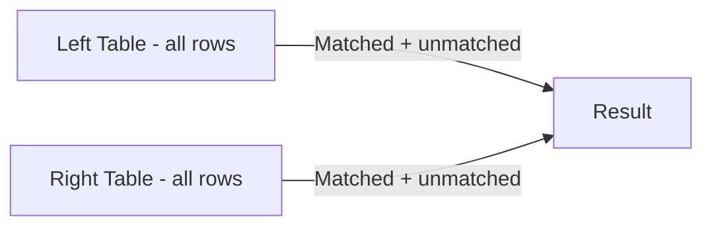

# How to Use FULL OUTER JOIN in MySQL (Emulation with UNION)

Author: [nawazdhandala](https://www.github.com/nawazdhandala)

Tags: MySQL, SQL, JOIN, UNION, Database, Query

Description: MySQL does not support FULL OUTER JOIN natively. Learn how to emulate it using a combination of LEFT JOIN, RIGHT JOIN, and UNION.

---

## How FULL OUTER JOIN Works

A FULL OUTER JOIN returns all rows from both tables. Where a match exists the columns from both tables are populated; where no match exists the columns from the table lacking a match are NULL. MySQL does not have a FULL OUTER JOIN keyword, but the behavior can be reproduced by combining a LEFT JOIN and a RIGHT JOIN with UNION.



## Syntax

The emulation pattern uses UNION to merge the two outer joins:

```sql
SELECT column_list
FROM table_a
LEFT JOIN table_b ON table_a.id = table_b.a_id

UNION

SELECT column_list
FROM table_a
RIGHT JOIN table_b ON table_a.id = table_b.a_id;
```

`UNION` automatically removes duplicate rows (the rows that matched in both joins). If you use `UNION ALL`, matched rows appear twice, which is not what you want for a FULL OUTER JOIN emulation.

## Examples

### Setup: Create Sample Tables

```sql
CREATE TABLE team_a (
    id INT PRIMARY KEY AUTO_INCREMENT,
    player_name VARCHAR(100) NOT NULL
);

CREATE TABLE team_b (
    id INT PRIMARY KEY AUTO_INCREMENT,
    player_name VARCHAR(100) NOT NULL
);

INSERT INTO team_a (player_name) VALUES
    ('Alice'), ('Bob'), ('Carol'), ('Dave');

INSERT INTO team_b (player_name) VALUES
    ('Bob'), ('Carol'), ('Eve'), ('Frank');
```

### Basic FULL OUTER JOIN Emulation

List all players from both teams, showing NULL in the opposite column when a player appears in only one team.

```sql
SELECT a.player_name AS team_a_player,
       b.player_name AS team_b_player
FROM team_a a
LEFT JOIN team_b b ON a.player_name = b.player_name

UNION

SELECT a.player_name AS team_a_player,
       b.player_name AS team_b_player
FROM team_a a
RIGHT JOIN team_b b ON a.player_name = b.player_name
ORDER BY team_a_player, team_b_player;
```

```text
+---------------+---------------+
| team_a_player | team_b_player |
+---------------+---------------+
| Alice         | NULL          |
| Bob           | Bob           |
| Carol         | Carol         |
| Dave          | NULL          |
| NULL          | Eve           |
| NULL          | Frank         |
+---------------+---------------+
```

### Efficient Emulation Using Anti-Join UNION

A more efficient alternative avoids scanning the joined rows twice. The first query retrieves all rows including matches via LEFT JOIN, and the second adds only the unmatched right-table rows.

```sql
SELECT a.player_name AS team_a_player,
       b.player_name AS team_b_player
FROM team_a a
LEFT JOIN team_b b ON a.player_name = b.player_name

UNION ALL

SELECT a.player_name AS team_a_player,
       b.player_name AS team_b_player
FROM team_a a
RIGHT JOIN team_b b ON a.player_name = b.player_name
WHERE a.id IS NULL;
```

This approach uses `UNION ALL` (no dedup scan) and filters with `WHERE a.id IS NULL` to include only unmatched right-side rows, making it more performant on large tables.

### Practical Example: Reconciling Two Data Sources

Compare product lists from two inventory systems and identify discrepancies.

```sql
CREATE TABLE inventory_old (
    sku VARCHAR(20) PRIMARY KEY,
    quantity INT
);

CREATE TABLE inventory_new (
    sku VARCHAR(20) PRIMARY KEY,
    quantity INT
);

INSERT INTO inventory_old (sku, quantity) VALUES
    ('SKU-001', 50), ('SKU-002', 30), ('SKU-003', 100);

INSERT INTO inventory_new (sku, quantity) VALUES
    ('SKU-001', 45), ('SKU-003', 100), ('SKU-004', 20);

SELECT
    COALESCE(o.sku, n.sku) AS sku,
    o.quantity AS old_qty,
    n.quantity AS new_qty,
    CASE
        WHEN o.sku IS NULL THEN 'New in system'
        WHEN n.sku IS NULL THEN 'Removed from system'
        WHEN o.quantity <> n.quantity THEN 'Quantity changed'
        ELSE 'No change'
    END AS status
FROM inventory_old o
LEFT JOIN inventory_new n ON o.sku = n.sku

UNION ALL

SELECT
    COALESCE(o.sku, n.sku) AS sku,
    o.quantity AS old_qty,
    n.quantity AS new_qty,
    CASE
        WHEN o.sku IS NULL THEN 'New in system'
        WHEN n.sku IS NULL THEN 'Removed from system'
        WHEN o.quantity <> n.quantity THEN 'Quantity changed'
        ELSE 'No change'
    END AS status
FROM inventory_old o
RIGHT JOIN inventory_new n ON o.sku = n.sku
WHERE o.sku IS NULL
ORDER BY sku;
```

```text
+---------+---------+---------+---------------------+
| sku     | old_qty | new_qty | status              |
+---------+---------+---------+---------------------+
| SKU-001 | 50      | 45      | Quantity changed    |
| SKU-002 | 30      | NULL    | Removed from system |
| SKU-003 | 100     | 100     | No change           |
| SKU-004 | NULL    | 20      | New in system       |
+---------+---------+---------+---------------------+
```

## Best Practices

- Prefer the efficient anti-join UNION pattern (`UNION ALL` + `WHERE left.id IS NULL`) over the naive double-scan approach for large tables.
- Use `COALESCE(a.id, b.id)` to display a non-NULL identifier regardless of which side the row came from.
- Ensure both SELECT statements in the UNION have the same number of columns and compatible data types.
- Add ORDER BY at the end of the combined query, not on individual SELECT statements.
- Index the join columns on both tables for better performance.

## Summary

MySQL does not support FULL OUTER JOIN directly, but you can emulate it by unioning a LEFT JOIN with a RIGHT JOIN. The most efficient pattern uses `UNION ALL` for the merge and limits the second query to unmatched right-side rows using `WHERE left_table.id IS NULL`. This approach is commonly used for data reconciliation, audit comparisons, and finding records that exist in one source but not another.
