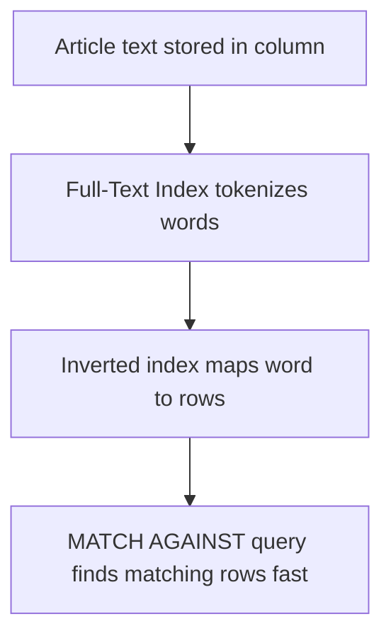

# How to Create a Full-Text Index in MySQL

Author: [nawazdhandala](https://www.github.com/nawazdhandala)

Tags: MySQL, SQL, Full-Text Index, Full-Text Search, Index, Database

Description: Learn how to create a full-text index in MySQL and use MATCH AGAINST for natural language and boolean full-text search on text columns.

---

## How Full-Text Indexes Work

A full-text index indexes the individual words (tokens) within text columns. It enables fast keyword-based searches using the `MATCH() AGAINST()` syntax, which is far more efficient and flexible than `LIKE '%keyword%'`. MySQL's full-text search supports two modes: natural language mode (relevance-ranked) and boolean mode (supports operators like +, -, *).

Full-text indexes work on `CHAR`, `VARCHAR`, and `TEXT` columns in InnoDB and MyISAM tables.



## Syntax

```sql
-- Inline during CREATE TABLE
CREATE TABLE articles (
    id INT PRIMARY KEY AUTO_INCREMENT,
    title VARCHAR(200),
    body TEXT,
    FULLTEXT INDEX ft_title_body (title, body)
);

-- Add to existing table
ALTER TABLE articles ADD FULLTEXT INDEX ft_title_body (title, body);

-- Using CREATE INDEX
CREATE FULLTEXT INDEX ft_body ON articles (body);
```

## Examples

### Setup: Create Sample Table and Data

```sql
CREATE TABLE blog_posts (
    id INT PRIMARY KEY AUTO_INCREMENT,
    title VARCHAR(200) NOT NULL,
    content TEXT NOT NULL,
    author VARCHAR(100),
    published_at DATE,
    FULLTEXT INDEX ft_idx (title, content)
);

INSERT INTO blog_posts (title, content, author, published_at) VALUES
    ('Getting Started with MySQL',
     'MySQL is a popular open source relational database. Learn how to install and configure MySQL on Linux and Windows.',
     'Alice', '2026-01-05'),
    ('MySQL Performance Tuning',
     'Improve your MySQL database performance using indexes, query optimization, and buffer pool configuration.',
     'Bob', '2026-01-15'),
    ('Introduction to PostgreSQL',
     'PostgreSQL is an advanced open source relational database with strong ACID compliance and JSON support.',
     'Carol', '2026-01-20'),
    ('MySQL Replication Setup',
     'Configure MySQL master-slave replication for high availability and read scaling across multiple servers.',
     'Alice', '2026-02-01'),
    ('Database Indexing Strategies',
     'Explore B-tree indexes, composite indexes, covering indexes, and full-text indexes for optimal query performance.',
     'Dave', '2026-02-10');
```

### Natural Language Mode Search

Natural language mode returns results ranked by relevance. It is the default mode.

```sql
SELECT id, title, author,
       MATCH(title, content) AGAINST ('MySQL performance') AS relevance_score
FROM blog_posts
WHERE MATCH(title, content) AGAINST ('MySQL performance')
ORDER BY relevance_score DESC;
```

```text
+----+-------------------------------+--------+-----------------+
| id | title                         | author | relevance_score |
+----+-------------------------------+--------+-----------------+
| 2  | MySQL Performance Tuning      | Bob    | 1.8542          |
| 1  | Getting Started with MySQL    | Alice  | 0.9271          |
| 4  | MySQL Replication Setup       | Alice  | 0.6513          |
+----+-------------------------------+--------+-----------------+
```

Rows with neither "MySQL" nor "performance" are excluded. Results are ranked by relevance.

### Boolean Mode Search

Boolean mode supports operators for precise control:
- `+` word must be present
- `-` word must be absent
- `*` wildcard suffix
- `""` phrase match

```sql
-- Must contain 'MySQL', must not contain 'replication'
SELECT id, title
FROM blog_posts
WHERE MATCH(title, content) AGAINST ('+MySQL -replication' IN BOOLEAN MODE);
```

```text
+----+-------------------------------+
| id | title                         |
+----+-------------------------------+
| 1  | Getting Started with MySQL    |
| 2  | MySQL Performance Tuning      |
+----+-------------------------------+
```

```sql
-- Wildcard search for words starting with 'index'
SELECT id, title
FROM blog_posts
WHERE MATCH(title, content) AGAINST ('index*' IN BOOLEAN MODE);
```

```text
+----+-------------------------------+
| id | title                         |
+----+-------------------------------+
| 2  | MySQL Performance Tuning      |
| 5  | Database Indexing Strategies  |
+----+-------------------------------+
```

```sql
-- Phrase search
SELECT id, title
FROM blog_posts
WHERE MATCH(title, content) AGAINST ('"open source relational database"' IN BOOLEAN MODE);
```

```text
+----+----------------------------+
| id | title                      |
+----+----------------------------+
| 1  | Getting Started with MySQL |
| 3  | Introduction to PostgreSQL |
+----+----------------------------+
```

### Query Expansion Mode

Query expansion first finds the top matches, extracts their significant words, then runs the search again with those words added.

```sql
SELECT id, title
FROM blog_posts
WHERE MATCH(title, content) AGAINST ('database' WITH QUERY EXPANSION)
ORDER BY MATCH(title, content) AGAINST ('database' WITH QUERY EXPANSION) DESC;
```

### Checking Minimum Word Length

InnoDB's default minimum token length is 3 characters. Words shorter than this are not indexed.

```sql
SHOW VARIABLES LIKE 'innodb_ft_min_token_size';
-- Default: 3
```

To index shorter words, change the variable and rebuild the index:

```sql
SET GLOBAL innodb_ft_min_token_size = 2;
-- Then rebuild: ALTER TABLE blog_posts DROP INDEX ft_idx;
-- ALTER TABLE blog_posts ADD FULLTEXT INDEX ft_idx (title, content);
```

## Best Practices

- Use boolean mode for user-facing search forms where you need operator control.
- Use natural language mode for relevance-ranked results like a typical search engine.
- Full-text indexes ignore common "stopwords" (like "the", "is", "and") - they are not indexed or searchable.
- Words shorter than `innodb_ft_min_token_size` (default 3) are not indexed.
- Full-text search is not suitable for exact lookups on short values - use regular indexes for those.
- Maintain full-text indexes on text-heavy columns (descriptions, articles, comments), not on short structured values.
- Rebuild the full-text index after changing `innodb_ft_min_token_size` or `innodb_ft_stopword_table`.

## Summary

Full-text indexes in MySQL enable efficient keyword search on text columns using the `MATCH() AGAINST()` syntax. Natural language mode ranks results by relevance; boolean mode supports operators for precise filtering. Full-text indexes are ideal for article search, comment search, and product description search - use cases where LIKE '%keyword%' would be too slow. They are supported on InnoDB and MyISAM tables for CHAR, VARCHAR, and TEXT columns.
