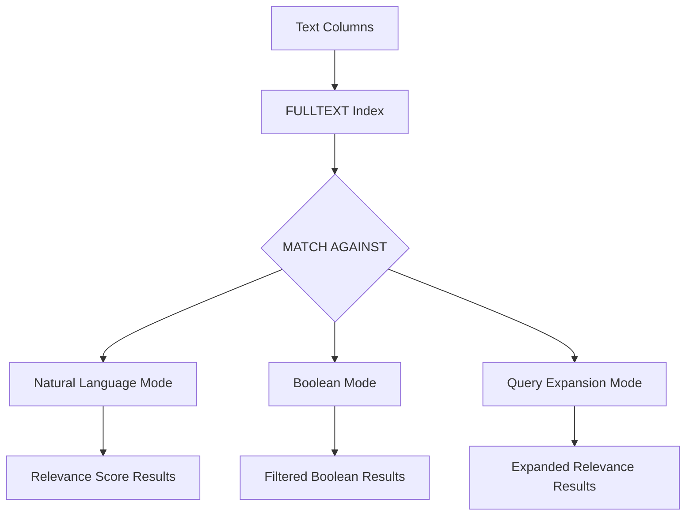

# How to Use Full-Text Search in MySQL with MATCH AGAINST

Author: [nawazdhandala](https://www.github.com/nawazdhandala)

Tags: MySQL, SQL, Full-Text Search, MATCH AGAINST, Database

Description: Learn how to use MySQL MATCH AGAINST with FULLTEXT indexes to perform fast natural-language and boolean full-text search across text columns.

---

## How MySQL Full-Text Search Works

MySQL full-text search uses an inverted index called a `FULLTEXT` index to map individual words to the rows that contain them. Unlike `LIKE '%keyword%'`, which forces a full table scan, `MATCH AGAINST` queries use this index for fast lookups even on large text columns.



## Setup: Sample Table

```sql
CREATE TABLE articles (
    id       INT AUTO_INCREMENT PRIMARY KEY,
    title    VARCHAR(200),
    body     TEXT,
    category VARCHAR(50),
    FULLTEXT idx_ft_articles (title, body)
);

INSERT INTO articles (title, body, category) VALUES
('Introduction to MySQL', 'MySQL is a popular open-source relational database management system used by millions of developers worldwide.', 'Database'),
('MySQL Performance Tuning', 'Learn how to optimize MySQL queries, indexes, and configuration for high-performance applications.', 'Performance'),
('MySQL vs PostgreSQL', 'A comparison of MySQL and PostgreSQL features including JSON support, full-text search, and scalability.', 'Comparison'),
('Getting Started with SQL', 'SQL is the standard language for relational databases. Learn SELECT, INSERT, UPDATE, and DELETE statements.', 'Tutorial'),
('Advanced MySQL Indexing', 'Understand B-Tree indexes, covering indexes, composite indexes, and FULLTEXT indexes in MySQL.', 'Database'),
('MySQL Replication Setup', 'Configure master-slave replication in MySQL for high availability and read scaling.', 'Administration'),
('NoSQL vs Relational Databases', 'Compare NoSQL databases like MongoDB and Redis against traditional relational databases like MySQL.', 'Comparison');
```

## Natural Language Mode (Default)

Natural language mode finds rows that are relevant to the search string and returns a relevance score. Common words (stop words) are ignored.

**Syntax:**

```sql
MATCH(col1, col2) AGAINST('search string')
MATCH(col1, col2) AGAINST('search string' IN NATURAL LANGUAGE MODE)
```

**Example - search for articles about MySQL indexing:**

```sql
SELECT
    id,
    title,
    MATCH(title, body) AGAINST('MySQL indexing') AS relevance
FROM articles
WHERE MATCH(title, body) AGAINST('MySQL indexing')
ORDER BY relevance DESC;
```

```text
+----+--------------------------+-----------+
| id | title                    | relevance |
+----+--------------------------+-----------+
| 5  | Advanced MySQL Indexing  | 1.8921    |
| 1  | Introduction to MySQL    | 0.4512    |
| 2  | MySQL Performance Tuning | 0.4512    |
+----+--------------------------+-----------+
```

The `MATCH ... AGAINST` expression in the SELECT list returns the relevance score without performing a second index scan.

## Boolean Mode

Boolean mode supports operators to include, exclude, or require specific words. It does not return relevance scores by default.

**Syntax:**

```sql
MATCH(col1, col2) AGAINST('boolean expression' IN BOOLEAN MODE)
```

**Boolean operators:**

```text
+word    - word MUST be present
-word    - word must NOT be present
word*    - prefix wildcard (matches 'word', 'words', etc.)
"phrase" - match exact phrase
~word    - lower the relevance if word is present
```

**Example - must contain "MySQL", must not contain "NoSQL":**

```sql
SELECT title, category
FROM articles
WHERE MATCH(title, body) AGAINST('+MySQL -NoSQL' IN BOOLEAN MODE);
```

**Example - prefix search:**

```sql
SELECT title FROM articles
WHERE MATCH(title, body) AGAINST('index*' IN BOOLEAN MODE);
```

**Example - exact phrase match:**

```sql
SELECT title FROM articles
WHERE MATCH(title, body) AGAINST('"full-text search"' IN BOOLEAN MODE);
```

**Example - combined boolean search:**

```sql
SELECT title, category
FROM articles
WHERE MATCH(title, body) AGAINST('+MySQL +index* -replication' IN BOOLEAN MODE);
```

## Query Expansion Mode

Query expansion performs the search twice: first a standard natural language search, then a second pass using the most significant words from the top results. This finds semantically related rows even if they do not contain the original search terms.

```sql
SELECT title
FROM articles
WHERE MATCH(title, body) AGAINST('database' WITH QUERY EXPANSION)
ORDER BY MATCH(title, body) AGAINST('database' WITH QUERY EXPANSION) DESC;
```

## Adding a FULLTEXT Index to an Existing Table

```sql
ALTER TABLE articles ADD FULLTEXT INDEX idx_ft_body (body);

-- Or using CREATE INDEX syntax:
CREATE FULLTEXT INDEX idx_ft_title ON articles (title);
```

## Minimum Word Length

By default MySQL ignores words shorter than `ft_min_word_len` (default 4 for MyISAM, `innodb_ft_min_token_size` default 3 for InnoDB). Check your setting:

```sql
SHOW VARIABLES LIKE 'innodb_ft_min_token_size';
```

To search for short words, use boolean mode with a prefix wildcard or adjust the server variable and rebuild the index:

```sql
-- Search for 'SQL' (3 chars) with prefix wildcard in boolean mode:
SELECT title FROM articles
WHERE MATCH(title, body) AGAINST('SQL*' IN BOOLEAN MODE);
```

## Combining Full-Text Search with Regular Filters

```sql
SELECT title, category,
       MATCH(title, body) AGAINST('performance optimization') AS score
FROM articles
WHERE category = 'Database'
  AND MATCH(title, body) AGAINST('performance optimization')
ORDER BY score DESC
LIMIT 10;
```

## Best Practices

- Create `FULLTEXT` indexes only on `CHAR`, `VARCHAR`, and `TEXT` columns.
- Use `IN BOOLEAN MODE` for user-facing search boxes where precise control over inclusion and exclusion is needed.
- Always place the `MATCH ... AGAINST` condition in both the WHERE clause and the SELECT list - MySQL reuses the index scan.
- Avoid full-text search on columns with very high cardinality of short tokens; adjust `innodb_ft_min_token_size` for short keywords.
- For very large search requirements (millions of rows, complex ranking) consider a dedicated search engine like Elasticsearch or Typesense alongside MySQL.

## Summary

MySQL full-text search with `MATCH AGAINST` provides efficient keyword search over large text columns using `FULLTEXT` indexes. Natural language mode returns relevance-ranked results automatically. Boolean mode adds control over required, excluded, and wildcard terms. Query expansion mode broadens results by finding semantically related content. These modes cover most search use cases without requiring external search infrastructure for small to medium-sized datasets.
