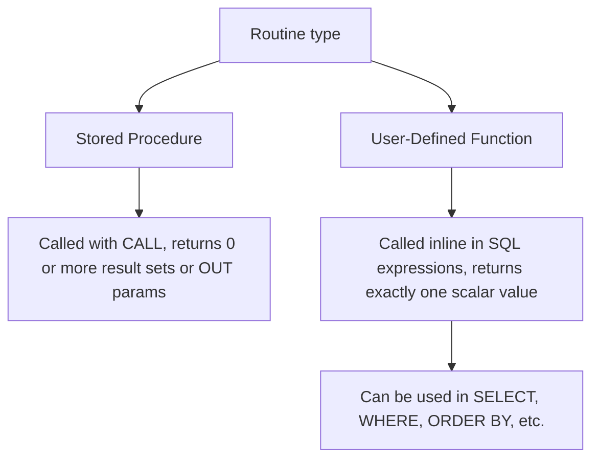

# How to Create a MySQL Function with RETURNS

Author: [nawazdhandala](https://www.github.com/nawazdhandala)

Tags: MySQL, Function, SQL, Database, Stored Procedure

Description: Learn how to create user-defined functions in MySQL using CREATE FUNCTION with RETURNS, covering scalar functions, determinism flags, and using functions in queries.

---

## Functions vs Stored Procedures

A MySQL user-defined function (UDF) differs from a stored procedure in two key ways:



Functions must return exactly one scalar value and can be used anywhere a value expression is valid in SQL. They cannot use `CALL`, return result sets, or contain non-deterministic DDL statements.

## Syntax

```sql
CREATE FUNCTION function_name (
    parameter_name data_type [, ...]
)
RETURNS return_data_type
[DETERMINISTIC | NOT DETERMINISTIC]
[CONTAINS SQL | NO SQL | READS SQL DATA | MODIFIES SQL DATA]
BEGIN
    -- function body
    RETURN expression;
END;
```

Key clauses:
- `RETURNS` - declares the data type of the return value (required).
- `RETURN` - statement inside the body that provides the actual return value.
- `DETERMINISTIC` - required when binary logging is enabled and the function always returns the same output for the same inputs.

## Setup: Sample Table

```sql
CREATE TABLE employees (
    id         INT PRIMARY KEY AUTO_INCREMENT,
    first_name VARCHAR(50),
    last_name  VARCHAR(50),
    salary     DECIMAL(10,2),
    hire_date  DATE
);

INSERT INTO employees (first_name, last_name, salary, hire_date) VALUES
    ('Alice',  'Smith',   95000.00, '2020-03-15'),
    ('Bob',    'Jones',   65000.00, '2022-07-01'),
    ('Carol',  'White',  105000.00, '2019-01-10'),
    ('Dave',   'Brown',   88000.00, '2018-06-20');
```

## Simple Scalar Function

Create a function that formats a full name.

```sql
DELIMITER $$

CREATE FUNCTION FullName (
    p_first VARCHAR(50),
    p_last  VARCHAR(50)
)
RETURNS VARCHAR(101)
DETERMINISTIC
NO SQL
BEGIN
    RETURN CONCAT(p_first, ' ', p_last);
END$$

DELIMITER ;
```

```sql
SELECT id, FullName(first_name, last_name) AS full_name, salary
FROM employees;
```

```text
+----+-------------+-----------+
| id | full_name   | salary    |
+----+-------------+-----------+
|  1 | Alice Smith | 95000.00  |
|  2 | Bob Jones   | 65000.00  |
|  3 | Carol White | 105000.00 |
|  4 | Dave Brown  | 88000.00  |
+----+-------------+-----------+
```

## Function with READS SQL DATA

A function can query a table. Declare it as `READS SQL DATA` to indicate it does not modify data.

```sql
DELIMITER $$

CREATE FUNCTION GetEmployeeSalary (
    p_employee_id INT
)
RETURNS DECIMAL(10,2)
READS SQL DATA
DETERMINISTIC
BEGIN
    DECLARE v_salary DECIMAL(10,2);

    SELECT salary INTO v_salary
    FROM employees
    WHERE id = p_employee_id;

    RETURN COALESCE(v_salary, 0.00);
END$$

DELIMITER ;
```

```sql
SELECT
    id,
    first_name,
    GetEmployeeSalary(id)            AS salary,
    GetEmployeeSalary(id) * 1.10     AS salary_with_raise
FROM employees;
```

```text
+----+------------+-----------+-------------------+
| id | first_name | salary    | salary_with_raise |
+----+------------+-----------+-------------------+
|  1 | Alice      | 95000.00  |       104500.0000 |
|  2 | Bob        | 65000.00  |        71500.0000 |
|  3 | Carol      | 105000.00 |       115500.0000 |
|  4 | Dave       | 88000.00  |        96800.0000 |
+----+------------+-----------+-------------------+
```

## Function with Conditional Logic

Functions support `IF`, `CASE`, and local variables just like stored procedures.

```sql
DELIMITER $$

CREATE FUNCTION SalaryGrade (
    p_salary DECIMAL(10,2)
)
RETURNS VARCHAR(10)
DETERMINISTIC
NO SQL
BEGIN
    DECLARE v_grade VARCHAR(10);

    IF p_salary >= 100000 THEN
        SET v_grade = 'Senior';
    ELSEIF p_salary >= 80000 THEN
        SET v_grade = 'Mid';
    ELSE
        SET v_grade = 'Junior';
    END IF;

    RETURN v_grade;
END$$

DELIMITER ;
```

```sql
SELECT first_name, salary, SalaryGrade(salary) AS grade
FROM employees
ORDER BY salary DESC;
```

```text
+------------+-----------+--------+
| first_name | salary    | grade  |
+------------+-----------+--------+
| Carol      | 105000.00 | Senior |
| Alice      |  95000.00 | Mid    |
| Dave       |  88000.00 | Mid    |
| Bob        |  65000.00 | Junior |
+------------+-----------+--------+
```

## Using a Function in WHERE and ORDER BY

Functions are usable anywhere a scalar expression is valid.

```sql
-- Filter using a function
SELECT first_name, salary
FROM employees
WHERE SalaryGrade(salary) = 'Senior';

-- Order by a function result
SELECT first_name, salary, SalaryGrade(salary) AS grade
FROM employees
ORDER BY SalaryGrade(salary), salary DESC;
```

## Function with Date Calculation

```sql
DELIMITER $$

CREATE FUNCTION YearsEmployed (
    p_hire_date DATE
)
RETURNS INT
DETERMINISTIC
NO SQL
BEGIN
    RETURN TIMESTAMPDIFF(YEAR, p_hire_date, CURDATE());
END$$

DELIMITER ;
```

```sql
SELECT first_name, hire_date, YearsEmployed(hire_date) AS years_at_company
FROM employees
ORDER BY years_at_company DESC;
```

## Dropping and Replacing Functions

```sql
-- Drop a function
DROP FUNCTION IF EXISTS FullName;

-- View existing functions
SHOW FUNCTION STATUS WHERE Db = DATABASE();

-- View function definition
SHOW CREATE FUNCTION SalaryGrade\G
```

## DETERMINISTIC vs NOT DETERMINISTIC

The `DETERMINISTIC` flag is important when binary logging is enabled (required for replication).

```sql
-- Deterministic: same inputs always produce same output
CREATE FUNCTION Add(a INT, b INT) RETURNS INT DETERMINISTIC NO SQL
BEGIN RETURN a + b; END;

-- Not deterministic: output depends on current time or random state
CREATE FUNCTION GetTimestamp() RETURNS DATETIME NOT DETERMINISTIC NO SQL
BEGIN RETURN NOW(); END;
```

If the server has `log_bin_trust_function_creators = OFF` and binary logging is on, you must declare functions as `DETERMINISTIC`, `NO SQL`, or `READS SQL DATA` - otherwise MySQL rejects the CREATE FUNCTION statement.

```sql
-- Enable trust for function creators (set in my.cnf or at runtime)
SET GLOBAL log_bin_trust_function_creators = 1;
```

## Best Practices

- Use `DETERMINISTIC` for pure functions (no side effects, no SQL reads) to help the optimizer and satisfy binary logging requirements.
- Keep functions focused on computation and avoid DML (`INSERT`, `UPDATE`, `DELETE`) inside functions.
- Prefix local variables with `v_` and parameters with `p_` to avoid conflicts with column names.
- For complex logic requiring DML, use a stored procedure instead.
- Use `SHOW FUNCTION STATUS` to audit existing functions in a schema.

## Summary

MySQL user-defined functions are created with `CREATE FUNCTION ... RETURNS data_type` and always return a single scalar value via the `RETURN` statement. Unlike stored procedures, functions can be embedded directly in SELECT, WHERE, and ORDER BY clauses. Mark functions as `DETERMINISTIC` when the same inputs always produce the same output, and choose the correct SQL access characteristic (`NO SQL`, `READS SQL DATA`, `MODIFIES SQL DATA`) to satisfy binary logging and replication requirements.
