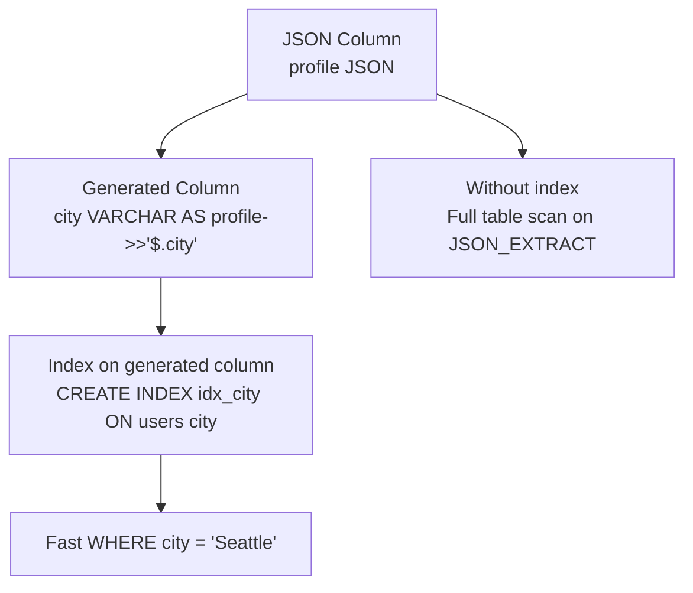

# How to Create Generated Columns from JSON in MySQL

Author: [nawazdhandala](https://www.github.com/nawazdhandala)

Tags: MySQL, SQL, JSON, Generated Column, Database, Index

Description: Learn how to create virtual and stored generated columns from JSON fields in MySQL to enable indexing, fast filtering, and cleaner queries on JSON data.

---

## Why Generated Columns for JSON?

JSON columns in MySQL cannot be indexed directly. Without an index, every query filtering on a JSON field performs a full table scan. Generated columns solve this by extracting a JSON value into a separate column that can be indexed, while keeping the JSON document as the authoritative source.



## Virtual vs Stored Generated Columns

MySQL supports two kinds of generated columns:

| Type | Storage | Performance |
|---|---|---|
| `VIRTUAL` | Computed on read, not stored on disk | Saves space, slightly slower reads |
| `STORED` | Computed on write, persisted on disk | Faster reads, uses extra disk space |

Both can be indexed. `VIRTUAL` is the default and is sufficient for most cases. Use `STORED` when you need the value materialized for heavy read workloads or when the expression is expensive to compute.

## Syntax

```sql
-- Add a generated column at table creation
CREATE TABLE t (
    id      INT AUTO_INCREMENT PRIMARY KEY,
    payload JSON,
    col_name type GENERATED ALWAYS AS (expression) [VIRTUAL | STORED]
);

-- Add a generated column to an existing table
ALTER TABLE t
ADD COLUMN col_name type GENERATED ALWAYS AS (expression) [VIRTUAL | STORED];
```

## Setup: Sample Table

```sql
CREATE TABLE users (
    id       INT AUTO_INCREMENT PRIMARY KEY,
    username VARCHAR(50),
    profile  JSON
);

INSERT INTO users (username, profile) VALUES
('alice',  '{"city": "Seattle",   "age": 30, "tier": "premium", "tags": ["admin", "editor"]}'),
('bob',    '{"city": "Chicago",   "age": 25, "tier": "free",    "tags": ["viewer"]}'),
('carol',  '{"city": "New York",  "age": 35, "tier": "premium", "tags": ["editor"]}'),
('dave',   '{"city": "Seattle",   "age": 28, "tier": "free",    "tags": ["viewer", "tester"]}'),
('eve',    '{"city": "Austin",    "age": 32, "tier": "premium", "tags": ["admin"]}');
```

## Creating Virtual Generated Columns

```sql
ALTER TABLE users
ADD COLUMN city VARCHAR(100) GENERATED ALWAYS AS (profile ->> '$.city')    VIRTUAL,
ADD COLUMN age  INT          GENERATED ALWAYS AS (profile -> '$.age' + 0)  VIRTUAL,
ADD COLUMN tier VARCHAR(20)  GENERATED ALWAYS AS (profile ->> '$.tier')    VIRTUAL;
```

Use `->>` (JSON_UNQUOTE) for string values so they are stored without JSON quotes. Use `-> ... + 0` to coerce numeric JSON values to their SQL numeric type.

## Querying Generated Columns

Once added, generated columns appear like regular columns:

```sql
SELECT username, city, age, tier
FROM users
WHERE city = 'Seattle';
```

```text
+----------+---------+-----+---------+
| username | city    | age | tier    |
+----------+---------+-----+---------+
| alice    | Seattle |  30 | premium |
| dave     | Seattle |  28 | free    |
+----------+---------+-----+---------+
```

No `JSON_EXTRACT()` or path notation needed in the query.

## Indexing Generated Columns

```sql
-- Create indexes on the generated columns for fast lookups
CREATE INDEX idx_users_city ON users (city);
CREATE INDEX idx_users_tier ON users (tier);
CREATE INDEX idx_users_age  ON users (age);

-- Compound index
CREATE INDEX idx_users_city_tier ON users (city, tier);
```

Verify with `EXPLAIN`:

```sql
EXPLAIN SELECT username FROM users WHERE city = 'Seattle' AND tier = 'premium';
-- key: idx_users_city_tier
```

## Creating a Stored Generated Column

```sql
ALTER TABLE users
ADD COLUMN tier_label VARCHAR(30) GENERATED ALWAYS AS (
    CASE profile ->> '$.tier'
        WHEN 'premium' THEN 'Premium Member'
        WHEN 'free'    THEN 'Free Member'
        ELSE 'Unknown'
    END
) STORED;

SELECT username, tier_label FROM users;
```

## Multi-Value Index for JSON Arrays (MySQL 8.0.17+)

For JSON arrays inside a document, create a multi-value index directly rather than a generated column:

```sql
CREATE TABLE articles (
    id   INT AUTO_INCREMENT PRIMARY KEY,
    meta JSON,
    INDEX idx_tags ((CAST(meta -> '$.tags' AS CHAR(50) ARRAY)))
);

INSERT INTO articles (meta) VALUES
('{"tags": ["mysql", "database"]}'),
('{"tags": ["python", "api"]}'),
('{"tags": ["mysql", "json"]}');

-- Uses the multi-value index
SELECT * FROM articles WHERE 'mysql' MEMBER OF (meta -> '$.tags');
SELECT * FROM articles WHERE JSON_OVERLAPS(meta -> '$.tags', '["mysql", "json"]');
```

## Practical Example: Full Setup with Indexes

```sql
CREATE TABLE products (
    id          INT AUTO_INCREMENT PRIMARY KEY,
    sku         VARCHAR(50) NOT NULL UNIQUE,
    attributes  JSON,
    -- Generated columns for frequently queried JSON fields
    brand       VARCHAR(100) GENERATED ALWAYS AS (attributes ->> '$.brand')    VIRTUAL,
    category    VARCHAR(50)  GENERATED ALWAYS AS (attributes ->> '$.category') VIRTUAL,
    price       DECIMAL(10,2) GENERATED ALWAYS AS (
                    CAST(attributes ->> '$.price' AS DECIMAL(10,2))
                ) VIRTUAL,
    in_stock    TINYINT(1)   GENERATED ALWAYS AS (
                    attributes -> '$.in_stock' = 'true'
                ) VIRTUAL,
    -- Indexes on the generated columns
    INDEX idx_brand    (brand),
    INDEX idx_category (category),
    INDEX idx_price    (price),
    INDEX idx_stock    (in_stock)
);

INSERT INTO products (sku, attributes) VALUES
('W-001', '{"brand": "Acme",  "category": "widgets", "price": 9.99,  "in_stock": true}'),
('G-002', '{"brand": "Globex","category": "gadgets", "price": 49.99, "in_stock": false}'),
('W-003', '{"brand": "Acme",  "category": "widgets", "price": 14.99, "in_stock": true}');

-- Fast indexed queries
SELECT sku, brand, price FROM products WHERE brand = 'Acme' AND in_stock = 1;
SELECT sku, category, price FROM products WHERE price BETWEEN 5 AND 20 ORDER BY price;
```

## Limitations

- A `VIRTUAL` generated column can have an index, but only `STORED` columns can be part of a foreign key.
- The expression cannot reference other generated columns or non-deterministic functions.
- `TEXT` and `BLOB` generated columns cannot be indexed unless a prefix length is specified.
- You cannot use `INSERT ... SET generated_col = value` for generated columns; they are read-only.

## Summary

Generated columns let you extract JSON fields into indexable, queryable columns without duplicating data or changing your JSON storage structure. Declare them as `VIRTUAL` (default, computed on read) or `STORED` (computed on write) depending on read/write patterns. Always create an index on generated columns used in `WHERE` clauses. For JSON arrays, use multi-value indexes in MySQL 8.0.17+ with `MEMBER OF`, `JSON_OVERLAPS`, or `JSON_CONTAINS` to enable index-based array lookups.
