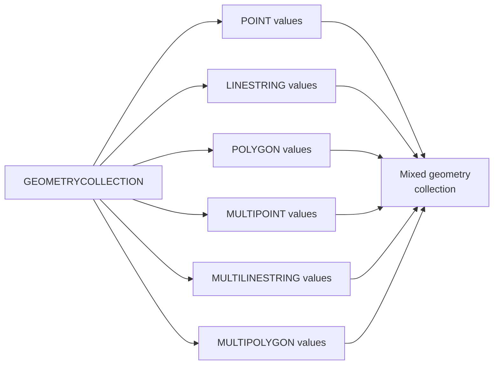

# How to Use GEOMETRYCOLLECTION Data Type in MySQL

Author: [nawazdhandala](https://www.github.com/nawazdhandala)

Tags: MySQL, SQL, Spatial, Geometry, Database

Description: Learn how to use the GEOMETRYCOLLECTION data type in MySQL to store mixed collections of spatial geometry objects, with creation, querying, and spatial index examples.

---

## What Is GEOMETRYCOLLECTION

`GEOMETRYCOLLECTION` is a spatial data type in MySQL that stores a collection of zero or more geometry objects of any type -- `POINT`, `LINESTRING`, `POLYGON`, `MULTIPOINT`, `MULTILINESTRING`, `MULTIPOLYGON`, or even nested `GEOMETRYCOLLECTION` values. It is the most general geometry type in MySQL.



## MySQL Spatial Type Hierarchy

| Type | Description |
|---|---|
| `GEOMETRY` | Base type; can hold any single geometry |
| `POINT` | Single coordinate (x, y) |
| `LINESTRING` | Ordered sequence of points forming a line |
| `POLYGON` | Closed ring defining an area |
| `MULTIPOINT` | Collection of points |
| `MULTILINESTRING` | Collection of linestrings |
| `MULTIPOLYGON` | Collection of polygons |
| `GEOMETRYCOLLECTION` | Heterogeneous mix of any geometry types |

## Syntax

```sql
column_name GEOMETRYCOLLECTION [NOT NULL]
-- or the generic alias:
column_name GEOMCOLLECTION [NOT NULL]
```

## Creating a Table with GEOMETRYCOLLECTION

```sql
CREATE TABLE map_layers (
    id          INT UNSIGNED AUTO_INCREMENT PRIMARY KEY,
    layer_name  VARCHAR(100) NOT NULL,
    description VARCHAR(500),
    features    GEOMETRYCOLLECTION NOT NULL SRID 4326,
    created_at  DATETIME NOT NULL DEFAULT CURRENT_TIMESTAMP
) ENGINE = InnoDB;
```

## Inserting a GEOMETRYCOLLECTION

Use `ST_GeomCollFromText()` or `ST_GeomCollFromWKB()` to create a `GEOMETRYCOLLECTION` value:

```sql
INSERT INTO map_layers (layer_name, features) VALUES
(
    'City Features',
    ST_GeomCollFromText(
        'GEOMETRYCOLLECTION(
            POINT(2.3522 48.8566),
            LINESTRING(2.3522 48.8566, 2.3600 48.8600),
            POLYGON((2.34 48.85, 2.36 48.85, 2.36 48.87, 2.34 48.87, 2.34 48.85))
        )',
        4326
    )
);
```

## Building GEOMETRYCOLLECTION with ST_Collect

In MySQL 8.0+, `ST_Collect()` aggregates multiple geometries into a collection:

```sql
CREATE TABLE pois (
    id        INT UNSIGNED AUTO_INCREMENT PRIMARY KEY,
    name      VARCHAR(100) NOT NULL,
    category  VARCHAR(50) NOT NULL,
    location  POINT NOT NULL SRID 4326
);

INSERT INTO pois (name, category, location) VALUES
('Eiffel Tower',   'landmark', ST_GeomFromText('POINT(2.2945 48.8584)', 4326)),
('Louvre Museum',  'museum',   ST_GeomFromText('POINT(2.3376 48.8606)', 4326)),
('Notre Dame',     'church',   ST_GeomFromText('POINT(2.3500 48.8530)', 4326));

-- Aggregate all points into a GEOMETRYCOLLECTION
SELECT ST_AsText(ST_Collect(location)) AS all_locations
FROM pois;
```

## Extracting Geometries from a GEOMETRYCOLLECTION

```sql
-- Get the number of geometries in the collection
SELECT layer_name,
       ST_NumGeometries(features) AS geometry_count
FROM map_layers;

-- Get a specific geometry by index (1-based)
SELECT layer_name,
       ST_AsText(ST_GeometryN(features, 1)) AS first_geometry,
       ST_GeometryType(ST_GeometryN(features, 1)) AS first_type
FROM map_layers;
```

```text
+---------------+------------------+------------+
| layer_name    | first_geometry   | first_type |
+---------------+------------------+------------+
| City Features | POINT(2.3522 48.8566) | Point |
+---------------+------------------+------------+
```

## Querying with Spatial Functions

```sql
-- Get the envelope (bounding box) of the entire collection
SELECT layer_name,
       ST_AsText(ST_Envelope(features)) AS bounding_box
FROM map_layers;

-- Get the centroid of the collection
SELECT layer_name,
       ST_AsText(ST_Centroid(features)) AS centroid
FROM map_layers;

-- Check if a point is within the collection's bounding area
SELECT layer_name
FROM map_layers
WHERE ST_Contains(
    features,
    ST_GeomFromText('POINT(2.3522 48.8566)', 4326)
);
```

## Converting GEOMETRYCOLLECTION to GeoJSON

```sql
SELECT layer_name,
       ST_AsGeoJSON(features) AS geojson
FROM map_layers;
```

```text
+---------------+----------------------------------------------------------------------+
| layer_name    | geojson                                                              |
+---------------+----------------------------------------------------------------------+
| City Features | {"type": "GeometryCollection", "geometries": [{"type": "Point", ...}]}|
+---------------+----------------------------------------------------------------------+
```

## Spatial Index on GEOMETRYCOLLECTION

```sql
-- Add a spatial index (requires NOT NULL and SRID)
ALTER TABLE map_layers ADD SPATIAL INDEX sidx_features (features);

-- Spatial query using the index
SELECT layer_name
FROM map_layers
WHERE MBRContains(
    ST_GeomFromText('POLYGON((2.30 48.84, 2.40 48.84, 2.40 48.88, 2.30 48.88, 2.30 48.84))', 4326),
    features
);
```

## Practical: City Infrastructure Layer

```sql
CREATE TABLE infrastructure_layers (
    id           INT UNSIGNED AUTO_INCREMENT PRIMARY KEY,
    city         VARCHAR(100) NOT NULL,
    layer_type   VARCHAR(50) NOT NULL,
    geometry     GEOMETRYCOLLECTION NOT NULL SRID 4326,
    last_updated DATETIME NOT NULL DEFAULT CURRENT_TIMESTAMP ON UPDATE CURRENT_TIMESTAMP,
    SPATIAL INDEX sidx_geometry (geometry)
);

-- Insert a mixed collection: roads (LineStrings) + parks (Polygons) + landmarks (Points)
INSERT INTO infrastructure_layers (city, layer_type, geometry) VALUES
(
    'Paris',
    'mixed',
    ST_GeomCollFromText(
        'GEOMETRYCOLLECTION(
            POINT(2.2945 48.8584),
            LINESTRING(2.3000 48.8600, 2.3100 48.8620, 2.3200 48.8640),
            POLYGON((2.34 48.86, 2.35 48.86, 2.35 48.87, 2.34 48.87, 2.34 48.86))
        )',
        4326
    )
);
```

## Iterating Over Geometries in Application Code

```sql
-- Get the count and then fetch each geometry
SELECT
    ST_NumGeometries(features) AS total,
    ST_AsText(ST_GeometryN(features, 1)) AS geom_1,
    ST_AsText(ST_GeometryN(features, 2)) AS geom_2,
    ST_AsText(ST_GeometryN(features, 3)) AS geom_3
FROM map_layers;
```

## Best Practices

- Use `SRID 4326` (WGS 84) for geographic coordinates (latitude/longitude) to enable correct spatial calculations.
- Prefer specialized multi-types (`MULTIPOINT`, `MULTIPOLYGON`) over `GEOMETRYCOLLECTION` when all geometries are of the same type.
- Always add a `SPATIAL INDEX` on `GEOMETRYCOLLECTION` columns used in spatial queries.
- Use `ST_AsGeoJSON()` to serialize geometry data for consumption by mapping libraries (Leaflet, Mapbox, Google Maps).
- Use `ST_NumGeometries()` before iterating with `ST_GeometryN()` to know the collection size.

## Summary

`GEOMETRYCOLLECTION` is MySQL's most flexible spatial type, storing a heterogeneous mix of `POINT`, `LINESTRING`, `POLYGON`, and other geometry types in a single column. Use `ST_GeomCollFromText()` to create collections from WKT and `ST_Collect()` to aggregate existing geometries. Retrieve individual geometries with `ST_GeometryN()` and the count with `ST_NumGeometries()`. Add a `SPATIAL INDEX` for efficient bounding-box queries, and export to GeoJSON with `ST_AsGeoJSON()`.
