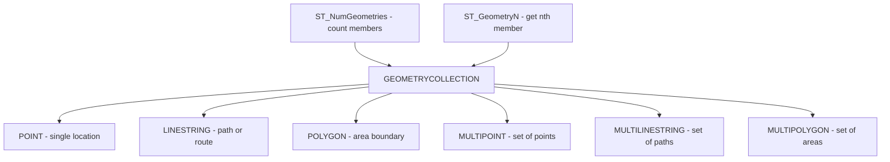

# How to Use GEOMETRYCOLLECTION Data Type in MySQL

Author: [OneUptime](https://www.github.com/OneUptime)

Tags: MySQL, SQL, Spatial, GIS, Geometry, Database

Description: Learn how to store mixed collections of spatial geometries using GEOMETRYCOLLECTION in MySQL, with insertion, iteration, and spatial query examples.

---

## What Is GEOMETRYCOLLECTION

`GEOMETRYCOLLECTION` is a spatial data type in MySQL that holds a collection of zero or more geometry objects of any type. A single GEOMETRYCOLLECTION column can contain a mix of `POINT`, `LINESTRING`, `POLYGON`, and even nested collection types (`MULTIPOINT`, `MULTILINESTRING`, `MULTIPOLYGON`).

This type is useful when a single entity has multiple spatial components of different types -- for example, a map feature that includes a building footprint (POLYGON), an entrance marker (POINT), and an access road (LINESTRING).



## Syntax

```sql
-- Column definition
column_name GEOMETRYCOLLECTION [NOT NULL] [SRID srid_value]

-- Create from WKT
ST_GeomFromText('GEOMETRYCOLLECTION(POINT(x y), LINESTRING(x1 y1, x2 y2), POLYGON(...))', srid)

-- Empty collection
ST_GeomFromText('GEOMETRYCOLLECTION EMPTY', 0)

-- Useful functions
ST_NumGeometries(geomcoll)       -- count of member geometries
ST_GeometryN(geomcoll, n)        -- nth member (1-based)
ST_AsText(geomcoll)              -- WKT representation
ST_GeometryType(geomcoll)        -- returns 'GEOMETRYCOLLECTION'
```

## Examples

### Create a Table with GEOMETRYCOLLECTION

```sql
CREATE TABLE map_features (
    id          INT              PRIMARY KEY AUTO_INCREMENT,
    name        VARCHAR(100)     NOT NULL,
    feature_set GEOMETRYCOLLECTION NOT NULL SRID 4326
);
```

### Insert GEOMETRYCOLLECTION Values

```sql
-- Airport feature: terminal building (POLYGON), runway (LINESTRING), control tower (POINT)
INSERT INTO map_features (name, feature_set) VALUES
(
    'JFK Airport Features',
    ST_GeomFromText(
        'GEOMETRYCOLLECTION(
            POINT(-73.7781 40.6413),
            LINESTRING(-73.7900 40.6350, -73.7650 40.6450),
            POLYGON((-73.7850 40.6380, -73.7720 40.6380, -73.7720 40.6450, -73.7850 40.6450, -73.7850 40.6380))
        )',
        4326
    )
),
(
    'Central Park Features',
    ST_GeomFromText(
        'GEOMETRYCOLLECTION(
            POINT(-73.9654 40.7829),
            POLYGON((-73.9812 40.7641, -73.9496 40.7968, -73.9584 40.8004, -73.9730 40.7648, -73.9812 40.7641))
        )',
        4326
    )
);
```

### Query Collection Properties

```sql
SELECT
    name,
    ST_NumGeometries(feature_set)        AS num_members,
    ST_GeometryType(feature_set)         AS type,
    ST_AsText(feature_set)               AS wkt
FROM map_features;
```

```text
+-----------------------+-------------+--------------------+---------------------------------------------+
| name                  | num_members | type               | wkt                                         |
+-----------------------+-------------+--------------------+---------------------------------------------+
| JFK Airport Features  |           3 | GEOMETRYCOLLECTION | GEOMETRYCOLLECTION(POINT(...),...)           |
| Central Park Features |           2 | GEOMETRYCOLLECTION | GEOMETRYCOLLECTION(POINT(...),POLYGON(...))  |
+-----------------------+-------------+--------------------+---------------------------------------------+
```

### Extract Individual Geometries from a Collection

```sql
SELECT
    name,
    ST_GeometryType(ST_GeometryN(feature_set, 1)) AS member_1_type,
    ST_AsText(ST_GeometryN(feature_set, 1))        AS member_1_wkt,
    ST_GeometryType(ST_GeometryN(feature_set, 2)) AS member_2_type,
    ST_AsText(ST_GeometryN(feature_set, 2))        AS member_2_wkt
FROM map_features
WHERE name = 'JFK Airport Features';
```

```text
+----------------------+---------------+----------------------------+----------------+-------------------------------+
| name                 | member_1_type | member_1_wkt               | member_2_type  | member_2_wkt                  |
+----------------------+---------------+----------------------------+----------------+-------------------------------+
| JFK Airport Features | Point         | POINT(-73.7781 40.6413)    | LineString     | LINESTRING(-73.79 40.635,...) |
+----------------------+---------------+----------------------------+----------------+-------------------------------+
```

### Iterate Through All Members Using a Stored Procedure

```sql
DELIMITER $$

CREATE PROCEDURE show_geometry_members(p_name VARCHAR(100))
BEGIN
    DECLARE total INT;
    DECLARE i     INT DEFAULT 1;
    DECLARE geom  GEOMETRY;

    SELECT feature_set INTO @collection
    FROM map_features
    WHERE name = p_name
    LIMIT 1;

    SET total = ST_NumGeometries(@collection);

    WHILE i <= total DO
        SET geom = ST_GeometryN(@collection, i);
        SELECT i AS member_index,
               ST_GeometryType(geom) AS geom_type,
               ST_AsText(geom)       AS wkt;
        SET i = i + 1;
    END WHILE;
END$$

DELIMITER ;

CALL show_geometry_members('JFK Airport Features');
```

### Check If a GEOMETRYCOLLECTION Is Empty

```sql
SELECT
    name,
    ST_IsEmpty(feature_set)    AS is_empty,
    ST_NumGeometries(feature_set) AS member_count
FROM map_features;
```

### Build a GEOMETRYCOLLECTION from Multiple Rows

Use `ST_Collect` (MySQL 8.0.24+) to aggregate multiple geometries into a collection:

```sql
-- Aggregate all point columns from a locations table into one collection
SELECT ST_AsText(
    ST_Collect(location)
) AS all_points
FROM landmarks;
```

## GEOMETRYCOLLECTION vs Homogeneous Types

| Type               | Contents                     | Use Case                            |
|--------------------|------------------------------|-------------------------------------|
| GEOMETRYCOLLECTION | Any mix of geometry types    | Map features with mixed shapes      |
| MULTIPOINT         | Multiple POINT values only   | Set of discrete locations           |
| MULTILINESTRING    | Multiple LINESTRING values   | Set of roads, rivers                |
| MULTIPOLYGON       | Multiple POLYGON values      | Country with islands, counties      |

## Best Practices

- Use homogeneous collection types (`MULTIPOINT`, `MULTILINESTRING`, `MULTIPOLYGON`) when all members share the same geometry type; they carry more semantic meaning and some functions work only on homogeneous types.
- Use `ST_GeometryN` with a loop or application-side iteration to process individual members.
- Avoid storing deeply nested collections unless the use case demands it.
- Spatial indexes work on the bounding box of the entire collection, not individual members.

## Summary

`GEOMETRYCOLLECTION` stores zero or more geometry objects of any type in a single column. Insert values with `ST_GeomFromText('GEOMETRYCOLLECTION(...)', srid)`. Use `ST_NumGeometries` to count members and `ST_GeometryN` to retrieve the nth member. Prefer specific collection types (`MULTIPOINT`, `MULTIPOLYGON`) when all members share a single type. Use `GEOMETRYCOLLECTION` for features that genuinely combine different geometry types.
