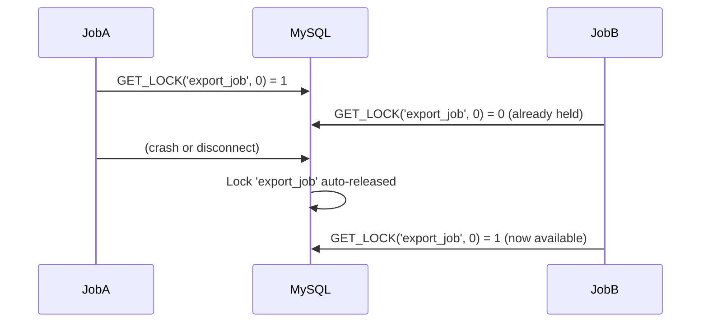
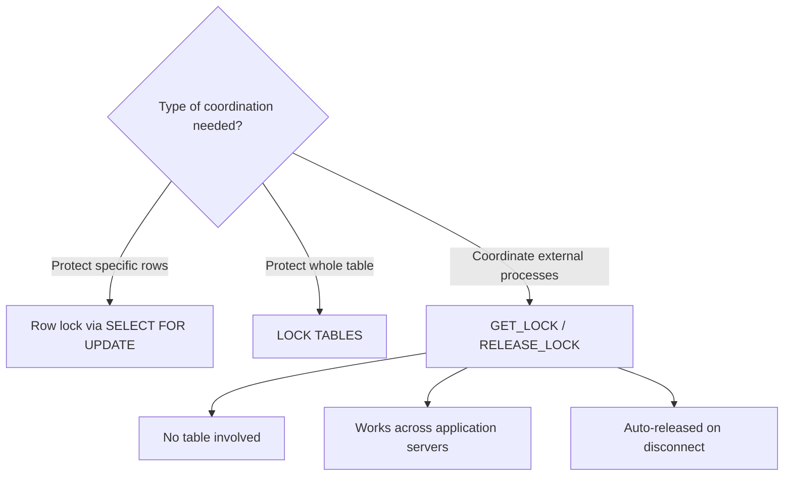

# How to Use GET_LOCK() and RELEASE_LOCK() in MySQL

Author: [OneUptime](https://oneuptime.com)

Tags: MySQL, Lock, Concurrency, Function, Advisory Lock

Description: Learn how to use MySQL GET_LOCK() and RELEASE_LOCK() to implement application-level advisory locks that coordinate concurrent processes without locking rows or tables.

---

## Introduction

MySQL provides user-level (advisory) locking through the `GET_LOCK()` and `RELEASE_LOCK()` functions. Unlike row locks or table locks, advisory locks are not attached to any database object -- they are identified by an arbitrary string name and exist only as long as the session holds them. They are useful for coordinating background jobs, cron tasks, and distributed processes that must not run concurrently.

## Function signatures

```sql
GET_LOCK(str, timeout)
RELEASE_LOCK(str)
```

| Parameter | Description |
|---|---|
| `str` | Lock name (string, case-insensitive, max 64 characters) |
| `timeout` | Seconds to wait for the lock; `-1` waits indefinitely; `0` returns immediately |

### Return values

**GET_LOCK()**

| Return | Meaning |
|---|---|
| `1` | Lock acquired successfully |
| `0` | Timeout expired without acquiring the lock |
| `NULL` | Error (e.g. thread was killed) |

**RELEASE_LOCK()**

| Return | Meaning |
|---|---|
| `1` | Lock released successfully |
| `0` | Lock was not held by this session |
| `NULL` | Lock name does not exist |

## Basic example

```sql
-- Session A: acquire the lock
SELECT GET_LOCK('my_job', 10) AS acquired;
-- acquired: 1

-- ... do exclusive work ...

-- Session A: release when done
SELECT RELEASE_LOCK('my_job') AS released;
-- released: 1
```

## Mutual exclusion for a background job

```sql
DELIMITER $$

CREATE PROCEDURE run_daily_report()
BEGIN
  DECLARE lock_result INT;

  -- Try to acquire the lock (wait up to 0 seconds = non-blocking)
  SET lock_result = GET_LOCK('daily_report_job', 0);

  IF lock_result = 1 THEN
    -- We hold the lock, proceed
    -- ... actual report generation logic here ...
    SELECT 'Report generated' AS status;
    DO RELEASE_LOCK('daily_report_job');
  ELSEIF lock_result = 0 THEN
    SELECT 'Another instance is already running' AS status;
  ELSE
    SELECT 'Failed to acquire lock (error)' AS status;
  END IF;
END$$

DELIMITER ;
```

## Waiting with a timeout

```sql
-- Wait up to 5 seconds for the lock
SELECT GET_LOCK('report_export', 5) AS result;

-- -1 means wait forever (use with caution)
SELECT GET_LOCK('critical_migration', -1) AS result;
```

## Lock names and namespacing

Lock names are case-insensitive strings. Use a naming convention to avoid accidental conflicts:

```sql
-- Good: include app name and purpose
SELECT GET_LOCK('myapp:reindex_products', 10);
SELECT GET_LOCK('myapp:send_newsletter', 0);

-- Include a scope identifier for multi-tenant systems
SELECT GET_LOCK(CONCAT('tenant:', @tenant_id, ':export'), 5);
```

## Multiple locks per session (MySQL 5.7.5+)

From MySQL 5.7.5, a single session can hold multiple named locks simultaneously:

```sql
SELECT GET_LOCK('lock_a', 5); -- 1
SELECT GET_LOCK('lock_b', 5); -- 1
-- Both locks are held by this session

SELECT RELEASE_LOCK('lock_a'); -- 1
SELECT RELEASE_LOCK('lock_b'); -- 1
```

Before 5.7.5, calling `GET_LOCK()` a second time released the previously held lock.

## Checking lock ownership

```sql
-- IS_FREE_LOCK returns 1 if the lock is not held by anyone
SELECT IS_FREE_LOCK('my_job') AS is_free;

-- IS_USED_LOCK returns the connection ID holding the lock, or NULL if free
SELECT IS_USED_LOCK('my_job') AS held_by_connection;
```

## Automatic lock release

Advisory locks are automatically released when the session ends (or when the connection drops). This prevents permanent lock starvation from crashed processes:



## Advisory lock vs. row/table lock



## Using advisory locks with Python

```python
import mysql.connector

conn = mysql.connector.connect(host='localhost', user='app', password='secret', database='myapp')
cursor = conn.cursor()

cursor.execute("SELECT GET_LOCK('python_job', 0)")
(acquired,) = cursor.fetchone()

if acquired == 1:
    try:
        # exclusive work here
        print("Lock acquired, running job")
    finally:
        cursor.execute("SELECT RELEASE_LOCK('python_job')")
        cursor.fetchone()
else:
    print("Job already running in another process")

conn.close()
```

## Summary

`GET_LOCK(name, timeout)` acquires a named advisory lock, returning `1` on success, `0` on timeout, and `NULL` on error. `RELEASE_LOCK(name)` releases the lock and returns `1` if successful. Advisory locks are not tied to any database object, work across application servers sharing the same MySQL instance, and are automatically released when a session disconnects. They are the right tool for ensuring that background jobs, batch exports, and scheduled tasks do not run concurrently.
