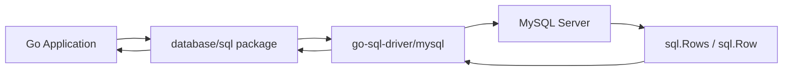

# How to Set Up MySQL with Go using database/sql

Author: [nawazdhandala](https://www.github.com/nawazdhandala)

Tags: MySQL, Go, Golang, database/sql, Database, Connection Pool

Description: Learn how to connect a Go application to MySQL using the standard database/sql package with go-sql-driver/mysql, prepared statements, and connection pool tuning.

---

## How database/sql Works in Go

Go's standard library provides the `database/sql` package as a generic interface for SQL databases. The actual MySQL protocol is implemented by a driver - the most popular being `go-sql-driver/mysql`. `database/sql` manages a connection pool internally, so you create a single `*sql.DB` and reuse it across the application.



## Installation

```bash
go get github.com/go-sql-driver/mysql
```

## Database Connection

```go
package db

import (
    "database/sql"
    "fmt"
    "time"

    _ "github.com/go-sql-driver/mysql"
)

var DB *sql.DB

func Init() error {
    dsn := "appuser:secret@tcp(localhost:3306)/myapp" +
        "?parseTime=true" +
        "&loc=UTC" +
        "&charset=utf8mb4" +
        "&collation=utf8mb4_unicode_ci"

    var err error
    DB, err = sql.Open("mysql", dsn)
    if err != nil {
        return fmt.Errorf("sql.Open: %w", err)
    }

    // Configure pool
    DB.SetMaxOpenConns(25)
    DB.SetMaxIdleConns(10)
    DB.SetConnMaxLifetime(5 * time.Minute)
    DB.SetConnMaxIdleTime(3 * time.Minute)

    return DB.Ping()
}
```

## Setup: Sample Table

```sql
CREATE TABLE products (
    id         INT AUTO_INCREMENT PRIMARY KEY,
    name       VARCHAR(100) NOT NULL,
    price      DECIMAL(10,2) NOT NULL,
    stock      INT NOT NULL DEFAULT 0,
    created_at DATETIME NOT NULL DEFAULT NOW()
);
```

## Model and Repository

```go
package main

import (
    "context"
    "database/sql"
    "time"
)

type Product struct {
    ID        int
    Name      string
    Price     float64
    Stock     int
    CreatedAt time.Time
}

// Create
func CreateProduct(ctx context.Context, name string, price float64, stock int) (int64, error) {
    res, err := db.DB.ExecContext(ctx,
        "INSERT INTO products (name, price, stock) VALUES (?, ?, ?)",
        name, price, stock,
    )
    if err != nil {
        return 0, err
    }
    return res.LastInsertId()
}

// Read single
func GetProduct(ctx context.Context, id int) (*Product, error) {
    p := &Product{}
    err := db.DB.QueryRowContext(ctx,
        "SELECT id, name, price, stock, created_at FROM products WHERE id = ?",
        id,
    ).Scan(&p.ID, &p.Name, &p.Price, &p.Stock, &p.CreatedAt)
    if err == sql.ErrNoRows {
        return nil, nil
    }
    return p, err
}

// Read many
func ListProducts(ctx context.Context) ([]Product, error) {
    rows, err := db.DB.QueryContext(ctx,
        "SELECT id, name, price, stock, created_at FROM products ORDER BY id",
    )
    if err != nil {
        return nil, err
    }
    defer rows.Close()

    var products []Product
    for rows.Next() {
        var p Product
        if err := rows.Scan(&p.ID, &p.Name, &p.Price, &p.Stock, &p.CreatedAt); err != nil {
            return nil, err
        }
        products = append(products, p)
    }
    return products, rows.Err()
}

// Update
func UpdateStock(ctx context.Context, id, delta int) (int64, error) {
    res, err := db.DB.ExecContext(ctx,
        "UPDATE products SET stock = stock + ? WHERE id = ?",
        delta, id,
    )
    if err != nil {
        return 0, err
    }
    return res.RowsAffected()
}

// Delete
func DeleteProduct(ctx context.Context, id int) (int64, error) {
    res, err := db.DB.ExecContext(ctx,
        "DELETE FROM products WHERE id = ?",
        id,
    )
    if err != nil {
        return 0, err
    }
    return res.RowsAffected()
}
```

## Transactions

```go
func TransferStock(ctx context.Context, fromID, toID, qty int) error {
    tx, err := db.DB.BeginTx(ctx, nil)
    if err != nil {
        return err
    }
    defer func() {
        if err != nil {
            tx.Rollback()
        }
    }()

    // Deduct from source (check stock >= qty)
    res, err := tx.ExecContext(ctx,
        "UPDATE products SET stock = stock - ? WHERE id = ? AND stock >= ?",
        qty, fromID, qty,
    )
    if err != nil {
        return err
    }
    affected, _ := res.RowsAffected()
    if affected == 0 {
        err = fmt.Errorf("insufficient stock in product %d", fromID)
        return err
    }

    // Add to destination
    _, err = tx.ExecContext(ctx,
        "UPDATE products SET stock = stock + ? WHERE id = ?",
        qty, toID,
    )
    if err != nil {
        return err
    }

    return tx.Commit()
}
```

## Prepared Statements (Explicit)

```go
func BulkInsert(ctx context.Context, products []Product) error {
    stmt, err := db.DB.PrepareContext(ctx,
        "INSERT INTO products (name, price, stock) VALUES (?, ?, ?)",
    )
    if err != nil {
        return err
    }
    defer stmt.Close()

    for _, p := range products {
        if _, err = stmt.ExecContext(ctx, p.Name, p.Price, p.Stock); err != nil {
            return err
        }
    }
    return nil
}
```

## Context and Timeouts

```go
func GetProductWithTimeout(id int) (*Product, error) {
    ctx, cancel := context.WithTimeout(context.Background(), 5*time.Second)
    defer cancel()
    return GetProduct(ctx, id)
}
```

## Best Practices

- Create one `*sql.DB` per application and reuse it - it is already a thread-safe pool.
- Always pass a `context.Context` to `QueryContext`, `ExecContext`, and `BeginTx` so queries can be cancelled on request timeout.
- Always call `rows.Close()` and check `rows.Err()` after iterating.
- Use `parseTime=true` in the DSN so `DATETIME` / `TIMESTAMP` columns scan directly into `time.Time`.
- Set `SetMaxOpenConns`, `SetMaxIdleConns`, and `SetConnMaxLifetime` to avoid connection exhaustion and stale connections.
- Use `sql.ErrNoRows` to distinguish "not found" from other query errors.

## Summary

Go's `database/sql` with `go-sql-driver/mysql` provides a robust, pool-aware MySQL client. A single `*sql.DB` manages the connection pool transparently. Use `QueryContext` for SELECT, `ExecContext` for DML, and `QueryRowContext` for single-row queries. Transactions use `BeginTx` / `Commit` / `Rollback`. Always pass `context.Context` for cancellable, timeout-aware database calls. Configure the pool settings (`SetMaxOpenConns`, `SetConnMaxLifetime`) to match your MySQL server's capacity.
