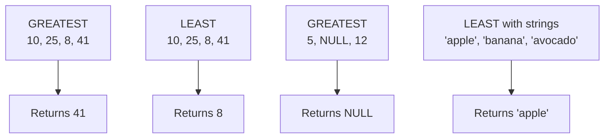

# How to Use GREATEST() and LEAST() Functions in MySQL

Author: [nawazdhandala](https://www.github.com/nawazdhandala)

Tags: MySQL, SQL, Comparison Function, Database

Description: Learn how to use MySQL GREATEST() and LEAST() functions to find the largest and smallest values from a list of arguments in a single expression.

---

## What GREATEST() and LEAST() Do

`GREATEST()` returns the largest value from a list of two or more arguments. `LEAST()` returns the smallest. Both functions compare values using MySQL type coercion rules and handle `NULL` by returning `NULL` if any argument is `NULL`.



## Syntax

```sql
GREATEST(value1, value2, value3, ...)
LEAST(value1, value2, value3, ...)
```

Both require at least two arguments. They accept numbers, strings, and date values.

## Basic Examples

```sql
-- Numeric comparison
SELECT GREATEST(10, 25, 8, 41) AS max_val;   -- 41
SELECT LEAST(10, 25, 8, 41)    AS min_val;   -- 8

-- String comparison (lexicographic)
SELECT GREATEST('apple', 'banana', 'avocado') AS max_str;  -- banana
SELECT LEAST('apple', 'banana', 'avocado')    AS min_str;  -- apple

-- Date comparison
SELECT GREATEST('2026-01-01', '2025-12-15', '2026-03-31') AS latest_date;
-- 2026-03-31
SELECT LEAST('2026-01-01', '2025-12-15', '2026-03-31') AS earliest_date;
-- 2025-12-15
```

## Setup: Sample Table

```sql
CREATE TABLE product_pricing (
    id           INT AUTO_INCREMENT PRIMARY KEY,
    product      VARCHAR(100),
    cost         DECIMAL(10, 2),
    list_price   DECIMAL(10, 2),
    sale_price   DECIMAL(10, 2),
    floor_price  DECIMAL(10, 2)
);

INSERT INTO product_pricing (product, cost, list_price, sale_price, floor_price) VALUES
('Widget A', 12.00, 29.99, 24.99, 15.00),
('Widget B', 45.00, 89.99, 89.99, 50.00),
('Gadget X', 80.00, 149.99, 119.99, 90.00),
('Gadget Y', 20.00, 49.99, 35.00, 25.00);
```

## Using GREATEST() and LEAST() Across Columns

A common use case is comparing values spread across multiple columns of the same row:

```sql
-- Find the highest price variant for each product
SELECT
    product,
    cost,
    list_price,
    sale_price,
    GREATEST(list_price, sale_price) AS effective_high,
    LEAST(cost, floor_price)         AS effective_low
FROM product_pricing;
```

```text
+-----------+-------+------------+------------+----------------+---------------+
| product   | cost  | list_price | sale_price | effective_high | effective_low |
+-----------+-------+------------+------------+----------------+---------------+
| Widget A  | 12.00 |      29.99 |      24.99 |          29.99 |         12.00 |
| Widget B  | 45.00 |      89.99 |      89.99 |          89.99 |         45.00 |
| Gadget X  | 80.00 |     149.99 |     119.99 |         149.99 |         80.00 |
| Gadget Y  | 20.00 |      49.99 |      35.00 |          49.99 |         20.00 |
+-----------+-------+------------+------------+----------------+---------------+
```

## Enforcing Business Rules with LEAST()

A typical scenario: ensure the selling price never drops below the floor price.

```sql
-- Apply a discount but never go below floor_price
SELECT
    product,
    sale_price,
    floor_price,
    GREATEST(sale_price * 0.90, floor_price) AS discounted_price
FROM product_pricing;
```

```text
+-----------+------------+-------------+------------------+
| product   | sale_price | floor_price | discounted_price |
+-----------+------------+-------------+------------------+
| Widget A  |      24.99 |       15.00 |            22.49 |
| Widget B  |      89.99 |       50.00 |            80.99 |
| Gadget X  |     119.99 |       90.00 |           107.99 |
| Gadget Y  |      35.00 |       25.00 |            31.50 |
+-----------+------------+-------------+------------------+
```

## NULL Handling

If any argument is `NULL`, both functions return `NULL`:

```sql
SELECT
    GREATEST(10, NULL, 5) AS result,   -- NULL
    LEAST(10, NULL, 5)    AS result2;  -- NULL
```

Use `COALESCE()` to substitute a safe default before passing values in:

```sql
SELECT
    product,
    GREATEST(
        COALESCE(list_price, 0),
        COALESCE(sale_price, 0)
    ) AS safe_greatest
FROM product_pricing;
```

## Comparing Dates Across Columns

```sql
CREATE TABLE project_dates (
    project      VARCHAR(100),
    planned_end  DATE,
    actual_end   DATE,
    deadline     DATE
);

INSERT INTO project_dates VALUES
('Alpha', '2026-06-01', '2026-05-28', '2026-06-15'),
('Beta',  '2026-08-01', '2026-09-10', '2026-08-01'),
('Gamma', '2026-04-01', NULL,         '2026-05-01');

-- Find the latest date reached for each project (ignoring NULLs)
SELECT
    project,
    GREATEST(
        planned_end,
        COALESCE(actual_end, planned_end)
    ) AS latest_reached
FROM project_dates;
```

## Type Coercion Behavior

When arguments have mixed types, MySQL coerces them:

```sql
-- String '20' is coerced to numeric 20
SELECT GREATEST(10, '20', 15) AS result;  -- 20 (numeric comparison)

-- When all look like numbers but are strings, numeric context applies
SELECT LEAST('100', '99', '200') AS result;  -- 99 (numeric if numeric-looking)

-- Purely non-numeric strings use lexicographic comparison
SELECT LEAST('a100', 'a99', 'a200') AS result;  -- a100 (string comparison)
```

To avoid unexpected coercion, ensure arguments share the same type.

## Using GREATEST() with CASE for Bounded Values

```sql
-- Clamp a value to a range [min_bound, max_bound]
SET @val = 150;
SET @min_bound = 0;
SET @max_bound = 100;

SELECT LEAST(GREATEST(@val, @min_bound), @max_bound) AS clamped;
-- Result: 100
```

## Summary

`GREATEST()` returns the largest value and `LEAST()` returns the smallest from a list of arguments. Both support numbers, strings, and dates, with string comparisons being lexicographic and mixed-type comparisons following MySQL coercion rules. Either function returns `NULL` if any argument is `NULL`, so wrap nullable columns with `COALESCE()` before passing them in. A common pattern is using `GREATEST(value, floor)` to enforce a minimum and `LEAST(value, ceiling)` to enforce a maximum.
