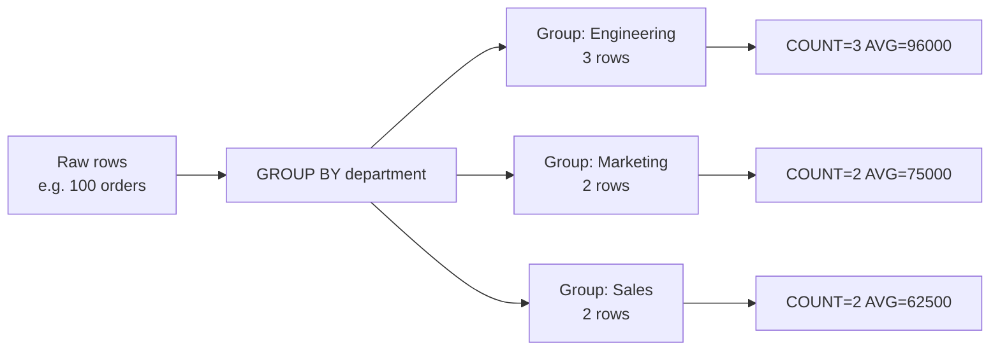

# How to Use GROUP BY in MySQL for Aggregation

Author: [nawazdhandala](https://www.github.com/nawazdhandala)

Tags: MySQL, SQL, DML, GROUP BY, Aggregation, Query, Analytics

Description: Aggregate MySQL data with GROUP BY using COUNT, SUM, AVG, MIN, and MAX, combine with HAVING for post-aggregation filtering, and use WITH ROLLUP for subtotals.

---

## How It Works

`GROUP BY` collapses multiple rows that share the same value for the grouped columns into a single summary row. Each summary row contains one value per group column plus the results of aggregate functions applied to all rows in that group.



## Aggregate Functions

| Function | Description |
|---|---|
| `COUNT(*)` | Count all rows including NULLs |
| `COUNT(col)` | Count non-NULL values in col |
| `COUNT(DISTINCT col)` | Count unique non-NULL values |
| `SUM(col)` | Sum of non-NULL values |
| `AVG(col)` | Average of non-NULL values |
| `MIN(col)` | Minimum non-NULL value |
| `MAX(col)` | Maximum non-NULL value |
| `GROUP_CONCAT(col)` | Concatenate values in the group |

## Sample Data

```sql
CREATE TABLE orders (
    id           INT UNSIGNED AUTO_INCREMENT PRIMARY KEY,
    user_id      INT UNSIGNED    NOT NULL,
    category     VARCHAR(50)     NOT NULL,
    amount       DECIMAL(10, 2)  NOT NULL,
    status       VARCHAR(20)     NOT NULL DEFAULT 'completed',
    created_at   DATE            NOT NULL
);

INSERT INTO orders (user_id, category, amount, status, created_at) VALUES
    (1, 'Electronics', 299.99, 'completed', '2024-01-15'),
    (1, 'Books',        39.99, 'completed', '2024-01-20'),
    (2, 'Electronics', 149.99, 'completed', '2024-01-22'),
    (2, 'Clothing',     59.99, 'completed', '2024-02-01'),
    (3, 'Books',        24.99, 'completed', '2024-02-05'),
    (3, 'Electronics', 499.99, 'completed', '2024-02-10'),
    (1, 'Electronics', 199.99, 'cancelled', '2024-02-15'),
    (4, 'Clothing',     89.99, 'completed', '2024-03-01'),
    (4, 'Books',        49.99, 'completed', '2024-03-05'),
    (5, 'Electronics', 399.99, 'completed', '2024-03-10');
```

## Basic GROUP BY

Count orders by category.

```sql
SELECT category, COUNT(*) AS order_count
FROM orders
GROUP BY category
ORDER BY order_count DESC;
```

```text
+-------------+-------------+
| category    | order_count |
+-------------+-------------+
| Electronics |           5 |
| Books       |           3 |
| Clothing    |           2 |
+-------------+-------------+
```

## Multiple Aggregate Functions

```sql
SELECT
    category,
    COUNT(*)               AS order_count,
    SUM(amount)            AS total_revenue,
    AVG(amount)            AS avg_order_value,
    MIN(amount)            AS min_order,
    MAX(amount)            AS max_order
FROM orders
WHERE status = 'completed'
GROUP BY category
ORDER BY total_revenue DESC;
```

```text
+-------------+-------------+---------------+-----------------+-----------+-----------+
| category    | order_count | total_revenue | avg_order_value | min_order | max_order |
+-------------+-------------+---------------+-----------------+-----------+-----------+
| Electronics |           4 |       1349.96 |      337.490000 |    149.99 |    499.99 |
| Books       |           3 |        114.97 |       38.323333 |     24.99 |     49.99 |
| Clothing    |           2 |        149.98 |       74.990000 |     59.99 |     89.99 |
+-------------+-------------+---------------+-----------------+-----------+-----------+
```

## GROUP BY Multiple Columns

```sql
SELECT
    category,
    status,
    COUNT(*)      AS cnt,
    SUM(amount)   AS total
FROM orders
GROUP BY category, status
ORDER BY category, status;
```

```text
+-------------+-----------+-----+---------+
| category    | status    | cnt | total   |
+-------------+-----------+-----+---------+
| Books       | completed |   3 |  114.97 |
| Clothing    | completed |   2 |  149.98 |
| Electronics | cancelled |   1 |  199.99 |
| Electronics | completed |   4 | 1349.96 |
+-------------+-----------+-----+---------+
```

## COUNT DISTINCT

```sql
-- Count unique customers per category
SELECT category, COUNT(DISTINCT user_id) AS unique_customers
FROM orders
GROUP BY category;
```

```text
+-------------+------------------+
| category    | unique_customers |
+-------------+------------------+
| Electronics |               4  |
| Books       |               3  |
| Clothing    |               2  |
+-------------+------------------+
```

## GROUP_CONCAT

Concatenate values within each group.

```sql
SELECT category, GROUP_CONCAT(DISTINCT user_id ORDER BY user_id SEPARATOR ', ') AS customer_ids
FROM orders
GROUP BY category;
```

```text
+-------------+--------------+
| category    | customer_ids |
+-------------+--------------+
| Books       | 1, 3, 4      |
| Clothing    | 2, 4         |
| Electronics | 1, 2, 3, 5   |
+-------------+--------------+
```

## Monthly Revenue Summary

```sql
SELECT
    DATE_FORMAT(created_at, '%Y-%m') AS month,
    COUNT(*)                          AS order_count,
    SUM(amount)                       AS total_revenue
FROM orders
WHERE status = 'completed'
GROUP BY DATE_FORMAT(created_at, '%Y-%m')
ORDER BY month;
```

```text
+---------+-------------+---------------+
| month   | order_count | total_revenue |
+---------+-------------+---------------+
| 2024-01 |           3 |        489.97 |
| 2024-02 |           2 |        524.98 |
| 2024-03 |           3 |        539.97 |
+---------+-------------+---------------+
```

## WITH ROLLUP - Subtotals and Grand Total

```sql
SELECT
    IFNULL(category, 'ALL CATEGORIES') AS category,
    COUNT(*)                            AS order_count,
    SUM(amount)                         AS total
FROM orders
WHERE status = 'completed'
GROUP BY category WITH ROLLUP;
```

```text
+----------------+-------------+----------+
| category       | order_count | total    |
+----------------+-------------+----------+
| Books          |           3 |   114.97 |
| Clothing       |           2 |   149.98 |
| Electronics    |           4 |  1349.96 |
| ALL CATEGORIES |           9 |  1614.91 |
+----------------+-------------+----------+
```

## HAVING - Filter Groups

`HAVING` filters after aggregation, unlike `WHERE` which filters before.

```sql
-- Categories with more than 2 orders
SELECT category, COUNT(*) AS order_count
FROM orders
GROUP BY category
HAVING order_count > 2;
```

See the dedicated HAVING Clause post for more examples.

## Best Practices

- Every column in the `SELECT` list that is not inside an aggregate function must be in the `GROUP BY` list (strict mode enforcement).
- Use `WHERE` to filter rows before grouping (faster - reduces rows to aggregate).
- Use `HAVING` to filter after grouping (slower - operates on aggregate results).
- Add indexes on GROUP BY columns: `INDEX (category)` or composite `INDEX (status, category)`.
- Use `COUNT(DISTINCT col)` to count unique values and avoid double-counting in joins.
- Use `GROUP_CONCAT` with `ORDER BY` and `SEPARATOR` for readable concatenated group values.

## Summary

`GROUP BY` collapses rows sharing the same value(s) into summary rows and applies aggregate functions - `COUNT`, `SUM`, `AVG`, `MIN`, `MAX`, `GROUP_CONCAT` - to compute statistics per group. Combine with `WHERE` to pre-filter rows, `HAVING` to post-filter groups, `ORDER BY` to sort results, and `WITH ROLLUP` to add subtotals and grand totals. Index the GROUP BY columns for efficient aggregation on large tables.
