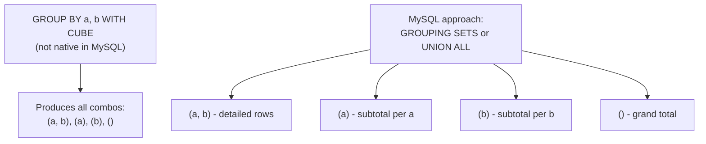

# How to Use GROUP BY with CUBE in MySQL 8.0+

Author: [OneUptime](https://www.github.com/OneUptime)

Tags: MySQL, SQL, GROUP BY, CUBE, Aggregation, Analytics

Description: Learn how to use GROUP BY WITH ROLLUP to simulate CUBE-style cross-tabulated subtotals in MySQL 8.0, generating all combinations of dimension aggregations.

---

## What Is CUBE in SQL

`CUBE` is a GROUP BY extension that generates subtotals for all possible combinations of the grouping columns. For N dimensions, CUBE produces 2^N grouping sets, including the grand total and every combination of partial aggregations.

MySQL 8.0 does not support `GROUP BY WITH CUBE` syntax directly. However, MySQL 8.0 supports `GROUPING SETS` which provides the same capability, and you can approximate CUBE using `UNION ALL` of multiple `GROUP BY WITH ROLLUP` queries or by using `GROUPING SETS` explicitly.



## Syntax Approaches in MySQL

```sql
-- MySQL 8.0+: GROUPING SETS (closest to CUBE)
SELECT col1, col2, AGG(col3)
FROM table
GROUP BY GROUPING SETS ((col1, col2), (col1), (col2), ());

-- MySQL: Simulate CUBE with UNION ALL
SELECT col1, col2, SUM(col3) FROM table GROUP BY col1, col2
UNION ALL
SELECT col1, NULL, SUM(col3) FROM table GROUP BY col1
UNION ALL
SELECT NULL, col2, SUM(col3) FROM table GROUP BY col2
UNION ALL
SELECT NULL, NULL, SUM(col3) FROM table;

-- MySQL 8.0: WITH ROLLUP (hierarchical, not all combinations)
SELECT col1, col2, SUM(col3)
FROM table
GROUP BY col1, col2 WITH ROLLUP;
```

## Examples

### Setup: Sales Data by Region and Product

```sql
CREATE TABLE sales_data (
    id       INT PRIMARY KEY AUTO_INCREMENT,
    region   VARCHAR(50),
    product  VARCHAR(50),
    quarter  VARCHAR(5),
    revenue  DECIMAL(12,2)
);

INSERT INTO sales_data (region, product, quarter, revenue) VALUES
    ('North', 'Widget', 'Q1', 12000),
    ('North', 'Widget', 'Q2', 14000),
    ('North', 'Gadget', 'Q1', 9000),
    ('North', 'Gadget', 'Q2', 11000),
    ('South', 'Widget', 'Q1', 8000),
    ('South', 'Widget', 'Q2', 9500),
    ('South', 'Gadget', 'Q1', 7500),
    ('South', 'Gadget', 'Q2', 8800),
    ('East',  'Widget', 'Q1', 15000),
    ('East',  'Widget', 'Q2', 16500),
    ('East',  'Gadget', 'Q1', 10000),
    ('East',  'Gadget', 'Q2', 12000);
```

### CUBE Using GROUPING SETS (MySQL 8.0.1+)

```sql
SELECT
    IFNULL(region, '(All Regions)')   AS region,
    IFNULL(product, '(All Products)') AS product,
    SUM(revenue)                      AS total_revenue
FROM sales_data
GROUP BY GROUPING SETS (
    (region, product),   -- detailed: each region + product combo
    (region),            -- subtotal per region
    (product),           -- subtotal per product
    ()                   -- grand total
)
ORDER BY region, product;
```

```text
+---------------+----------------+---------------+
| region        | product        | total_revenue |
+---------------+----------------+---------------+
| (All Regions) | (All Products) |     133300.00 |
| (All Regions) | Gadget         |      58300.00 |
| (All Regions) | Widget         |      75000.00 |
| East          | (All Products) |      53500.00 |
| East          | Gadget         |      22000.00 |
| East          | Widget         |      31500.00 |
| North         | (All Products) |      46000.00 |
| North         | Gadget         |      20000.00 |
| North         | Widget         |      26000.00 |
| South         | (All Products) |      33800.00 |
| South         | Gadget         |      16300.00 |
| South         | Widget         |      17500.00 |
+---------------+----------------+---------------+
```

### Identify Subtotal Rows with GROUPING()

```sql
SELECT
    CASE GROUPING(region)  WHEN 1 THEN '(All)' ELSE region  END AS region,
    CASE GROUPING(product) WHEN 1 THEN '(All)' ELSE product END AS product,
    SUM(revenue)    AS total_revenue,
    GROUPING(region)  AS grp_region,
    GROUPING(product) AS grp_product
FROM sales_data
GROUP BY GROUPING SETS (
    (region, product),
    (region),
    (product),
    ()
)
ORDER BY grp_region DESC, grp_product DESC, region, product;
```

```text
+-------+---------+---------------+------------+-------------+
| region| product | total_revenue | grp_region | grp_product |
+-------+---------+---------------+------------+-------------+
| (All) | (All)   |     133300.00 | 1          | 1           |
| (All) | Gadget  |      58300.00 | 1          | 0           |
| (All) | Widget  |      75000.00 | 1          | 0           |
| East  | (All)   |      53500.00 | 0          | 1           |
| North | (All)   |      46000.00 | 0          | 1           |
| South | (All)   |      33800.00 | 0          | 1           |
| East  | Gadget  |      22000.00 | 0          | 0           |
| East  | Widget  |      31500.00 | 0          | 0           |
| North | Gadget  |      20000.00 | 0          | 0           |
| North | Widget  |      26000.00 | 0          | 0           |
| South | Gadget  |      16300.00 | 0          | 0           |
| South | Widget  |      17500.00 | 0          | 0           |
+-------+---------+---------------+------------+-------------+
```

### CUBE Using UNION ALL (Compatibility Approach)

For environments without GROUPING SETS, simulate CUBE with UNION ALL:

```sql
-- Detailed rows (region + product)
SELECT region, product, SUM(revenue) AS total_revenue FROM sales_data GROUP BY region, product
UNION ALL
-- Subtotal by region only
SELECT region, NULL AS product, SUM(revenue) FROM sales_data GROUP BY region
UNION ALL
-- Subtotal by product only
SELECT NULL AS region, product, SUM(revenue) FROM sales_data GROUP BY product
UNION ALL
-- Grand total
SELECT NULL, NULL, SUM(revenue) FROM sales_data
ORDER BY region, product;
```

### Three-Dimension CUBE Simulation

For three dimensions (region, product, quarter), full CUBE requires 2^3 = 8 grouping combinations:

```sql
SELECT
    CASE GROUPING(region)  WHEN 1 THEN '(All)' ELSE region  END AS region,
    CASE GROUPING(product) WHEN 1 THEN '(All)' ELSE product END AS product,
    CASE GROUPING(quarter) WHEN 1 THEN '(All)' ELSE quarter END AS quarter,
    SUM(revenue) AS total_revenue
FROM sales_data
GROUP BY GROUPING SETS (
    (region, product, quarter),  -- detail
    (region, product),           -- by region + product
    (region, quarter),           -- by region + quarter
    (product, quarter),          -- by product + quarter
    (region),                    -- by region
    (product),                   -- by product
    (quarter),                   -- by quarter
    ()                           -- grand total
)
ORDER BY GROUPING(region), GROUPING(product), GROUPING(quarter),
         region, product, quarter;
```

### WITH ROLLUP (Hierarchical, Not Full CUBE)

`WITH ROLLUP` is the native MySQL syntax, but it only generates hierarchical subtotals -- not all combinations:

```sql
SELECT
    IFNULL(region,  '(All)') AS region,
    IFNULL(product, '(All)') AS product,
    SUM(revenue) AS total_revenue
FROM sales_data
GROUP BY region, product WITH ROLLUP;
```

ROLLUP produces: (region, product), (region), () but NOT (product) alone. Use GROUPING SETS for full CUBE behavior.

## CUBE vs ROLLUP vs GROUPING SETS

| Feature        | MySQL Support | Groupings Produced             | Best For                        |
|----------------|---------------|--------------------------------|---------------------------------|
| WITH ROLLUP    | Yes           | Hierarchical subtotals         | Reports with drill-down levels  |
| GROUPING SETS  | Yes (8.0.1+)  | Custom-specified combinations  | Flexible multi-dimensional reports |
| WITH CUBE      | Not directly  | All 2^N combinations           | Cross-tabulation (use GROUPING SETS) |

## Best Practices

- Use `GROUPING SETS` in MySQL 8.0.1+ to get CUBE-like results without writing verbose UNION ALL queries.
- Use `GROUPING(column)` to distinguish NULL subtotals from actual NULL data values.
- Wrap `GROUPING()` in a `CASE` expression to replace subtotal NULLs with readable labels like "(All)".
- For two-dimension cross-tabulation, `GROUPING SETS ((a,b),(a),(b),())` is the exact MySQL equivalent of CUBE(a,b).

## Summary

MySQL 8.0 does not support `GROUP BY WITH CUBE` syntax but provides `GROUPING SETS` which achieves the same result. `GROUPING SETS ((a,b),(a),(b),())` generates all four combinations for two dimensions, equivalent to CUBE. Use `GROUPING(column)` to identify which rows are subtotals vs detail rows. For MySQL versions without GROUPING SETS, simulate CUBE with `UNION ALL` of multiple GROUP BY queries.
