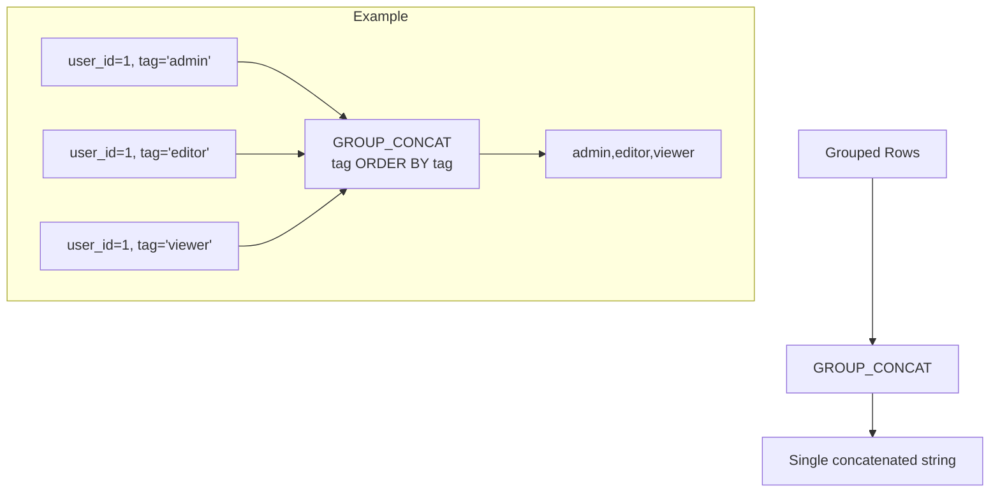

# How to Use GROUP_CONCAT() Function in MySQL

Author: [nawazdhandala](https://www.github.com/nawazdhandala)

Tags: MySQL, SQL, Aggregate Function, String Function, Database

Description: Learn how to use MySQL GROUP_CONCAT() to concatenate values from multiple rows into a single string, with custom separators, ordering, and DISTINCT support.

---

## What GROUP_CONCAT() Does

`GROUP_CONCAT()` is an aggregate function that concatenates non-NULL values from a group of rows into a single comma-separated string. It is useful for collapsing one-to-many relationships into a single column without application-side string building.



## Syntax

```sql
GROUP_CONCAT(
    [DISTINCT] expression
    [ORDER BY col [ASC | DESC]]
    [SEPARATOR 'string']
)
```

- `DISTINCT` removes duplicate values before concatenating.
- `ORDER BY` controls the order of values in the result string.
- `SEPARATOR` sets the delimiter (default is a comma).

## Setup: Sample Tables

```sql
CREATE TABLE users (
    id   INT AUTO_INCREMENT PRIMARY KEY,
    name VARCHAR(100)
);

CREATE TABLE user_roles (
    user_id INT,
    role    VARCHAR(50),
    PRIMARY KEY (user_id, role)
);

INSERT INTO users (name) VALUES
('Alice'), ('Bob'), ('Carol'), ('Dave');

INSERT INTO user_roles (user_id, role) VALUES
(1, 'admin'), (1, 'editor'), (1, 'viewer'),
(2, 'viewer'),
(3, 'editor'), (3, 'moderator'),
(4, 'admin'), (4, 'moderator'), (4, 'viewer');
```

## Basic Usage

```sql
SELECT
    u.name,
    GROUP_CONCAT(r.role) AS roles
FROM users u
JOIN user_roles r ON u.id = r.user_id
GROUP BY u.id, u.name;
```

```text
+-------+----------------------------+
| name  | roles                      |
+-------+----------------------------+
| Alice | admin,editor,viewer        |
| Bob   | viewer                     |
| Carol | editor,moderator           |
| Dave  | admin,moderator,viewer     |
+-------+----------------------------+
```

## Custom Separator

```sql
SELECT
    u.name,
    GROUP_CONCAT(r.role SEPARATOR ' | ') AS roles
FROM users u
JOIN user_roles r ON u.id = r.user_id
GROUP BY u.id, u.name;
```

```text
+-------+-----------------------------+
| name  | roles                       |
+-------+-----------------------------+
| Alice | admin | editor | viewer     |
| Bob   | viewer                      |
| Carol | editor | moderator          |
| Dave  | admin | moderator | viewer  |
+-------+-----------------------------+
```

## Ordering the Concatenated Values

```sql
SELECT
    u.name,
    GROUP_CONCAT(r.role ORDER BY r.role ASC SEPARATOR ', ') AS roles_sorted
FROM users u
JOIN user_roles r ON u.id = r.user_id
GROUP BY u.id, u.name;
```

## DISTINCT to Remove Duplicates

```sql
CREATE TABLE order_tags (
    order_id INT,
    tag      VARCHAR(50)
);

INSERT INTO order_tags VALUES
(1, 'urgent'), (1, 'urgent'), (1, 'fragile'),
(2, 'fragile'), (2, 'fragile'),
(3, 'urgent'), (3, 'bulk');

SELECT
    order_id,
    GROUP_CONCAT(tag)          AS all_tags,
    GROUP_CONCAT(DISTINCT tag) AS unique_tags
FROM order_tags
GROUP BY order_id;
```

```text
+----------+-----------------+----------------+
| order_id | all_tags        | unique_tags    |
+----------+-----------------+----------------+
|        1 | urgent,urgent,fragile | fragile,urgent |
|        2 | fragile,fragile | fragile        |
|        3 | urgent,bulk     | bulk,urgent    |
+----------+-----------------+----------------+
```

## Controlling Maximum Length

`GROUP_CONCAT()` is limited by the `group_concat_max_len` system variable (default 1024 bytes). Results are silently truncated if the combined string exceeds this limit.

```sql
-- Check current limit
SHOW VARIABLES LIKE 'group_concat_max_len';

-- Increase limit for the current session
SET SESSION group_concat_max_len = 65536;

-- Or increase globally
SET GLOBAL group_concat_max_len = 65536;
```

Always increase this variable when concatenating large numbers of values or long strings.

## Using GROUP_CONCAT() in Subqueries

```sql
-- Get users who have both 'admin' and 'editor' roles
SELECT name
FROM (
    SELECT
        u.name,
        GROUP_CONCAT(r.role ORDER BY r.role) AS roles
    FROM users u
    JOIN user_roles r ON u.id = r.user_id
    GROUP BY u.id, u.name
) AS role_summary
WHERE FIND_IN_SET('admin', roles) > 0
  AND FIND_IN_SET('editor', roles) > 0;
```

## Generating Dynamic SQL

`GROUP_CONCAT()` is commonly used to generate dynamic SQL strings:

```sql
-- Generate a comma-separated list of column names from INFORMATION_SCHEMA
SELECT GROUP_CONCAT(COLUMN_NAME ORDER BY ORDINAL_POSITION SEPARATOR ', ')
FROM INFORMATION_SCHEMA.COLUMNS
WHERE TABLE_SCHEMA = 'your_database'
  AND TABLE_NAME   = 'users';
```

## Aggregating with COUNT and GROUP_CONCAT Together

```sql
SELECT
    u.name,
    COUNT(r.role)                                       AS role_count,
    GROUP_CONCAT(r.role ORDER BY r.role SEPARATOR ', ') AS role_list
FROM users u
LEFT JOIN user_roles r ON u.id = r.user_id
GROUP BY u.id, u.name
ORDER BY role_count DESC;
```

## NULL Handling

`GROUP_CONCAT()` ignores `NULL` values automatically:

```sql
SELECT GROUP_CONCAT(role SEPARATOR ', ')
FROM (
    SELECT 'admin' AS role
    UNION ALL SELECT NULL
    UNION ALL SELECT 'editor'
) AS t;
-- Result: admin, editor
```

## Summary

`GROUP_CONCAT()` aggregates multiple rows into a single concatenated string per group. Use `ORDER BY` inside the function to control value order, `SEPARATOR` to change the delimiter, and `DISTINCT` to remove duplicates. Increase `group_concat_max_len` when working with large datasets to prevent silent truncation. It is particularly useful for collapsing tag lists, role lists, and one-to-many relationships into a denormalized column without post-processing in application code.
