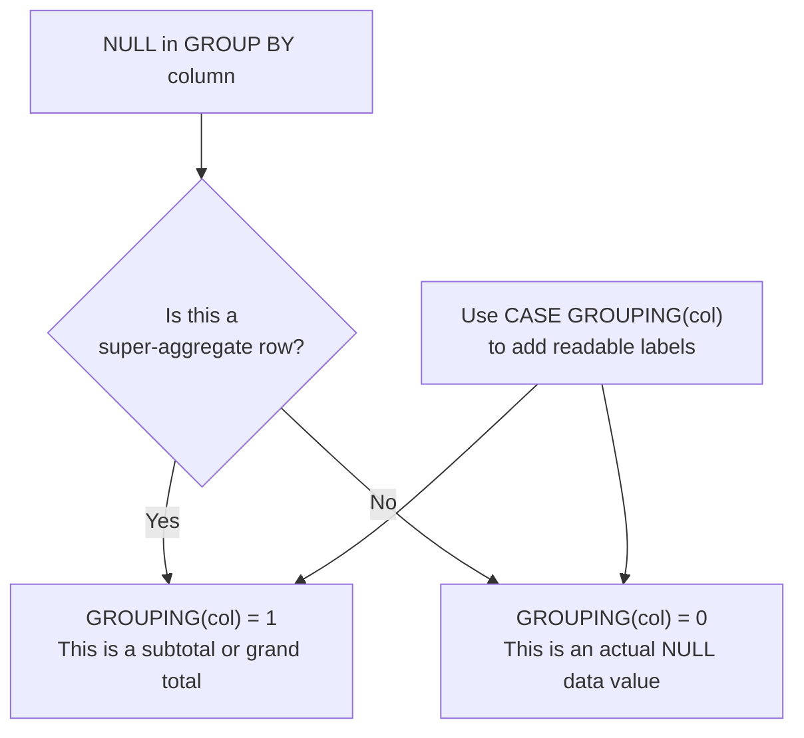

# How to Use GROUPING() Function in MySQL

Author: [nawazdhandala](https://www.github.com/nawazdhandala)

Tags: MySQL, SQL, GROUP BY, Grouping, Aggregation, Analytics

Description: Learn how to use the GROUPING() function in MySQL to distinguish subtotal rows generated by WITH ROLLUP or GROUPING SETS from rows with actual NULL data values.

---

## What Is the GROUPING() Function

The `GROUPING()` function in MySQL returns 1 when a column is NULL because it is part of a super-aggregate row created by `WITH ROLLUP` or `GROUPING SETS`, and returns 0 when the column is NULL because the actual data value is NULL.

This distinction is important: `WITH ROLLUP` represents aggregate summary rows with NULL in the grouping columns, but your real data may also contain NULL values in those columns. Without `GROUPING()`, you cannot tell which NULLs are totals and which are real missing data.



## Syntax

```sql
GROUPING(column_expression)

-- Returns 1 if the column is NULL because of ROLLUP/GROUPING SETS (super-aggregate)
-- Returns 0 if the column holds an actual value or a real NULL

-- Can accept multiple arguments to produce a bitmask
GROUPING(col1, col2)  -- returns integer bitmask: bit 1 = col1, bit 0 = col2
```

`GROUPING()` is only meaningful inside queries using `WITH ROLLUP` or `GROUPING SETS`.

## Examples

### Setup: Sales Data with Some NULL Regions

```sql
CREATE TABLE quarterly_sales (
    id      INT PRIMARY KEY AUTO_INCREMENT,
    region  VARCHAR(50),    -- intentionally allows NULL
    product VARCHAR(50),
    quarter VARCHAR(5),
    revenue DECIMAL(12,2)
);

INSERT INTO quarterly_sales (region, product, quarter, revenue) VALUES
    ('North', 'Widget', 'Q1', 12000),
    ('North', 'Widget', 'Q2', 14000),
    ('South', 'Gadget', 'Q1',  9000),
    ('South', 'Gadget', 'Q2', 11000),
    (NULL,    'Widget', 'Q1',  5000),   -- actual NULL region
    (NULL,    'Gadget', 'Q2',  4500);   -- actual NULL region
```

### ROLLUP Without GROUPING: Ambiguous NULLs

```sql
SELECT region, SUM(revenue) AS total
FROM quarterly_sales
GROUP BY region WITH ROLLUP;
```

```text
+--------+----------+
| region | total    |
+--------+----------+
| NULL   | 9500.00  |   <- actual NULL data
| North  | 26000.00 |
| South  | 20000.00 |
| NULL   | 55500.00 |   <- grand total (also NULL)
+--------+----------+
```

Two rows show NULL for region, but one is real data and one is the grand total. `GROUPING()` resolves this ambiguity.

### ROLLUP With GROUPING: Clear Labels

```sql
SELECT
    CASE GROUPING(region)
        WHEN 1 THEN 'GRAND TOTAL'
        ELSE IFNULL(region, '(Unknown Region)')
    END          AS region,
    SUM(revenue) AS total,
    GROUPING(region) AS is_rollup_row
FROM quarterly_sales
GROUP BY region WITH ROLLUP;
```

```text
+--------------------+----------+---------------+
| region             | total    | is_rollup_row |
+--------------------+----------+---------------+
| (Unknown Region)   |  9500.00 | 0             |
| North              | 26000.00 | 0             |
| South              | 20000.00 | 0             |
| GRAND TOTAL        | 55500.00 | 1             |
+--------------------+----------+---------------+
```

### Multi-Column ROLLUP with GROUPING

```sql
SELECT
    CASE GROUPING(region)  WHEN 1 THEN 'ALL REGIONS' ELSE IFNULL(region, '(Unknown)') END AS region,
    CASE GROUPING(product) WHEN 1 THEN 'ALL PRODUCTS' ELSE product END AS product,
    SUM(revenue)  AS total,
    GROUPING(region)  AS grp_region,
    GROUPING(product) AS grp_product
FROM quarterly_sales
GROUP BY region, product WITH ROLLUP
ORDER BY grp_region DESC, grp_product DESC, region, product;
```

```text
+-------------+--------------+----------+------------+-------------+
| region      | product      | total    | grp_region | grp_product |
+-------------+--------------+----------+------------+-------------+
| ALL REGIONS | ALL PRODUCTS | 55500.00 | 1          | 1           |
| (Unknown)   | ALL PRODUCTS |  9500.00 | 0          | 1           |
| North       | ALL PRODUCTS | 26000.00 | 0          | 1           |
| South       | ALL PRODUCTS | 20000.00 | 0          | 1           |
| (Unknown)   | Gadget       |  4500.00 | 0          | 0           |
| (Unknown)   | Widget       |  5000.00 | 0          | 0           |
| North       | Widget       | 26000.00 | 0          | 0           |
| South       | Gadget       | 20000.00 | 0          | 0           |
+-------------+--------------+----------+------------+-------------+
```

### GROUPING() Bitmask with Multiple Arguments

`GROUPING(col1, col2)` returns an integer where each bit represents one column:

```sql
SELECT
    region,
    product,
    SUM(revenue)            AS total,
    GROUPING(region, product) AS grp_bitmask,
    -- Bit 1 (value 2) = region is rollup
    -- Bit 0 (value 1) = product is rollup
    CASE GROUPING(region, product)
        WHEN 3 THEN 'Grand Total'
        WHEN 2 THEN 'Region Subtotal'
        WHEN 1 THEN 'Product Subtotal'
        WHEN 0 THEN 'Detail Row'
    END AS row_type
FROM quarterly_sales
GROUP BY region, product WITH ROLLUP
ORDER BY grp_bitmask DESC, region, product;
```

```text
+--------+---------+----------+-------------+------------------+
| region | product | total    | grp_bitmask | row_type         |
+--------+---------+----------+-------------+------------------+
| NULL   | NULL    | 55500.00 | 3           | Grand Total      |
| NULL   | NULL    |  9500.00 | 2           | Region Subtotal  |
| North  | NULL    | 26000.00 | 2           | Region Subtotal  |
| South  | NULL    | 20000.00 | 2           | Region Subtotal  |
| NULL   | Gadget  |  4500.00 | 0           | Detail Row       |
| NULL   | Widget  |  5000.00 | 0           | Detail Row       |
| North  | Widget  | 26000.00 | 0           | Detail Row       |
| South  | Gadget  | 20000.00 | 0           | Detail Row       |
+--------+---------+----------+-------------+------------------+
```

### GROUPING with GROUPING SETS

```sql
SELECT
    CASE GROUPING(region)  WHEN 1 THEN '(All)' ELSE IFNULL(region, '?') END AS region,
    CASE GROUPING(quarter) WHEN 1 THEN '(All)' ELSE quarter END              AS quarter,
    SUM(revenue) AS total
FROM quarterly_sales
GROUP BY GROUPING SETS (
    (region, quarter),
    (region),
    (quarter),
    ()
)
ORDER BY GROUPING(region), GROUPING(quarter), region, quarter;
```

### Filter Only Subtotal Rows

```sql
-- Show only the region-level subtotals and grand total
SELECT
    CASE GROUPING(region)  WHEN 1 THEN 'GRAND TOTAL' ELSE region END AS region,
    SUM(revenue) AS total
FROM quarterly_sales
GROUP BY region WITH ROLLUP
HAVING GROUPING(region) = 1 OR (GROUPING(region) = 0 AND region IS NOT NULL);
```

```text
+-------------+----------+
| region      | total    |
+-------------+----------+
| North       | 26000.00 |
| South       | 20000.00 |
| GRAND TOTAL | 55500.00 |
+-------------+----------+
```

## GROUPING() Return Values for Two Columns

| GROUPING(col1, col2) | col1 is super-agg | col2 is super-agg |
|----------------------|-------------------|--------------------|
| 0                    | No                | No                 |
| 1                    | No                | Yes                |
| 2                    | Yes               | No                 |
| 3                    | Yes               | Yes (grand total)  |

## Best Practices

- Always use `GROUPING()` when your data may contain actual NULL values in any column used in `GROUP BY WITH ROLLUP`.
- Wrap `GROUPING()` in a `CASE` expression to replace subtotal NULLs with human-readable labels.
- Use the bitmask form `GROUPING(col1, col2)` when you need to handle multiple rollup levels with a single `CASE` expression.
- Use `HAVING GROUPING(col) = 1` to filter queries to show only summary rows and exclude detail rows.

## Summary

`GROUPING(column)` returns 1 when a NULL in a GROUP BY column is a super-aggregate placeholder from `WITH ROLLUP` or `GROUPING SETS`, and returns 0 for real NULL data or actual values. Use it inside `CASE` expressions to label subtotal rows clearly (e.g., "Grand Total", "All Regions") and use it in `HAVING` to filter results to only summary rows or only detail rows.
