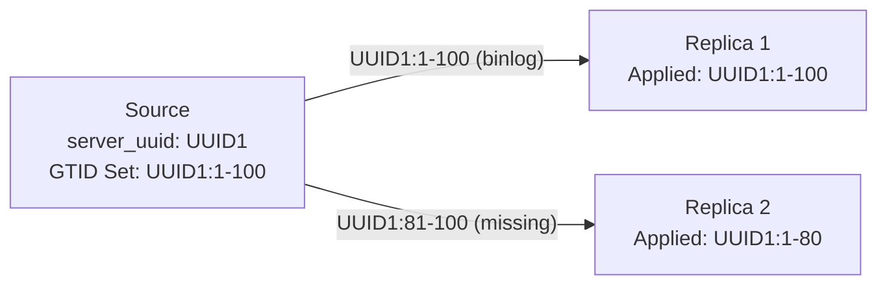

# How to Configure MySQL GTID-Based Replication

Author: [nawazdhandala](https://www.github.com/nawazdhandala)

Tags: MySQL, Replication, GTID, High Availability

Description: Learn how to configure MySQL GTID-based replication for automatic position tracking, simplified failover, and reliable multi-source topologies.

---

## How GTID-Based Replication Works

Global Transaction Identifiers (GTIDs) assign a unique identifier to every transaction committed on the source server. A GTID has the format `source_uuid:transaction_id`, for example:

```text
3E11FA47-71CA-11E1-9E33-C80AA9429562:23
```

With GTIDs enabled, replicas do not need to track binary log file names and positions. Instead, they track which transaction IDs have been applied, and the source sends only the transactions the replica is missing.



Benefits of GTID replication:
- Replicas automatically find the correct starting position
- Failover and re-pointing replicas is simpler
- Prevents duplicate transaction application
- Easier to implement multi-source replication

## Configuration

### Step 1 - Enable GTIDs on the Source

Edit the source MySQL configuration at `/etc/mysql/mysql.conf.d/mysqld.cnf`:

```ini
[mysqld]
server-id            = 1
log_bin              = /var/log/mysql/mysql-bin.log
gtid_mode            = ON
enforce_gtid_consistency = ON
log_replica_updates  = ON
binlog_format        = ROW
```

Restart the source:

```bash
sudo systemctl restart mysql
```

### Step 2 - Enable GTIDs on the Replica

Edit the replica MySQL configuration:

```ini
[mysqld]
server-id                = 2
relay-log                = /var/log/mysql/mysql-relay-bin.log
gtid_mode                = ON
enforce_gtid_consistency = ON
log_replica_updates      = ON
read_only                = ON
```

Restart the replica:

```bash
sudo systemctl restart mysql
```

### Step 3 - Create the Replication User

On the source, create a user for replication:

```sql
CREATE USER 'replicator'@'%' IDENTIFIED WITH mysql_native_password BY 'StrongPass123!';
GRANT REPLICATION SLAVE ON *.* TO 'replicator'@'%';
FLUSH PRIVILEGES;
```

### Step 4 - Take a Consistent Snapshot

Take a dump with GTID information included:

```bash
mysqldump -u root -p \
    --all-databases \
    --single-transaction \
    --master-data=1 \
    --set-gtid-purged=ON \
    > /tmp/gtid_dump.sql
```

Import the dump on the replica:

```bash
mysql -u root -p < /tmp/gtid_dump.sql
```

### Step 5 - Connect the Replica Using GTID Auto-Position

On the replica, use `SOURCE_AUTO_POSITION = 1` instead of specifying a log file and position:

```sql
CHANGE REPLICATION SOURCE TO
    SOURCE_HOST      = '192.168.1.10',
    SOURCE_USER      = 'replicator',
    SOURCE_PASSWORD  = 'StrongPass123!',
    SOURCE_AUTO_POSITION = 1;

START REPLICA;
```

### Step 6 - Verify GTID Replication

Check the replication status:

```sql
SHOW REPLICA STATUS\G
```

Verify the GTID sets:

```sql
-- On the source: show all GTIDs ever executed
SELECT @@GLOBAL.gtid_executed;

-- On the replica: show GTIDs received from source
SELECT @@GLOBAL.gtid_executed;
```

Both should match once the replica has caught up.

## Converting Existing Replication to GTID

To convert a running non-GTID replication setup to GTID without downtime, use online GTID migration (MySQL 5.7.6+):

Set `GTID_MODE` incrementally on all servers:

```sql
-- Step 1: Set on all servers
SET @@GLOBAL.ENFORCE_GTID_CONSISTENCY = WARN;

-- Step 2: Confirm no warnings, then:
SET @@GLOBAL.ENFORCE_GTID_CONSISTENCY = ON;

-- Step 3: On all servers
SET @@GLOBAL.GTID_MODE = OFF_PERMISSIVE;

-- Step 4: On all servers
SET @@GLOBAL.GTID_MODE = ON_PERMISSIVE;

-- Step 5: Confirm replicas have applied all anonymous transactions, then:
SET @@GLOBAL.GTID_MODE = ON;
```

Also update `my.cnf` so the settings persist across restarts.

## GTID Failover

When a replica needs to be promoted to source, simply re-point other replicas to the new source:

```sql
-- On replicas still pointing to the old source
STOP REPLICA;

CHANGE REPLICATION SOURCE TO
    SOURCE_HOST      = '192.168.1.20',  -- new source IP
    SOURCE_USER      = 'replicator',
    SOURCE_PASSWORD  = 'StrongPass123!',
    SOURCE_AUTO_POSITION = 1;

START REPLICA;
```

With GTIDs, the replica will automatically skip transactions it has already applied.

## Best Practices

- Always set `enforce_gtid_consistency = ON` to prevent statements that cannot be GTID-safe.
- Use `binlog_format = ROW` for consistent replication with GTIDs.
- Set `log_replica_updates = ON` so intermediate replicas propagate GTIDs correctly.
- Monitor `GTID_EXECUTED` and `GTID_PURGED` to understand the state of your topology.
- Do not mix GTID and non-GTID topologies - convert all servers together.

## Summary

GTID-based MySQL replication replaces file-and-position tracking with unique transaction identifiers that follow data across the topology. Enabling GTIDs requires setting `gtid_mode = ON` and `enforce_gtid_consistency = ON` on all servers, then using `SOURCE_AUTO_POSITION = 1` when configuring replicas. This simplifies failover, multi-source replication, and replica re-pointing compared to traditional binary log position-based replication.
