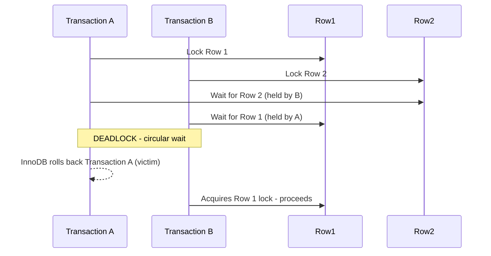

# How to Handle Deadlocks in MySQL

Author: [nawazdhandala](https://www.github.com/nawazdhandala)

Tags: MySQL, SQL, Deadlock, Transaction, InnoDB, Lock, Database

Description: Learn how deadlocks occur in MySQL InnoDB, how to detect and diagnose them, and the strategies to prevent and handle them in your application.

---

## How Deadlocks Occur

A deadlock happens when two or more transactions each hold a lock that the other needs, creating a circular dependency where neither can proceed. InnoDB detects this and automatically rolls back one of the transactions (the victim), which is typically the one that has done the least work.



## Detecting Deadlocks

### InnoDB Status

```sql
SHOW ENGINE INNODB STATUS\G
```

Look for the `LATEST DETECTED DEADLOCK` section:

```text
------------------------
LATEST DETECTED DEADLOCK
------------------------
2026-03-31 12:00:00 0x7f...
*** (1) TRANSACTION:
TRANSACTION 123456, ACTIVE 0 sec starting index read
MySQL thread id 42, ...
LOCK WAIT 2 lock struct(s), ...
*** (1) HOLDS THE LOCK(S):
RECORD LOCKS ... index PRIMARY of table `mydb`.`accounts`
...trx id 123456 lock_mode X locks rec but not gap
*** (1) WAITING FOR THIS LOCK TO BE GRANTED:
RECORD LOCKS ... index PRIMARY of table `mydb`.`accounts`
...trx id 123456 lock_mode X locks rec but not gap waiting

*** (2) TRANSACTION:
TRANSACTION 123457, ACTIVE 0 sec starting index read
*** (2) HOLDS THE LOCK(S):
...
*** (2) WAITING FOR THIS LOCK TO BE GRANTED:
...
*** WE ROLL BACK TRANSACTION (1)
```

The last line tells you which transaction was chosen as the victim.

### Performance Schema: Recent Deadlock Data

```sql
SELECT *
FROM performance_schema.data_lock_waits
ORDER BY REQUESTING_ENGINE_TRANSACTION_ID;
```

```sql
SELECT ENGINE_TRANSACTION_ID, OBJECT_SCHEMA, OBJECT_NAME,
       LOCK_TYPE, LOCK_MODE, LOCK_STATUS
FROM performance_schema.data_locks
WHERE LOCK_STATUS = 'WAITING';
```

### Enable Deadlock Logging

```sql
-- Log all deadlocks to the MySQL error log
SET GLOBAL innodb_print_all_deadlocks = ON;
```

Add to my.cnf for persistence:

```text
[mysqld]
innodb_print_all_deadlocks = 1
```

## Examples

### Setup: Create Sample Tables

```sql
CREATE TABLE accounts (
    id INT PRIMARY KEY AUTO_INCREMENT,
    holder VARCHAR(100) NOT NULL,
    balance DECIMAL(12, 2) NOT NULL
);

INSERT INTO accounts (holder, balance) VALUES
    ('Alice', 5000.00),
    ('Bob',   3000.00);
```

### Reproducing a Deadlock

Open two MySQL sessions and run these in the order shown:

**Session A:**
```sql
START TRANSACTION;
UPDATE accounts SET balance = balance - 200 WHERE id = 1;  -- Locks Row 1
```

**Session B:**
```sql
START TRANSACTION;
UPDATE accounts SET balance = balance - 100 WHERE id = 2;  -- Locks Row 2
```

**Session A:**
```sql
UPDATE accounts SET balance = balance + 100 WHERE id = 2;  -- Waits for Row 2 (held by B)
```

**Session B:**
```sql
UPDATE accounts SET balance = balance + 200 WHERE id = 1;  -- Waits for Row 1 (held by A)
-- InnoDB detects deadlock and rolls back one transaction
-- ERROR 1213: Deadlock found when trying to get lock; try restarting transaction
```

### Deadlock Prevention Strategy 1: Consistent Lock Ordering

The most effective prevention is to always acquire locks in the same order across all transactions. The deadlock above happens because A locks row 1 then row 2, while B locks row 2 then row 1. Fix by standardizing order:

```sql
-- Both transactions always lock lower ID first
-- Application code ensures this order

-- Session A - Transfer from 1 to 2
START TRANSACTION;
UPDATE accounts SET balance = balance - 200 WHERE id = 1;  -- Lower ID first
UPDATE accounts SET balance = balance + 200 WHERE id = 2;  -- Higher ID second
COMMIT;

-- Session B - Transfer from 2 to 1
START TRANSACTION;
UPDATE accounts SET balance = balance - 100 WHERE id = 1;  -- Lower ID first (even though src is 2)
UPDATE accounts SET balance = balance + 100 WHERE id = 2;  -- Higher ID second
-- Wait: this doesn't work as written. Sort by ID before locking:
```

Correct implementation - sort by account ID to lock in consistent order:

```sql
-- Transfer money between two accounts, always lock lower ID first
DELIMITER $$
CREATE PROCEDURE safe_transfer(
    IN p_from_id INT,
    IN p_to_id INT,
    IN p_amount DECIMAL(12,2)
)
BEGIN
    DECLARE v_first INT;
    DECLARE v_second INT;

    -- Always lock the lower ID first
    IF p_from_id < p_to_id THEN
        SET v_first = p_from_id;
        SET v_second = p_to_id;
    ELSE
        SET v_first = p_to_id;
        SET v_second = p_from_id;
    END IF;

    START TRANSACTION;
    -- Lock in consistent order (using SELECT FOR UPDATE)
    SELECT id FROM accounts WHERE id = v_first FOR UPDATE;
    SELECT id FROM accounts WHERE id = v_second FOR UPDATE;

    UPDATE accounts SET balance = balance - p_amount WHERE id = p_from_id;
    UPDATE accounts SET balance = balance + p_amount WHERE id = p_to_id;
    COMMIT;
END$$
DELIMITER ;
```

### Deadlock Prevention Strategy 2: Keep Transactions Short

Long transactions hold locks longer, increasing deadlock probability.

```sql
-- Bad: long transaction that fetches, processes, then updates
START TRANSACTION;
SELECT * FROM orders WHERE status = 'pending';  -- May hold shared locks
-- ... application processes data for 10 seconds ...
UPDATE orders SET status = 'processing' WHERE id IN (...);
COMMIT;

-- Better: fetch outside transaction, then do atomic update inside
SELECT * FROM orders WHERE status = 'pending';
-- ... application processes data ...
START TRANSACTION;
UPDATE orders SET status = 'processing' WHERE id IN (...) AND status = 'pending';
COMMIT;
```

### Deadlock Prevention Strategy 3: SELECT FOR UPDATE

Use `SELECT ... FOR UPDATE` to acquire the lock upfront rather than discovering conflicts during UPDATE.

```sql
START TRANSACTION;
SELECT id, balance FROM accounts WHERE id = 1 FOR UPDATE;  -- Acquire lock immediately
SELECT id, balance FROM accounts WHERE id = 2 FOR UPDATE;
UPDATE accounts SET balance = balance - 200 WHERE id = 1;
UPDATE accounts SET balance = balance + 200 WHERE id = 2;
COMMIT;
```

### Application-Level Retry on Deadlock

InnoDB error 1213 (ER_LOCK_DEADLOCK) indicates a deadlock. Applications should catch and retry:

```sql
-- Pseudocode representing application logic
DECLARE max_retries INT DEFAULT 3;
DECLARE retry_count INT DEFAULT 0;
DECLARE deadlock_occurred BOOL DEFAULT FALSE;

retry_loop: LOOP
    BEGIN
        DECLARE CONTINUE HANDLER FOR SQLSTATE '40001'  -- deadlock error state
        BEGIN
            SET deadlock_occurred = TRUE;
        END;

        SET deadlock_occurred = FALSE;
        START TRANSACTION;
        UPDATE accounts SET balance = balance - 200 WHERE id = 1;
        UPDATE accounts SET balance = balance + 200 WHERE id = 2;
        COMMIT;
    END;

    IF NOT deadlock_occurred THEN
        LEAVE retry_loop;
    END IF;

    SET retry_count = retry_count + 1;
    IF retry_count >= max_retries THEN
        SIGNAL SQLSTATE '45000' SET MESSAGE_TEXT = 'Max retries exceeded';
        LEAVE retry_loop;
    END IF;
END LOOP;
```

## Best Practices

- Always acquire locks in a consistent order (e.g., by primary key) across all code paths.
- Keep transactions as short as possible to minimize lock hold time.
- Use `SELECT ... FOR UPDATE` to acquire row locks early when you know you'll update those rows.
- Enable `innodb_print_all_deadlocks = 1` in production to log deadlocks for analysis.
- Implement retry logic in the application for SQLSTATE 40001 (deadlock).
- Run `ANALYZE TABLE` regularly to keep statistics current - the optimizer may avoid patterns that lead to deadlocks.
- Reduce isolation level to READ COMMITTED if appropriate - it uses fewer gap locks and reduces deadlock risk.

## Summary

MySQL InnoDB deadlocks occur when two transactions form a circular lock dependency. InnoDB automatically detects and resolves deadlocks by rolling back the victim transaction (error 1213). Prevent deadlocks by acquiring locks in a consistent order, keeping transactions short, and using SELECT FOR UPDATE to lock rows early. Enable `innodb_print_all_deadlocks` to log deadlocks for analysis. Applications should always implement retry logic for the 1213 error code since some deadlocks are unavoidable in high-concurrency workloads.
