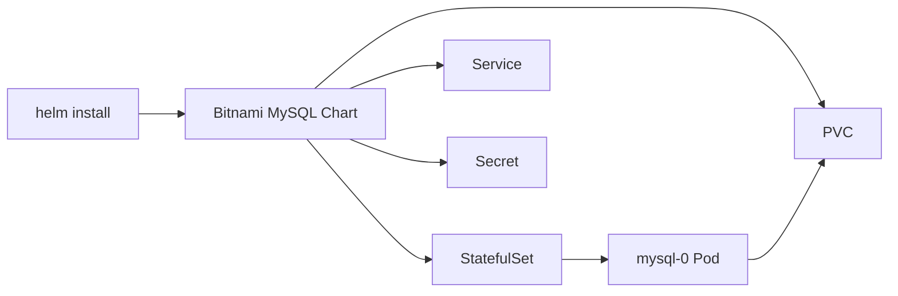

# How to Use MySQL Helm Chart for Kubernetes Deployment

Author: [nawazdhandala](https://www.github.com/nawazdhandala)

Tags: MySQL, Helm, Kubernetes, Database, DevOps

Description: Deploy MySQL on Kubernetes using the Bitnami MySQL Helm chart with custom values for storage, credentials, and resource configuration.

---

## How It Works

Helm is the package manager for Kubernetes. The Bitnami MySQL Helm chart bundles all Kubernetes resources needed to run MySQL - a StatefulSet, Services, ConfigMaps, Secrets, and PersistentVolumeClaims - into a single deployable package. You customise the deployment by overriding default values in a `values.yaml` file.



## Prerequisites

- Kubernetes cluster with `kubectl` configured
- Helm 3 installed (`brew install helm` or the official installer)
- A StorageClass available in the cluster

## Step 1 - Add the Bitnami Repository

```bash
helm repo add bitnami https://charts.bitnami.com/bitnami
helm repo update
```

Check the available versions.

```bash
helm search repo bitnami/mysql --versions | head -10
```

## Step 2 - Inspect Default Values

Review all available configuration options before deploying.

```bash
helm show values bitnami/mysql > default-values.yaml
```

## Step 3 - Create a Custom Values File

Create a `mysql-values.yaml` file with your overrides. You only need to specify values that differ from the defaults.

```yaml
auth:
  rootPassword: "SuperSecret123"
  database: "myapp"
  username: "appuser"
  password: "AppSecret456"

primary:
  persistence:
    enabled: true
    size: 20Gi
    storageClass: "standard"

  resources:
    requests:
      memory: 512Mi
      cpu: 250m
    limits:
      memory: 1Gi
      cpu: 500m

  configuration: |-
    [mysqld]
    innodb_buffer_pool_size = 256M
    max_connections         = 200
    slow_query_log          = 1
    long_query_time         = 1

metrics:
  enabled: true

volumePermissions:
  enabled: true
```

## Step 4 - Install MySQL

Deploy MySQL into a dedicated namespace.

```bash
kubectl create namespace databases

helm install mysql bitnami/mysql \
  --namespace databases \
  --values mysql-values.yaml
```

Helm prints instructions after installation. Follow them to retrieve the root password and connect.

## Step 5 - Verify the Deployment

```bash
helm status mysql -n databases
kubectl get pods -n databases
kubectl get pvc -n databases
```

Expected output:

```text
NAME      READY   STATUS    RESTARTS   AGE
mysql-0   1/1     Running   0          90s

NAME                    STATUS   VOLUME          CAPACITY   STORAGECLASS
data-mysql-0            Bound    pvc-abc1234     20Gi       standard
```

## Step 6 - Connect to MySQL

Retrieve the root password from the Secret.

```bash
export MYSQL_ROOT_PASSWORD=$(kubectl get secret \
  --namespace databases mysql \
  -o jsonpath="{.data.mysql-root-password}" | base64 --decode)
```

Open a temporary Pod to connect.

```bash
kubectl run mysql-client --rm --tty -i \
  --restart='Never' \
  --image docker.io/bitnami/mysql:8.0 \
  --namespace databases \
  --env MYSQL_PWD=$MYSQL_ROOT_PASSWORD \
  --command -- mysql -h mysql.databases.svc.cluster.local -uroot myapp
```

## Upgrading MySQL

Update your values file and run `helm upgrade`.

```bash
helm upgrade mysql bitnami/mysql \
  --namespace databases \
  --values mysql-values.yaml
```

Check the rollout status.

```bash
kubectl rollout status statefulset/mysql -n databases
```

## Uninstalling MySQL

```bash
helm uninstall mysql -n databases
```

Note that uninstalling Helm releases does not delete PVCs by default. Delete them manually if you want to remove data.

```bash
kubectl delete pvc -n databases -l app.kubernetes.io/instance=mysql
```

## Enabling MySQL Replication with the Helm Chart

The Bitnami chart supports a primary-replica topology. Add the following to your values file.

```yaml
architecture: replication

secondary:
  replicaCount: 2
  persistence:
    enabled: true
    size: 20Gi
```

## Best Practices

- Store `mysql-values.yaml` in version control but keep sensitive values in Kubernetes Secrets or a secrets manager (Vault, AWS Secrets Manager) using the `existingSecret` parameter.
- Use the `existingSecret` value key instead of plain-text passwords in your Helm values.
- Set explicit resource requests and limits to prevent resource contention.
- Enable metrics (`metrics.enabled: true`) and scrape them with Prometheus for visibility into query performance and connection counts.
- Pin the chart version with `--version 11.x.x` to avoid unintended upgrades during `helm repo update`.

## Summary

The Bitnami MySQL Helm chart turns a multi-resource Kubernetes deployment into a single `helm install` command. A custom `values.yaml` file provides a versioned, reviewable record of every configuration decision - storage size, resource limits, MySQL tuning parameters, and topology. Combined with `helm upgrade` for rolling updates and Helm's built-in rollback, the chart provides a reproducible, maintainable MySQL deployment lifecycle on Kubernetes.
