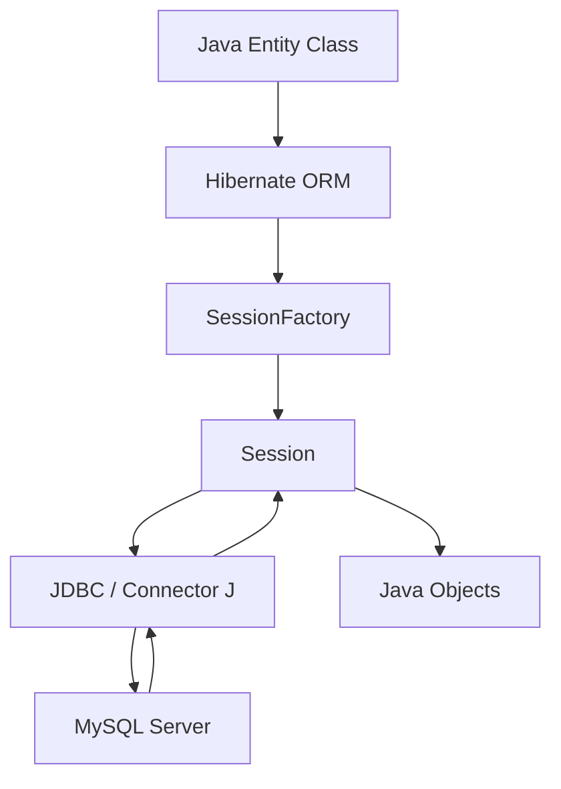

# How to Use MySQL with Hibernate in Java

Author: [nawazdhandala](https://www.github.com/nawazdhandala)

Tags: MySQL, Java, Hibernate, ORM, JPA, Database

Description: Learn how to use Hibernate ORM with MySQL in a standalone Java application to map entities, run queries, and manage sessions and transactions.

---

## How Hibernate Works with MySQL

Hibernate is the most widely used JPA (Jakarta Persistence API) implementation in Java. It maps annotated Java classes (entities) to database tables, generates SQL automatically, and manages a first-level session cache. Hibernate uses Connector/J to communicate with MySQL.



## Maven Dependencies

```xml
<dependencies>
    <dependency>
        <groupId>org.hibernate.orm</groupId>
        <artifactId>hibernate-core</artifactId>
        <version>6.5.2.Final</version>
    </dependency>
    <dependency>
        <groupId>com.mysql</groupId>
        <artifactId>mysql-connector-j</artifactId>
        <version>9.1.0</version>
    </dependency>
    <dependency>
        <groupId>com.zaxxer</groupId>
        <artifactId>HikariCP</artifactId>
        <version>5.1.0</version>
    </dependency>
</dependencies>
```

## Hibernate Configuration (hibernate.cfg.xml)

```xml
<?xml version="1.0" encoding="UTF-8"?>
<!DOCTYPE hibernate-configuration PUBLIC
    "-//Hibernate/Hibernate Configuration DTD 3.0//EN"
    "http://www.hibernate.org/dtd/hibernate-configuration-3.0.dtd">
<hibernate-configuration>
    <session-factory>
        <property name="hibernate.connection.driver_class">com.mysql.cj.jdbc.Driver</property>
        <property name="hibernate.connection.url">
            jdbc:mysql://localhost:3306/myapp?serverTimezone=UTC&amp;characterEncoding=utf8mb4
        </property>
        <property name="hibernate.connection.username">appuser</property>
        <property name="hibernate.connection.password">secret</property>
        <property name="hibernate.dialect">org.hibernate.dialect.MySQLDialect</property>
        <property name="hibernate.hbm2ddl.auto">validate</property>
        <property name="hibernate.show_sql">false</property>

        <!-- HikariCP connection pool -->
        <property name="hibernate.connection.provider_class">
            org.hibernate.hikaricp.internal.HikariCPConnectionProvider
        </property>
        <property name="hibernate.hikari.maximumPoolSize">10</property>
        <property name="hibernate.hikari.minimumIdle">2</property>

        <mapping class="com.example.model.User"/>
        <mapping class="com.example.model.Post"/>
    </session-factory>
</hibernate-configuration>
```

## Entity Classes

```java
package com.example.model;

import jakarta.persistence.*;
import java.time.LocalDateTime;
import java.util.List;

@Entity
@Table(name = "users")
public class User {

    @Id
    @GeneratedValue(strategy = GenerationType.IDENTITY)
    private Integer id;

    @Column(name = "name", nullable = false, length = 100)
    private String name;

    @Column(name = "email", nullable = false, unique = true, length = 150)
    private String email;

    @Column(name = "role", nullable = false, length = 20)
    private String role = "user";

    @Column(name = "created_at", nullable = false, updatable = false)
    private LocalDateTime createdAt = LocalDateTime.now();

    @OneToMany(mappedBy = "author", fetch = FetchType.LAZY, cascade = CascadeType.ALL)
    private List<Post> posts;

    // Constructors, getters, setters
    public User() {}
    public User(String name, String email) {
        this.name = name;
        this.email = email;
    }
    public Integer getId() { return id; }
    public String getName() { return name; }
    public void setName(String name) { this.name = name; }
    public String getEmail() { return email; }
    public String getRole() { return role; }
    public void setRole(String role) { this.role = role; }
}
```

```java
@Entity
@Table(name = "posts")
public class Post {

    @Id
    @GeneratedValue(strategy = GenerationType.IDENTITY)
    private Integer id;

    @Column(nullable = false, length = 200)
    private String title;

    @Lob
    @Column(columnDefinition = "TEXT")
    private String body;

    @ManyToOne(fetch = FetchType.LAZY)
    @JoinColumn(name = "user_id", nullable = false)
    private User author;

    @Column(name = "created_at", nullable = false, updatable = false)
    private LocalDateTime createdAt = LocalDateTime.now();

    public Post() {}
    public Post(String title, String body, User author) {
        this.title = title;
        this.body = body;
        this.author = author;
    }
}
```

## SessionFactory Setup

```java
package com.example;

import org.hibernate.SessionFactory;
import org.hibernate.cfg.Configuration;

public class HibernateUtil {
    private static final SessionFactory sessionFactory;

    static {
        sessionFactory = new Configuration()
                .configure("hibernate.cfg.xml")
                .buildSessionFactory();
    }

    public static SessionFactory getSessionFactory() {
        return sessionFactory;
    }
}
```

## CRUD Operations

```java
package com.example.repository;

import com.example.HibernateUtil;
import com.example.model.User;
import org.hibernate.Session;
import org.hibernate.Transaction;

import java.util.List;
import java.util.Optional;

public class UserRepository {

    // Create
    public Integer save(User user) {
        try (Session session = HibernateUtil.getSessionFactory().openSession()) {
            Transaction tx = session.beginTransaction();
            Integer id = (Integer) session.save(user);
            tx.commit();
            return id;
        }
    }

    // Read
    public Optional<User> findById(int id) {
        try (Session session = HibernateUtil.getSessionFactory().openSession()) {
            return Optional.ofNullable(session.get(User.class, id));
        }
    }

    // List with HQL
    public List<User> findByRole(String role) {
        try (Session session = HibernateUtil.getSessionFactory().openSession()) {
            return session.createQuery(
                "FROM User u WHERE u.role = :role ORDER BY u.name", User.class
            ).setParameter("role", role).list();
        }
    }

    // Update
    public void updateRole(int userId, String newRole) {
        try (Session session = HibernateUtil.getSessionFactory().openSession()) {
            Transaction tx = session.beginTransaction();
            User user = session.get(User.class, userId);
            if (user != null) {
                user.setRole(newRole);
                session.merge(user);
            }
            tx.commit();
        }
    }

    // Delete
    public void delete(int userId) {
        try (Session session = HibernateUtil.getSessionFactory().openSession()) {
            Transaction tx = session.beginTransaction();
            User user = session.get(User.class, userId);
            if (user != null) {
                session.remove(user);
            }
            tx.commit();
        }
    }
}
```

## HQL Query with JOIN Fetch

```java
public List<User> findAdminsWithPosts() {
    try (Session session = HibernateUtil.getSessionFactory().openSession()) {
        return session.createQuery(
            "SELECT DISTINCT u FROM User u " +
            "JOIN FETCH u.posts " +
            "WHERE u.role = 'admin'",
            User.class
        ).list();
    }
}
```

## Native SQL Query

```java
public List<Object[]> getPostCounts() {
    try (Session session = HibernateUtil.getSessionFactory().openSession()) {
        return session.createNativeQuery(
            "SELECT u.id, u.name, COUNT(p.id) AS post_count " +
            "FROM users u LEFT JOIN posts p ON u.id = p.user_id " +
            "GROUP BY u.id ORDER BY post_count DESC",
            Object[].class
        ).list();
    }
}
```

## Best Practices

- Set `hibernate.hbm2ddl.auto=validate` in production - never `create` or `create-drop`.
- Use `FetchType.LAZY` for all associations by default; switch to EAGER or use `JOIN FETCH` in HQL only when you need the related data.
- Always open a `Session` in a try-with-resources block so it is closed automatically.
- Use HQL parameters (`:paramName`) instead of string concatenation.
- Enable the second-level cache (Ehcache or Caffeine) for read-heavy entities.
- Use Hibernate 6's `session.createMutationQuery()` for HQL UPDATE and DELETE instead of `session.createQuery()`.

## Summary

Hibernate maps Java entity classes to MySQL tables using JPA annotations. A `SessionFactory` is created once from the configuration and is thread-safe. Individual `Session` objects are opened per transaction or unit of work. CRUD operations use `session.save()`, `session.get()`, `session.merge()`, and `session.remove()`. HQL (Hibernate Query Language) provides a type-safe, object-oriented alternative to SQL, and `JOIN FETCH` solves N+1 loading issues. Native SQL is available through `session.createNativeQuery()` for complex queries that HQL cannot express.
