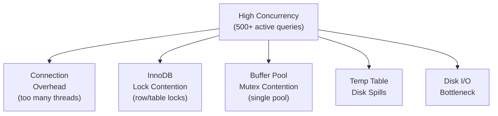

# How to Optimize MySQL for High Concurrency

Author: [nawazdhandala](https://www.github.com/nawazdhandala)

Tags: MySQL, Performance, Concurrency, Tuning, Scalability

Description: Learn how to tune MySQL for high-concurrency workloads by optimizing connection management, InnoDB locking, buffer pool, query cache alternatives, and operating system settings.

---

## Understanding High-Concurrency Bottlenecks

High concurrency in MySQL creates pressure on several subsystems simultaneously:



Optimization is about addressing each of these bottlenecks systematically.

## Connection Management

### Use Connection Pooling

The first line of defense is reducing the number of connections that reach MySQL:

```ini
[mysqld]
max_connections        = 500
wait_timeout           = 300
interactive_timeout    = 300
connect_timeout        = 10
```

Add ProxySQL in front of MySQL to pool connections:

```bash
# Install ProxySQL and configure max_connections per backend
# Set ProxySQL max backend connections to 500
# Allow application to have 5000 client connections to ProxySQL
```

### Tune Thread Handling

For Percona Server or MySQL Enterprise, enable the Thread Pool:

```ini
[mysqld]
thread_handling         = pool-of-threads
thread_pool_size        = 16     -- equal to CPU cores
thread_pool_stall_limit = 200    -- ms before a new thread is created
```

For MySQL Community Edition, reduce per-thread memory to support more connections:

```ini
[mysqld]
thread_stack           = 256K     -- default 1M, reduce to save memory
sort_buffer_size       = 256K     -- allocate per-query, not always needed at max
join_buffer_size       = 256K
read_buffer_size       = 128K
read_rnd_buffer_size   = 256K
```

## InnoDB Tuning for Concurrency

### Buffer Pool Size and Instances

```ini
[mysqld]
innodb_buffer_pool_size      = 24G     -- 70-80% of RAM
innodb_buffer_pool_instances = 16      -- one per GB, max 64
```

Multiple buffer pool instances reduce mutex contention on the LRU list and hash table.

### InnoDB I/O Capacity

Configure InnoDB to use the full I/O bandwidth of your storage:

```ini
[mysqld]
# For SSDs
innodb_io_capacity          = 2000
innodb_io_capacity_max      = 4000

# For NVMe SSDs
innodb_io_capacity          = 10000
innodb_io_capacity_max      = 20000

# Read/Write I/O threads
innodb_read_io_threads      = 8
innodb_write_io_threads     = 8
```

### InnoDB Log Settings

A larger redo log reduces I/O during high write concurrency:

```ini
[mysqld]
# MySQL 8.0.30+ (dynamic redo log size)
innodb_redo_log_capacity = 4294967296  -- 4 GB

# MySQL < 8.0.30
innodb_log_file_size     = 1G
innodb_log_files_in_group = 2
innodb_log_buffer_size   = 64M
```

Durability vs. performance tradeoff:

```ini
# Fastest - lose at most 1 second of transactions on crash
innodb_flush_log_at_trx_commit = 2

# Safest (default) - no data loss on crash, slower
innodb_flush_log_at_trx_commit = 1

# Fastest but risky - lose transactions on crash
innodb_flush_log_at_trx_commit = 0
```

### InnoDB Concurrency Tickets

Limit the number of threads inside InnoDB at once to reduce lock contention:

```ini
[mysqld]
innodb_thread_concurrency = 0   -- 0 = unlimited (default; let OS schedule)
innodb_concurrency_tickets = 5000
```

For CPU-bound workloads with many threads:

```ini
innodb_thread_concurrency = 32  -- limit to 2x CPU core count
```

### Flush Method

Use `O_DIRECT` to avoid double-buffering on Linux:

```ini
[mysqld]
innodb_flush_method = O_DIRECT
```

## Reducing Lock Contention

### Use Proper Indexes

Missing indexes cause table-level or larger range locks. Always check `EXPLAIN`:

```sql
EXPLAIN SELECT * FROM orders WHERE status = 'pending' AND created_at > NOW() - INTERVAL 1 HOUR\G
```

Add indexes if full scans appear:

```sql
ALTER TABLE orders ADD INDEX idx_status_created (status, created_at);
```

### Keep Transactions Short

Long transactions hold locks. Design application code to:
- Commit frequently inside loops
- Never hold transactions open across user-facing requests

```sql
-- Bad: hold transaction open for minutes
START TRANSACTION;
-- ... multiple queries over many seconds ...
COMMIT;

-- Good: small, fast transactions
START TRANSACTION;
UPDATE orders SET status = 'processing' WHERE id = 42;
COMMIT;
```

### Use Optimistic Locking

Avoid `SELECT ... FOR UPDATE` where possible. Use application-level version checking:

```sql
-- Use a version column for optimistic locking
UPDATE orders
SET    status = 'done', version = version + 1
WHERE  id = 42 AND version = 5;
-- If 0 rows updated, another process changed it; retry
```

## Temporary Table Settings

High concurrency with complex queries creates many temporary tables. Keep them in memory:

```ini
[mysqld]
tmp_table_size       = 64M
max_heap_table_size  = 64M
```

## Binary Log Optimization

For replication environments, binary logging adds overhead:

```ini
[mysqld]
sync_binlog          = 0    -- Async flush (fastest; lose < 1s on OS crash)
binlog_cache_size    = 4M
```

For safety with a replica as backup:

```ini
sync_binlog          = 1    -- Synchronous; durability guaranteed
```

## Operating System Tuning

### File Descriptor Limits

```bash
# Check current limits
ulimit -n

# Increase for the mysql user in /etc/security/limits.conf
mysql soft nofile 65535
mysql hard nofile 65535
```

### Swappiness

```bash
# Reduce kernel swap tendency
echo 'vm.swappiness=10' | sudo tee -a /etc/sysctl.conf
sudo sysctl -p
```

### Filesystem Mount Options

Use `noatime` to reduce inode update I/O:

```text
# /etc/fstab
/dev/sdb1 /var/lib/mysql ext4 defaults,noatime,nodiratime 0 2
```

## Monitoring High-Concurrency Health

```sql
-- Threads running right now (should stay < CPU cores)
SHOW GLOBAL STATUS LIKE 'Threads_running';

-- InnoDB row lock waits (should be low)
SHOW GLOBAL STATUS LIKE 'Innodb_row_lock%';

-- Current transactions open
SELECT COUNT(*) FROM information_schema.INNODB_TRX;

-- Long-running queries
SELECT id, time, LEFT(info, 100) AS query
FROM   information_schema.PROCESSLIST
WHERE  time > 5 AND command = 'Query'
ORDER  BY time DESC;
```

## Best Practices Summary

```text
1. Connection pool with ProxySQL - reduce backend connection count
2. innodb_buffer_pool_instances = 1 per GB - reduce mutex contention
3. innodb_io_capacity tuned to storage type - maximize flush throughput
4. Keep transactions short - minimize lock duration
5. Index all WHERE clauses - avoid table scans that hold broad locks
6. set tmp_table_size = max_heap_table_size = 64M - keep temps in memory
7. Use O_DIRECT - avoid OS page cache double-buffering
8. Thread pool plugin (Percona/Enterprise) - reduce context switching
```

## Summary

Optimizing MySQL for high concurrency requires a layered approach: use ProxySQL to limit backend connections, size the InnoDB buffer pool correctly with multiple instances, tune I/O capacity to match your storage, keep transactions short to minimize lock contention, and index queries properly. OS-level tuning (file descriptors, swappiness, mount options) rounds out the optimization. Monitor `Threads_running` and `Innodb_row_lock_waits` as the primary health indicators under high concurrency.
