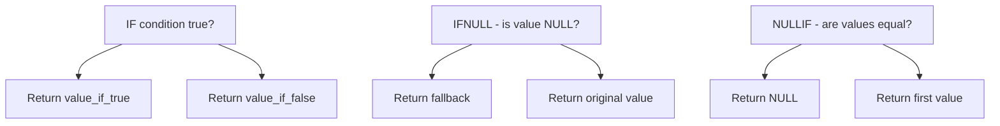

# How to Use MySQL IF, IFNULL, NULLIF Functions

Author: [nawazdhandala](https://www.github.com/nawazdhandala)

Tags: MySQL, SQL, Conditional Function, NULL Handling, Database

Description: Learn how to use MySQL IF, IFNULL, and NULLIF functions to write conditional logic and handle NULL values cleanly within SQL queries.

---

## How MySQL Conditional Functions Work

MySQL provides several compact functions for inline conditional logic. `IF` evaluates a boolean condition and returns one of two values. `IFNULL` provides a fallback when a value is NULL. `NULLIF` returns NULL when two values are equal, which is useful for suppressing divide-by-zero errors. These functions are alternatives to the more verbose `CASE WHEN` expression when the logic is simple.



## Setup: Sample Table

```sql
CREATE TABLE employees (
    id          INT AUTO_INCREMENT PRIMARY KEY,
    name        VARCHAR(100),
    salary      DECIMAL(10,2),
    bonus       DECIMAL(10,2),
    department  VARCHAR(50),
    hours_worked INT,
    target_hours INT
);

INSERT INTO employees (name, salary, bonus, department, hours_worked, target_hours) VALUES
('Alice',   85000.00,  5000.00, 'Engineering', 160, 160),
('Bob',     72000.00,  NULL,    'Marketing',   145, 160),
('Charlie', 95000.00,  8000.00, 'Engineering', 175, 160),
('Diana',   68000.00,  NULL,    'HR',          160, 160),
('Eve',     110000.00, 12000.00,'Engineering', 180, 160);
```

## IF

`IF(condition, value_if_true, value_if_false)` is the simplest form of inline conditional logic. It works like a ternary operator.

**Syntax:**

```sql
IF(condition, value_if_true, value_if_false)
```

**Example - label senior employees by salary:**

```sql
SELECT
    name,
    salary,
    IF(salary >= 90000, 'Senior', 'Standard') AS level
FROM employees;
```

```text
+---------+-----------+----------+
| name    | salary    | level    |
+---------+-----------+----------+
| Alice   | 85000.00  | Standard |
| Bob     | 72000.00  | Standard |
| Charlie | 95000.00  | Senior   |
| Diana   | 68000.00  | Standard |
| Eve     | 110000.00 | Senior   |
+---------+-----------+----------+
```

**Example - apply overtime pay:**

```sql
SELECT
    name,
    hours_worked,
    target_hours,
    salary,
    IF(hours_worked > target_hours,
       salary + ((hours_worked - target_hours) * (salary / target_hours / 4)),
       salary
    ) AS adjusted_salary
FROM employees;
```

**Nested IF (use CASE WHEN for more than two branches):**

```sql
SELECT
    name,
    salary,
    IF(salary >= 100000, 'High',
        IF(salary >= 80000, 'Mid', 'Low')
    ) AS pay_band
FROM employees;
```

## IFNULL

`IFNULL(expr, fallback)` returns `expr` if it is not NULL, otherwise returns `fallback`. It is a two-argument shorthand for `COALESCE`.

**Syntax:**

```sql
IFNULL(expr, fallback)
```

**Example - treat missing bonus as zero:**

```sql
SELECT
    name,
    salary,
    IFNULL(bonus, 0.00)                AS effective_bonus,
    salary + IFNULL(bonus, 0.00)       AS total_compensation
FROM employees;
```

```text
+---------+-----------+-----------------+--------------------+
| name    | salary    | effective_bonus | total_compensation |
+---------+-----------+-----------------+--------------------+
| Alice   | 85000.00  | 5000.00         | 90000.00           |
| Bob     | 72000.00  | 0.00            | 72000.00           |
| Charlie | 95000.00  | 8000.00         | 103000.00          |
| Diana   | 68000.00  | 0.00            | 68000.00           |
| Eve     | 110000.00 | 12000.00        | 122000.00          |
+---------+-----------+-----------------+--------------------+
```

**Example - show placeholder text for NULL:**

```sql
SELECT
    name,
    IFNULL(bonus, 'Not eligible') AS bonus_display
FROM employees;
```

## NULLIF

`NULLIF(expr1, expr2)` returns NULL when the two arguments are equal, otherwise returns `expr1`. Its most common use is preventing division-by-zero errors.

**Syntax:**

```sql
NULLIF(expr1, expr2)
```

**Example - safe division:**

```sql
SELECT
    name,
    hours_worked,
    target_hours,
    hours_worked / NULLIF(target_hours, 0) AS efficiency_ratio
FROM employees;
```

When `target_hours` is 0, `NULLIF` returns NULL so the division produces NULL instead of a fatal error.

**Example - turn sentinel value into NULL:**

Some legacy systems store `-1` to indicate "no data". Convert these to NULL:

```sql
SELECT
    name,
    NULLIF(bonus, -1) AS clean_bonus
FROM employees;
```

## Comparing IF, IFNULL, and NULLIF

```text
Function         Arguments  Use Case
-----------      ---------  ----------------------------------------
IF               3          General conditional logic (true/false branch)
IFNULL           2          Provide a fallback when value is NULL
NULLIF           2          Convert a specific value to NULL
COALESCE         N          Return first non-NULL from a list of values
```

## Best Practices

- Use `IFNULL` for simple NULL substitution and `COALESCE` when checking multiple columns.
- Avoid deeply nested `IF` calls - use `CASE WHEN` instead for readability.
- Use `NULLIF` when dividing two columns to prevent division-by-zero runtime errors.
- Wrap `IF` return values in `CAST` if the two branches return different types to avoid implicit type coercion surprises.
- Be aware that `IF` short-circuits - the unused branch is not evaluated.

## Summary

MySQL's `IF`, `IFNULL`, and `NULLIF` functions provide concise inline conditional logic. `IF` branches on a boolean condition and returns one of two values. `IFNULL` replaces NULL with a fallback value, which is essential for correct arithmetic on nullable columns. `NULLIF` converts a specific value to NULL, most commonly used to guard against division-by-zero. Together these functions reduce the need for verbose `CASE WHEN` expressions in straightforward scenarios.
