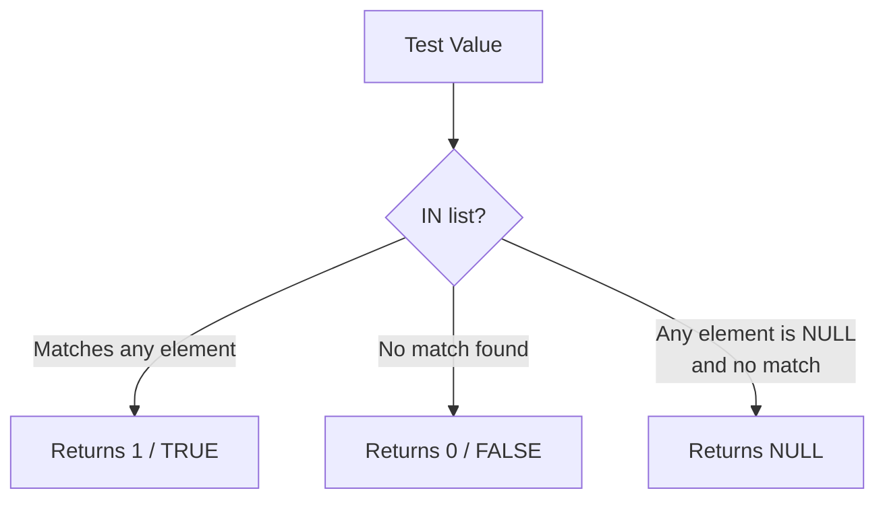

# How to Use IN() Function in MySQL

Author: [nawazdhandala](https://www.github.com/nawazdhandala)

Tags: MySQL, SQL, Comparison Function, Database

Description: Learn how to use the MySQL IN() function and IN operator to test whether a value matches any value in a list or subquery, replacing multiple OR conditions.

---

## What IN() Does

In MySQL, `IN()` can be used as both a comparison operator and as a function. The expression `value IN (list)` returns `1` (true) if the value matches any element in the list, and `0` (false) otherwise. It is a concise replacement for multiple `OR` conditions.



## Syntax

```sql
-- Operator form (most common)
expression IN (value1, value2, value3, ...)

-- Negated form
expression NOT IN (value1, value2, value3, ...)

-- Subquery form
expression IN (SELECT column FROM table WHERE ...)

-- Function form
IN(value1, value2, ...)  -- less common, rarely used outside expressions
```

## Setup: Sample Tables

```sql
CREATE TABLE orders (
    id         INT AUTO_INCREMENT PRIMARY KEY,
    customer   VARCHAR(100),
    status     VARCHAR(20),
    region     VARCHAR(20),
    amount     DECIMAL(10, 2)
);

INSERT INTO orders (customer, status, region, amount) VALUES
('Alice',   'completed', 'North', 250.00),
('Bob',     'pending',   'South', 89.99),
('Carol',   'shipped',   'East',  430.50),
('Dave',    'cancelled', 'West',  120.00),
('Eve',     'completed', 'North', 780.00),
('Frank',   'refunded',  'South', 55.00),
('Grace',   'shipped',   'East',  310.00),
('Henry',   'pending',   'North', 640.00);
```

## Basic Usage in WHERE

```sql
-- Find orders in specific statuses
SELECT customer, status, amount
FROM orders
WHERE status IN ('completed', 'shipped');
```

```text
+----------+-----------+--------+
| customer | status    | amount |
+----------+-----------+--------+
| Alice    | completed | 250.00 |
| Carol    | shipped   | 430.50 |
| Eve      | completed | 780.00 |
| Grace    | shipped   | 310.00 |
+----------+-----------+--------+
```

This is equivalent to:

```sql
WHERE status = 'completed' OR status = 'shipped'
```

But `IN()` is cleaner, especially as the list grows.

## NOT IN

```sql
-- Exclude cancelled and refunded orders
SELECT customer, status, amount
FROM orders
WHERE status NOT IN ('cancelled', 'refunded')
ORDER BY amount DESC;
```

## Using IN() with Numbers

```sql
-- Find orders for specific IDs
SELECT id, customer, amount
FROM orders
WHERE id IN (1, 3, 5, 7);
```

## IN() in SELECT (Function Form)

When used in a `SELECT` list, `IN()` returns 1 or 0:

```sql
SELECT
    customer,
    status,
    status IN ('completed', 'shipped') AS is_fulfilled
FROM orders;
```

```text
+----------+-----------+--------------+
| customer | status    | is_fulfilled |
+----------+-----------+--------------+
| Alice    | completed |            1 |
| Bob      | pending   |            0 |
| Carol    | shipped   |            1 |
| Dave     | cancelled |            0 |
| Eve      | completed |            1 |
| Frank    | refunded  |            0 |
| Grace    | shipped   |            1 |
| Henry    | pending   |            0 |
+----------+-----------+--------------+
```

## IN() with Subquery

Use a subquery to compare against a dynamic set of values:

```sql
CREATE TABLE vip_customers (
    name VARCHAR(100) PRIMARY KEY
);

INSERT INTO vip_customers VALUES ('Alice'), ('Eve'), ('Henry');

-- Find orders placed by VIP customers
SELECT o.customer, o.status, o.amount
FROM orders o
WHERE o.customer IN (SELECT name FROM vip_customers);
```

## NULL Behavior

`IN()` has special behavior with `NULL`:

```sql
-- If the list contains NULL and no match is found, result is NULL (not FALSE)
SELECT 5 IN (1, 2, NULL);    -- NULL
SELECT 1 IN (1, 2, NULL);    -- 1 (match found before NULL matters)
SELECT 5 NOT IN (1, 2, NULL); -- NULL (not FALSE!)
```

This is why `NOT IN` with a subquery that can return `NULL` values is dangerous:

```sql
-- If any row in the subquery returns NULL, NOT IN returns NULL for all rows
-- This query returns 0 rows if vip_customers.name can be NULL
SELECT customer FROM orders
WHERE customer NOT IN (SELECT name FROM vip_customers);
```

Use `NOT EXISTS` instead when the subquery column could contain `NULL`:

```sql
SELECT o.customer FROM orders o
WHERE NOT EXISTS (
    SELECT 1 FROM vip_customers v WHERE v.name = o.customer
);
```

## IN() with Multiple Columns Using Row Constructors

MySQL supports row value constructors with `IN()`:

```sql
-- Match on a combination of columns
SELECT customer, region, status
FROM orders
WHERE (region, status) IN (
    ('North', 'completed'),
    ('East',  'shipped')
);
```

```text
+----------+--------+-----------+
| customer | region | status    |
+----------+--------+-----------+
| Alice    | North  | completed |
| Carol    | East   | shipped   |
| Eve      | North  | completed |
| Grace    | East   | shipped   |
+----------+--------+-----------+
```

## Performance: IN() vs OR

For small static lists, `IN()` and `OR` perform identically. For large lists or subqueries, `IN()` with an index on the column can use an index range scan:

```sql
-- Ensure an index exists on the tested column
CREATE INDEX idx_status ON orders (status);

-- This benefits from the index
SELECT * FROM orders WHERE status IN ('completed', 'shipped', 'pending');
```

## Using IN() with CASE

```sql
SELECT
    customer,
    status,
    CASE
        WHEN status IN ('completed', 'shipped') THEN 'Fulfilled'
        WHEN status IN ('cancelled', 'refunded') THEN 'Closed'
        ELSE 'Open'
    END AS category
FROM orders;
```

## Summary

`IN()` tests whether a value matches any element in a list or subquery result, returning 1 for a match and 0 for no match. It is a clean alternative to multiple `OR` conditions and supports numbers, strings, dates, and row constructors. Be careful with `NOT IN` when the list or subquery can contain `NULL` values, since any `NULL` in the list causes the result to be `NULL` rather than `FALSE` when no match is found. In those cases, prefer `NOT EXISTS`.
