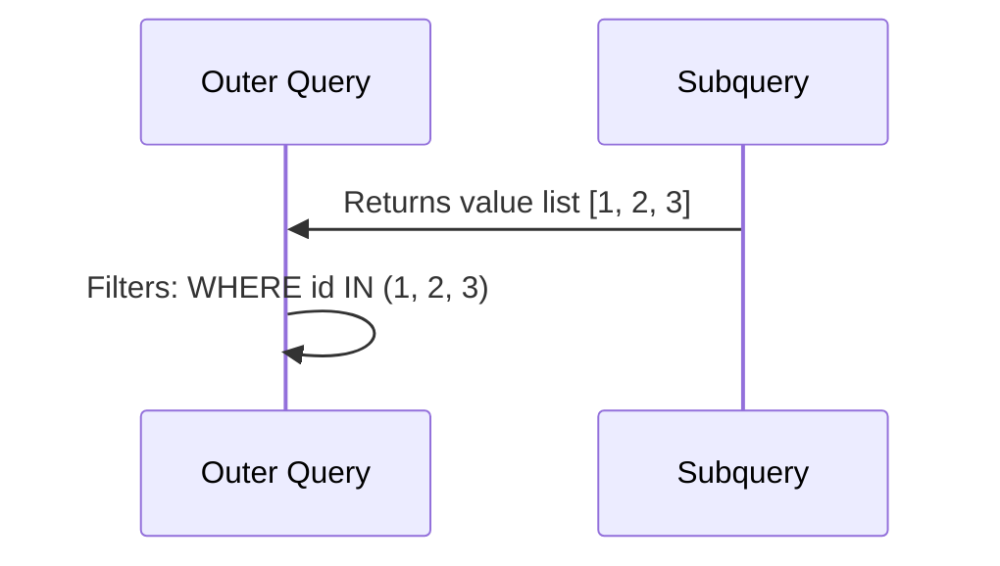

# How to Use IN and NOT IN with Subqueries in MySQL

Author: [nawazdhandala](https://www.github.com/nawazdhandala)

Tags: MySQL, SQL, Subquery, IN, Database, Query

Description: Learn how to use IN and NOT IN with subqueries in MySQL to filter rows based on whether a value appears in a derived list of values.

---

## How IN and NOT IN Work with Subqueries

`IN` checks whether a value matches any value in a list or subquery result set. `NOT IN` checks whether a value does not appear in the list. When used with a subquery, MySQL first executes the inner query to produce a value list, then filters the outer query against that list.



## Syntax

```sql
-- IN with subquery
SELECT columns
FROM table_name
WHERE column IN (SELECT column FROM other_table WHERE condition);

-- NOT IN with subquery
SELECT columns
FROM table_name
WHERE column NOT IN (SELECT column FROM other_table WHERE condition);
```

## Examples

### Setup: Create Sample Tables

```sql
CREATE TABLE products (
    id INT PRIMARY KEY AUTO_INCREMENT,
    name VARCHAR(100) NOT NULL,
    category VARCHAR(50),
    price DECIMAL(10, 2)
);

CREATE TABLE sale_items (
    id INT PRIMARY KEY AUTO_INCREMENT,
    product_id INT NOT NULL,
    discount_pct INT
);

CREATE TABLE categories (
    id INT PRIMARY KEY AUTO_INCREMENT,
    name VARCHAR(50) NOT NULL,
    active TINYINT(1) DEFAULT 1
);

INSERT INTO products (name, category, price) VALUES
    ('Laptop',      'Electronics', 999.99),
    ('Mouse',       'Electronics',  29.99),
    ('Keyboard',    'Electronics',  59.99),
    ('Desk',        'Furniture',   349.99),
    ('Chair',       'Furniture',   199.99),
    ('Notebook',    'Stationery',    4.99),
    ('Pen Set',     'Stationery',    9.99),
    ('Headphones',  'Electronics', 149.99);

INSERT INTO sale_items (product_id, discount_pct) VALUES
    (1, 10), (3, 15), (5, 20), (7, 5);

INSERT INTO categories (name, active) VALUES
    ('Electronics', 1), ('Furniture', 1), ('Stationery', 0);
```

### Basic IN with Subquery

Find all products that are currently on sale.

```sql
SELECT name, price, category
FROM products
WHERE id IN (SELECT product_id FROM sale_items)
ORDER BY name;
```

```text
+------------+--------+-------------+
| name       | price  | category    |
+------------+--------+-------------+
| Chair      | 199.99 | Furniture   |
| Keyboard   |  59.99 | Electronics |
| Laptop     | 999.99 | Electronics |
| Pen Set    |   9.99 | Stationery  |
+------------+--------+-------------+
```

### NOT IN with Subquery

Find products that are NOT on sale.

```sql
SELECT name, price, category
FROM products
WHERE id NOT IN (SELECT product_id FROM sale_items)
ORDER BY name;
```

```text
+------------+--------+-------------+
| name       | price  | category    |
+------------+--------+-------------+
| Desk       | 349.99 | Furniture   |
| Headphones | 149.99 | Electronics |
| Mouse      |  29.99 | Electronics |
| Notebook   |   4.99 | Stationery  |
+------------+--------+-------------+
```

### IN with Multi-Level Subquery

Find products in active categories only. The inner query gets active category names.

```sql
SELECT p.name, p.category, p.price
FROM products p
WHERE p.category IN (
    SELECT name FROM categories WHERE active = 1
)
ORDER BY p.category, p.name;
```

```text
+------------+-------------+--------+
| name       | category    | price  |
+------------+-------------+--------+
| Headphones | Electronics | 149.99 |
| Keyboard   | Electronics |  59.99 |
| Laptop     | Electronics | 999.99 |
| Mouse      | Electronics |  29.99 |
| Chair      | Furniture   | 199.99 |
| Desk       | Furniture   | 349.99 |
+------------+-------------+--------+
```

Stationery products are excluded because their category is inactive.

### IN with Aggregated Subquery

Find categories that have more than two products.

```sql
SELECT name, category, price
FROM products
WHERE category IN (
    SELECT category
    FROM products
    GROUP BY category
    HAVING COUNT(*) > 2
);
```

```text
+------------+-------------+--------+
| name       | category    | price  |
+------------+-------------+--------+
| Laptop     | Electronics | 999.99 |
| Mouse      | Electronics |  29.99 |
| Keyboard   | Electronics |  59.99 |
| Headphones | Electronics | 149.99 |
+------------+-------------+--------+
```

### The NULL Trap with NOT IN

When the subquery result contains a NULL value, NOT IN returns no rows at all. This is a critical gotcha.

```sql
-- Add a row with NULL product_id
INSERT INTO sale_items (product_id, discount_pct) VALUES (NULL, 5);

-- This returns NO rows because NULL is in the subquery result
SELECT name FROM products
WHERE id NOT IN (SELECT product_id FROM sale_items);
```

```text
-- Empty result set! NOT IN with NULLs in the list returns nothing.
```

Fix it by filtering NULLs from the subquery:

```sql
SELECT name FROM products
WHERE id NOT IN (
    SELECT product_id FROM sale_items WHERE product_id IS NOT NULL
);
```

Or use `NOT EXISTS` which handles NULLs correctly:

```sql
SELECT p.name FROM products p
WHERE NOT EXISTS (
    SELECT 1 FROM sale_items s WHERE s.product_id = p.id
);
```

### IN vs JOIN: Performance Note

For large result sets, JOIN often outperforms IN with a subquery because MySQL can use index-based merge strategies.

```sql
-- Using IN
SELECT name FROM products WHERE id IN (SELECT product_id FROM sale_items);

-- Equivalent JOIN (often faster on large tables)
SELECT DISTINCT p.name
FROM products p
INNER JOIN sale_items s ON p.id = s.product_id;
```

## Best Practices

- Always filter NULLs from the subquery when using NOT IN: add `WHERE column IS NOT NULL`.
- For NOT IN scenarios, prefer NOT EXISTS - it is immune to the NULL trap.
- Use IN when the subquery returns a small, bounded list; use EXISTS for large tables.
- Check EXPLAIN to verify that MySQL uses the subquery as a semi-join optimization rather than a full scan.
- Use `DISTINCT` or `GROUP BY` in the inner query only when the subquery could return many duplicates that inflate memory usage.

## Summary

IN and NOT IN with subqueries filter rows based on whether a value appears in a dynamically generated list. They are simple and readable, but NOT IN has a critical flaw: if any value in the subquery result is NULL, NOT IN returns no rows. Always filter NULLs from NOT IN subqueries or use NOT EXISTS instead. For large tables, consider rewriting IN subqueries as JOINs for better performance.
