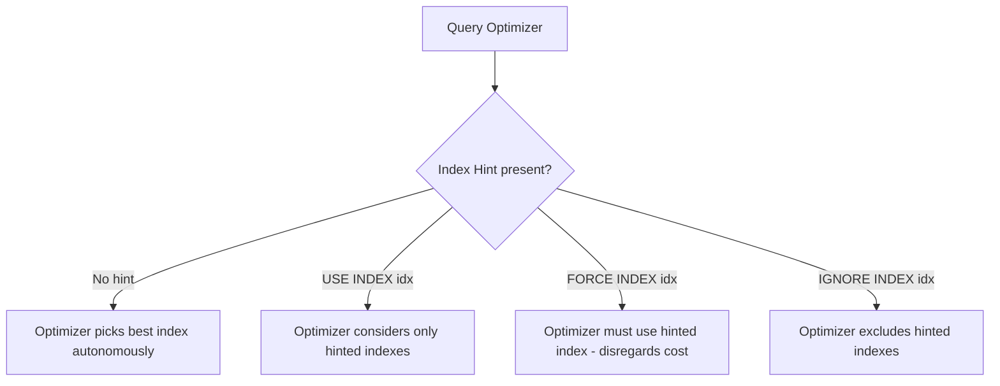

# How to Use Index Hints in MySQL (USE INDEX, FORCE INDEX)

Author: [nawazdhandala](https://www.github.com/nawazdhandala)

Tags: MySQL, SQL, Index, Index Hint, USE INDEX, FORCE INDEX, Performance, Database

Description: Learn how to use MySQL index hints (USE INDEX, IGNORE INDEX, FORCE INDEX) to guide the query optimizer when it chooses a suboptimal execution plan.

---

## How Index Hints Work

MySQL's query optimizer usually chooses the best index automatically. However, it can occasionally pick a suboptimal index due to stale statistics, unusual data distributions, or complex query shapes. Index hints allow you to tell MySQL which indexes to consider (USE INDEX), exclude (IGNORE INDEX), or mandate (FORCE INDEX).



Use index hints sparingly - they lock in behavior that may become suboptimal as data changes.

## Syntax

```sql
SELECT columns
FROM table_name USE INDEX (index_name)
WHERE condition;

SELECT columns
FROM table_name FORCE INDEX (index_name)
WHERE condition;

SELECT columns
FROM table_name IGNORE INDEX (index_name)
WHERE condition;

-- Scope can be specified (default is FOR JOIN)
USE INDEX FOR JOIN (index_name)
USE INDEX FOR ORDER BY (index_name)
USE INDEX FOR GROUP BY (index_name)
```

## Examples

### Setup: Create Sample Table with Multiple Indexes

```sql
CREATE TABLE orders (
    id INT PRIMARY KEY AUTO_INCREMENT,
    customer_id INT NOT NULL,
    status VARCHAR(20) NOT NULL,
    amount DECIMAL(10, 2),
    order_date DATE NOT NULL
);

CREATE INDEX idx_customer   ON orders (customer_id);
CREATE INDEX idx_status     ON orders (status);
CREATE INDEX idx_date       ON orders (order_date);
CREATE INDEX idx_cust_date  ON orders (customer_id, order_date);

-- Insert sample data
INSERT INTO orders (customer_id, status, amount, order_date)
SELECT
    1 + (n MOD 100),
    ELT(1 + (n MOD 3), 'completed', 'pending', 'cancelled'),
    ROUND(10 + RAND() * 990, 2),
    DATE_SUB('2026-03-31', INTERVAL (n MOD 365) DAY)
FROM (
    SELECT a.n + b.n * 10 + c.n * 100 + 1 AS n
    FROM (SELECT 0 n UNION SELECT 1 UNION SELECT 2 UNION SELECT 3 UNION SELECT 4
          UNION SELECT 5 UNION SELECT 6 UNION SELECT 7 UNION SELECT 8 UNION SELECT 9) a
    CROSS JOIN (SELECT 0 n UNION SELECT 1 UNION SELECT 2 UNION SELECT 3 UNION SELECT 4
               UNION SELECT 5 UNION SELECT 6 UNION SELECT 7 UNION SELECT 8 UNION SELECT 9) b
    CROSS JOIN (SELECT 0 n UNION SELECT 1 UNION SELECT 2 UNION SELECT 3 UNION SELECT 4
               UNION SELECT 5 UNION SELECT 6 UNION SELECT 7 UNION SELECT 8 UNION SELECT 9) c
) nums
WHERE n <= 2000;
```

### Check Optimizer's Natural Choice

```sql
EXPLAIN SELECT id, amount
FROM orders
WHERE customer_id = 5 AND order_date >= '2026-01-01';
```

```text
+----+...+------+--------------+...+------+...
|    |   | type | key          |   | rows |
+----+...+------+--------------+...+------+...
| 1  |   | ref  | idx_cust_date|   | 20   |
+----+...+------+--------------+...+------+...
```

The optimizer chose the composite index. This is usually the right choice.

### USE INDEX: Suggest an Index

Tell the optimizer to only consider the specified index. If it determines a full scan is still better, it can choose that.

```sql
EXPLAIN SELECT id, amount
FROM orders USE INDEX (idx_customer)
WHERE customer_id = 5 AND order_date >= '2026-01-01';
```

```text
+----+...+------+--------------+...+------+...
|    |   | type | key          |   | rows |
+----+...+------+--------------+...+------+...
| 1  |   | ref  | idx_customer |   | 20   |
+----+...+------+--------------+...+------+...
```

The optimizer now only considers `idx_customer` and picks it. Filtered rows on `order_date` will be applied as a post-filter.

### FORCE INDEX: Mandate an Index

FORCE INDEX tells the optimizer it must use the specified index. A full table scan is only used if the index cannot be applied at all.

```sql
EXPLAIN SELECT id, amount
FROM orders FORCE INDEX (idx_date)
WHERE customer_id = 5 AND order_date >= '2026-01-01';
```

```text
+----+...+-------+----------+...+------+...
|    |   | type  | key      |   | rows |
+----+...+-------+----------+...+------+...
| 1  |   | range | idx_date |   | 500  |
+----+...+-------+----------+...+------+...
```

MySQL is forced to use `idx_date` even though the composite index would be more selective here. This illustrates why FORCE INDEX should be used cautiously.

### IGNORE INDEX: Exclude an Index

Useful when you suspect MySQL is incorrectly choosing a particular index.

```sql
EXPLAIN SELECT id, amount
FROM orders IGNORE INDEX (idx_cust_date)
WHERE customer_id = 5 AND order_date >= '2026-01-01';
```

The optimizer will now choose among `idx_customer`, `idx_status`, `idx_date`, or a full scan - but not `idx_cust_date`.

### Hints on Multiple Indexes

```sql
SELECT * FROM orders
USE INDEX (idx_customer, idx_date)
WHERE customer_id = 5;

SELECT * FROM orders
IGNORE INDEX (idx_status, idx_date)
WHERE customer_id = 5;
```

### Index Hints Scoped to FOR ORDER BY

```sql
-- Tell optimizer to use idx_date only for the ORDER BY, not for filtering
SELECT id, amount
FROM orders USE INDEX FOR ORDER BY (idx_date)
WHERE customer_id = 5
ORDER BY order_date;
```

## When to Use Index Hints

Use index hints only when:
1. You have profiled the query with EXPLAIN and confirmed the optimizer is making a suboptimal choice.
2. You have updated table statistics with `ANALYZE TABLE` and the problem persists.
3. You understand that data distribution will remain similar so the hint stays valid.

## Best Practices

- Run `ANALYZE TABLE table_name` first to update statistics before resorting to hints - stale stats are often the real culprit.
- Always verify with EXPLAIN that the hinted plan is actually faster using EXPLAIN ANALYZE.
- Prefer USE INDEX over FORCE INDEX - USE INDEX still allows the optimizer some flexibility.
- Document any index hints in your code with a comment explaining why the hint is needed.
- Remove hints after schema changes or data distribution shifts, and re-evaluate.
- Optimizer hints (`/*+ INDEX(table idx) */`) are a more modern alternative available in MySQL 8.0.

## Summary

MySQL index hints - USE INDEX, IGNORE INDEX, and FORCE INDEX - allow developers to override the query optimizer's index selection. USE INDEX suggests indexes to consider, FORCE INDEX mandates use, and IGNORE INDEX excludes specific indexes. These should be used sparingly and only after confirming with EXPLAIN and EXPLAIN ANALYZE that the optimizer is genuinely making a poor choice. Always update table statistics first and document hints with comments explaining the reasoning.
