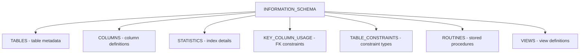

# How to Use INFORMATION_SCHEMA in MySQL for Metadata Queries

Author: [nawazdhandala](https://www.github.com/nawazdhandala)

Tags: MySQL, SQL, INFORMATION_SCHEMA, Metadata, Database Administration

Description: Learn how to use MySQL INFORMATION_SCHEMA views to query database metadata including tables, columns, indexes, constraints, and more.

---

## How INFORMATION_SCHEMA Works

`INFORMATION_SCHEMA` is a virtual database built into MySQL that exposes metadata about all other databases, tables, columns, indexes, and privileges. It is always present and does not correspond to actual files on disk. Queries against it let you inspect and audit your MySQL instance programmatically.



## Key INFORMATION_SCHEMA Views

```text
View                  Description
-----------           -----------
TABLES                Row count estimates, engine, size
COLUMNS               Column names, types, defaults, nullability
STATISTICS            Index definitions and cardinality
KEY_COLUMN_USAGE      Foreign key and unique constraint columns
TABLE_CONSTRAINTS     Constraint names and types
REFERENTIAL_CONSTRAINTS FK delete/update rules
ROUTINES              Stored procedures and functions
TRIGGERS              Trigger definitions
VIEWS                 View definitions
PROCESSLIST           Active queries (also: SHOW PROCESSLIST)
INNODB_BUFFER_PAGE    InnoDB buffer pool contents
```

## Setup: Example Database

```sql
CREATE DATABASE catalog;
USE catalog;

CREATE TABLE categories (
    id   INT AUTO_INCREMENT PRIMARY KEY,
    name VARCHAR(50) NOT NULL UNIQUE
);

CREATE TABLE products (
    id          INT AUTO_INCREMENT PRIMARY KEY,
    category_id INT NOT NULL,
    name        VARCHAR(100) NOT NULL,
    price       DECIMAL(10,2) NOT NULL,
    stock       INT NOT NULL DEFAULT 0,
    created_at  DATETIME NOT NULL DEFAULT NOW(),
    FOREIGN KEY (category_id) REFERENCES categories(id)
);

CREATE INDEX idx_products_price ON products(price);
```

## Querying TABLES

```sql
SELECT
    TABLE_NAME,
    ENGINE,
    TABLE_ROWS,
    ROUND(DATA_LENGTH / 1024 / 1024, 2)  AS data_mb,
    ROUND(INDEX_LENGTH / 1024 / 1024, 2) AS index_mb,
    CREATE_TIME
FROM information_schema.TABLES
WHERE TABLE_SCHEMA = 'catalog'
ORDER BY DATA_LENGTH DESC;
```

```text
+------------+--------+------------+---------+----------+---------------------+
| TABLE_NAME | ENGINE | TABLE_ROWS | data_mb | index_mb | CREATE_TIME         |
+------------+--------+------------+---------+----------+---------------------+
| products   | InnoDB | 0          | 0.02    | 0.03     | 2026-03-31 10:00:00 |
| categories | InnoDB | 0          | 0.02    | 0.02     | 2026-03-31 09:58:00 |
+------------+--------+------------+---------+----------+---------------------+
```

Note: `TABLE_ROWS` is an estimate for InnoDB. Use `COUNT(*)` for exact counts.

## Querying COLUMNS

```sql
SELECT
    COLUMN_NAME,
    ORDINAL_POSITION,
    DATA_TYPE,
    COLUMN_TYPE,
    IS_NULLABLE,
    COLUMN_DEFAULT,
    EXTRA
FROM information_schema.COLUMNS
WHERE TABLE_SCHEMA = 'catalog'
  AND TABLE_NAME   = 'products'
ORDER BY ORDINAL_POSITION;
```

**Find all DATETIME columns across all tables in a database:**

```sql
SELECT TABLE_NAME, COLUMN_NAME
FROM information_schema.COLUMNS
WHERE TABLE_SCHEMA = 'catalog'
  AND DATA_TYPE IN ('datetime', 'timestamp')
ORDER BY TABLE_NAME, COLUMN_NAME;
```

## Querying STATISTICS (Indexes)

```sql
SELECT
    TABLE_NAME,
    INDEX_NAME,
    SEQ_IN_INDEX,
    COLUMN_NAME,
    NON_UNIQUE,
    CARDINALITY,
    INDEX_TYPE
FROM information_schema.STATISTICS
WHERE TABLE_SCHEMA = 'catalog'
ORDER BY TABLE_NAME, INDEX_NAME, SEQ_IN_INDEX;
```

## Querying KEY_COLUMN_USAGE (Foreign Keys)

```sql
SELECT
    kcu.TABLE_NAME,
    kcu.COLUMN_NAME,
    kcu.CONSTRAINT_NAME,
    kcu.REFERENCED_TABLE_NAME,
    kcu.REFERENCED_COLUMN_NAME,
    rc.UPDATE_RULE,
    rc.DELETE_RULE
FROM information_schema.KEY_COLUMN_USAGE kcu
JOIN information_schema.REFERENTIAL_CONSTRAINTS rc
    ON rc.CONSTRAINT_NAME = kcu.CONSTRAINT_NAME
    AND rc.CONSTRAINT_SCHEMA = kcu.CONSTRAINT_SCHEMA
WHERE kcu.TABLE_SCHEMA = 'catalog'
  AND kcu.REFERENCED_TABLE_NAME IS NOT NULL;
```

## Find Tables Without a Primary Key

```sql
SELECT t.TABLE_NAME
FROM information_schema.TABLES t
LEFT JOIN information_schema.TABLE_CONSTRAINTS tc
    ON tc.TABLE_SCHEMA = t.TABLE_SCHEMA
    AND tc.TABLE_NAME  = t.TABLE_NAME
    AND tc.CONSTRAINT_TYPE = 'PRIMARY KEY'
WHERE t.TABLE_SCHEMA = 'catalog'
  AND t.TABLE_TYPE   = 'BASE TABLE'
  AND tc.CONSTRAINT_NAME IS NULL;
```

## Find Nullable Columns in All Tables

```sql
SELECT TABLE_NAME, COLUMN_NAME, DATA_TYPE
FROM information_schema.COLUMNS
WHERE TABLE_SCHEMA = 'catalog'
  AND IS_NULLABLE  = 'YES'
  AND DATA_TYPE NOT IN ('text', 'blob')
ORDER BY TABLE_NAME, ORDINAL_POSITION;
```

## Total Database Size

```sql
SELECT
    TABLE_SCHEMA AS db_name,
    ROUND(SUM(DATA_LENGTH + INDEX_LENGTH) / 1024 / 1024, 2) AS total_mb
FROM information_schema.TABLES
GROUP BY TABLE_SCHEMA
ORDER BY total_mb DESC;
```

## Querying ROUTINES

```sql
SELECT
    ROUTINE_NAME,
    ROUTINE_TYPE,
    CREATED,
    LAST_ALTERED
FROM information_schema.ROUTINES
WHERE ROUTINE_SCHEMA = 'catalog';
```

## Generating DDL Dynamically

```sql
-- Generate ALTER TABLE statements to add DEFAULT NOW() to all DATETIME columns:
SELECT CONCAT(
    'ALTER TABLE `', TABLE_NAME, '` ',
    'MODIFY `', COLUMN_NAME, '` DATETIME NOT NULL DEFAULT NOW();'
) AS alter_statement
FROM information_schema.COLUMNS
WHERE TABLE_SCHEMA = 'catalog'
  AND DATA_TYPE    = 'datetime'
  AND COLUMN_DEFAULT IS NULL;
```

## Best Practices

- Queries against `INFORMATION_SCHEMA` can be slow on servers with hundreds of databases or tables - filter by `TABLE_SCHEMA` and `TABLE_NAME` whenever possible.
- `TABLE_ROWS` in `INFORMATION_SCHEMA.TABLES` is an estimate for InnoDB; use `ANALYZE TABLE` to refresh it.
- Use `INFORMATION_SCHEMA` to audit schemas during code review, migration validation, and documentation generation.
- Grant read-only access to `INFORMATION_SCHEMA` for monitoring tools without exposing data tables.
- For performance-sensitive metadata queries on MySQL 8.0+, use the `performance_schema` instead, which has lower query overhead.

## Summary

`INFORMATION_SCHEMA` is MySQL's built-in metadata database that exposes schema details as queryable views. `TABLES` provides size and row count estimates. `COLUMNS` lists column definitions. `STATISTICS` shows index composition and cardinality. `KEY_COLUMN_USAGE` and `REFERENTIAL_CONSTRAINTS` expose foreign key relationships. Combined, these views enable automated schema auditing, documentation generation, and consistency checks without relying on external tools.
