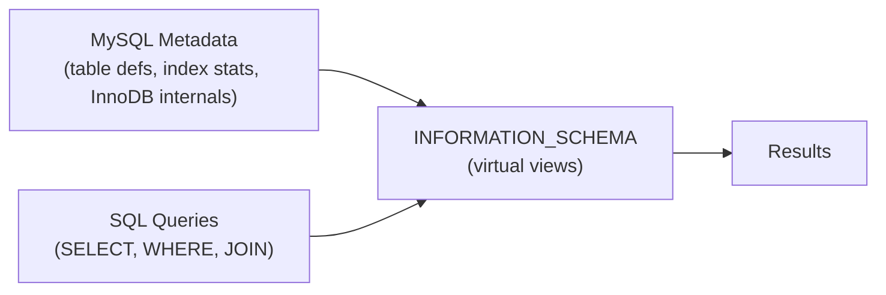

# How to Monitor MySQL with INFORMATION_SCHEMA

Author: [nawazdhandala](https://www.github.com/nawazdhandala)

Tags: MySQL, INFORMATION_SCHEMA, Monitoring, Database Administration, Query Analysis

Description: Learn how to use the MySQL INFORMATION_SCHEMA to inspect table sizes, index usage, running queries, InnoDB internals, and other metadata for performance monitoring.

---

## How INFORMATION_SCHEMA Works

`INFORMATION_SCHEMA` is a virtual database in MySQL that provides read-only access to server metadata - database and table structures, column definitions, indexes, user privileges, InnoDB internals, and more. It is defined by the SQL standard and available in all MySQL versions.



Unlike `SHOW` commands, `INFORMATION_SCHEMA` supports standard SQL: JOINs, WHERE clauses, aggregations, and subqueries.

## Database and Table Information

### List All Databases and Their Sizes

```sql
SELECT table_schema AS database_name,
       ROUND(SUM(data_length + index_length) / 1024 / 1024, 2) AS size_mb
FROM   information_schema.TABLES
WHERE  table_schema NOT IN ('information_schema', 'performance_schema', 'mysql', 'sys')
GROUP  BY table_schema
ORDER  BY size_mb DESC;
```

### List Tables in a Database with Sizes

```sql
SELECT table_name,
       engine,
       table_rows,
       ROUND(data_length / 1024 / 1024, 2) AS data_mb,
       ROUND(index_length / 1024 / 1024, 2) AS index_mb,
       ROUND((data_length + index_length) / 1024 / 1024, 2) AS total_mb,
       create_time,
       update_time
FROM   information_schema.TABLES
WHERE  table_schema = 'myapp_db'
ORDER  BY total_mb DESC;
```

### Find Largest Tables Across All Databases

```sql
SELECT table_schema,
       table_name,
       ROUND((data_length + index_length) / 1024 / 1024 / 1024, 3) AS total_gb
FROM   information_schema.TABLES
ORDER  BY data_length + index_length DESC
LIMIT  20;
```

## Column Information

### Inspect Table Columns

```sql
SELECT column_name,
       ordinal_position,
       column_default,
       is_nullable,
       data_type,
       character_maximum_length,
       numeric_precision,
       column_type,
       column_key,
       extra,
       column_comment
FROM   information_schema.COLUMNS
WHERE  table_schema = 'myapp_db'
AND    table_name   = 'orders'
ORDER  BY ordinal_position;
```

### Find Tables with a Specific Column Name

```sql
SELECT table_schema, table_name, column_name, column_type
FROM   information_schema.COLUMNS
WHERE  column_name = 'created_at'
AND    table_schema NOT IN ('information_schema', 'mysql', 'sys', 'performance_schema')
ORDER  BY table_schema, table_name;
```

## Index Information

### List All Indexes on a Table

```sql
SELECT index_name,
       seq_in_index,
       column_name,
       non_unique,
       index_type,
       cardinality,
       nullable
FROM   information_schema.STATISTICS
WHERE  table_schema = 'myapp_db'
AND    table_name   = 'orders'
ORDER  BY index_name, seq_in_index;
```

### Find Tables Without Primary Keys

```sql
SELECT t.table_schema,
       t.table_name
FROM   information_schema.TABLES t
LEFT   JOIN information_schema.TABLE_CONSTRAINTS tc
       ON  t.table_schema = tc.table_schema
       AND t.table_name   = tc.table_name
       AND tc.constraint_type = 'PRIMARY KEY'
WHERE  t.table_schema NOT IN ('information_schema', 'mysql', 'sys', 'performance_schema')
AND    t.table_type = 'BASE TABLE'
AND    tc.constraint_name IS NULL;
```

### Find Duplicate Indexes (same column combination)

```sql
SELECT s1.table_schema,
       s1.table_name,
       s1.index_name AS index_1,
       s2.index_name AS index_2,
       s1.column_name
FROM   information_schema.STATISTICS s1
JOIN   information_schema.STATISTICS s2
       ON  s1.table_schema = s2.table_schema
       AND s1.table_name   = s2.table_name
       AND s1.column_name  = s2.column_name
       AND s1.seq_in_index = s2.seq_in_index
       AND s1.index_name  != s2.index_name
WHERE  s1.table_schema NOT IN ('information_schema', 'mysql', 'sys', 'performance_schema')
ORDER  BY s1.table_schema, s1.table_name;
```

## User and Privilege Information

### List All Users and Their Hosts

```sql
SELECT user, host, account_locked, password_expired, plugin
FROM   information_schema.USER_ATTRIBUTES ua
RIGHT  JOIN mysql.user u USING (user, host)
ORDER  BY user, host;
```

### Check Grants for a Specific User

```sql
SELECT grantee,
       table_schema,
       privilege_type,
       is_grantable
FROM   information_schema.SCHEMA_PRIVILEGES
WHERE  grantee LIKE "'appuser'%"
ORDER  BY table_schema, privilege_type;
```

## InnoDB-Specific Views

### View Active Transactions

```sql
SELECT trx_id,
       trx_state,
       trx_started,
       TIMESTAMPDIFF(SECOND, trx_started, NOW()) AS age_seconds,
       trx_rows_locked,
       trx_rows_modified,
       trx_query
FROM   information_schema.INNODB_TRX
ORDER  BY trx_started;
```

### View Current Lock Waits

```sql
SELECT r.trx_id AS waiting_trx_id,
       r.trx_query AS waiting_query,
       b.trx_id AS blocking_trx_id,
       b.trx_query AS blocking_query
FROM   information_schema.INNODB_TRX r
JOIN   performance_schema.data_lock_waits dlw
       ON r.trx_id = dlw.REQUESTING_ENGINE_TRANSACTION_ID
JOIN   information_schema.INNODB_TRX b
       ON b.trx_id = dlw.BLOCKING_ENGINE_TRANSACTION_ID;
```

### View All InnoDB Tablespaces

```sql
SELECT space,
       name,
       space_type,
       file_size / 1024 / 1024 AS size_mb,
       allocated_size / 1024 / 1024 AS allocated_mb
FROM   information_schema.INNODB_TABLESPACES
ORDER  BY file_size DESC
LIMIT  20;
```

## View and Routine Information

### List All Views

```sql
SELECT table_schema, table_name, view_definition
FROM   information_schema.VIEWS
WHERE  table_schema = 'myapp_db';
```

### List Stored Procedures and Functions

```sql
SELECT routine_schema,
       routine_name,
       routine_type,
       created,
       last_altered
FROM   information_schema.ROUTINES
WHERE  routine_schema = 'myapp_db'
ORDER  BY routine_type, routine_name;
```

## Process and Query Monitoring

### View All Running Queries

```sql
SELECT id,
       user,
       host,
       db,
       command,
       time,
       state,
       LEFT(info, 200) AS query
FROM   information_schema.PROCESSLIST
WHERE  command != 'Sleep'
ORDER  BY time DESC;
```

### Kill Long-Running Queries

```sql
-- Find queries running longer than 30 seconds
SELECT id, user, time, LEFT(info, 100) AS query
FROM   information_schema.PROCESSLIST
WHERE  time > 30
AND    command != 'Sleep';

-- Kill by ID
KILL QUERY 1234;
```

## Best Practices

- Use `information_schema.TABLES` for regular storage audits; schedule weekly size reports.
- Query `information_schema.INNODB_TRX` in incidents to find long-running transactions.
- Automate index audits with `information_schema.STATISTICS` to find tables missing primary keys.
- Note that `table_rows` in `information_schema.TABLES` is an estimate - use `SELECT COUNT(*)` for exact counts.
- Combine `information_schema` with `sys` schema and `performance_schema` for comprehensive monitoring.

## Summary

`INFORMATION_SCHEMA` provides a SQL-queryable interface to MySQL metadata: database sizes, table structures, column definitions, index statistics, user privileges, InnoDB transactions, and running processes. Unlike `SHOW` commands, it supports standard SQL operations, making it ideal for automated monitoring scripts, storage audits, and performance investigations.
