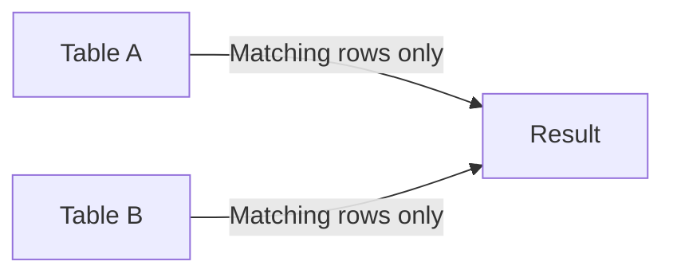

# How to Use INNER JOIN in MySQL

Author: [nawazdhandala](https://www.github.com/nawazdhandala)

Tags: MySQL, SQL, Join, Database, Query

Description: Learn how to use INNER JOIN in MySQL to combine rows from two or more tables based on a matching condition, with practical examples.

---

## How INNER JOIN Works

An INNER JOIN returns only the rows where there is a match in both tables based on the join condition. Rows that do not have a corresponding match in the other table are excluded from the result set.



Think of it as the intersection of two sets: only records that exist in both tables (according to the join condition) appear in the output.

## Syntax

The basic syntax for INNER JOIN is:

```sql
SELECT column_list
FROM table_a
INNER JOIN table_b ON table_a.column = table_b.column;
```

The `INNER` keyword is optional - a plain `JOIN` defaults to an INNER JOIN.

## Examples

### Setup: Create Sample Tables

First, create sample tables with data to demonstrate the joins.

```sql
CREATE TABLE departments (
    id INT PRIMARY KEY AUTO_INCREMENT,
    name VARCHAR(100) NOT NULL
);

CREATE TABLE employees (
    id INT PRIMARY KEY AUTO_INCREMENT,
    name VARCHAR(100) NOT NULL,
    department_id INT,
    salary DECIMAL(10, 2)
);

INSERT INTO departments (name) VALUES
    ('Engineering'),
    ('Marketing'),
    ('Finance'),
    ('HR');

INSERT INTO employees (name, department_id, salary) VALUES
    ('Alice', 1, 95000.00),
    ('Bob', 2, 72000.00),
    ('Carol', 1, 105000.00),
    ('Dave', 3, 88000.00),
    ('Eve', NULL, 65000.00);
```

### Basic INNER JOIN

Retrieve all employees along with their department name. Eve has no department and will be excluded.

```sql
SELECT e.name AS employee, d.name AS department, e.salary
FROM employees e
INNER JOIN departments d ON e.department_id = d.id;
```

```text
+----------+-------------+-----------+
| employee | department  | salary    |
+----------+-------------+-----------+
| Alice    | Engineering | 95000.00  |
| Bob      | Marketing   | 72000.00  |
| Carol    | Engineering | 105000.00 |
| Dave     | Finance     | 88000.00  |
+----------+-------------+-----------+
```

### INNER JOIN with WHERE Filter

Narrow down the results with an additional WHERE clause after joining.

```sql
SELECT e.name AS employee, d.name AS department, e.salary
FROM employees e
INNER JOIN departments d ON e.department_id = d.id
WHERE d.name = 'Engineering';
```

```text
+----------+-------------+-----------+
| employee | department  | salary    |
+----------+-------------+-----------+
| Alice    | Engineering | 95000.00  |
| Carol    | Engineering | 105000.00 |
+----------+-------------+-----------+
```

### INNER JOIN with Aggregation

Combine an INNER JOIN with GROUP BY to compute per-department statistics.

```sql
SELECT d.name AS department,
       COUNT(e.id) AS headcount,
       AVG(e.salary) AS avg_salary
FROM employees e
INNER JOIN departments d ON e.department_id = d.id
GROUP BY d.id, d.name
ORDER BY avg_salary DESC;
```

```text
+-------------+-----------+------------+
| department  | headcount | avg_salary |
+-------------+-----------+------------+
| Engineering | 2         | 100000.000 |
| Finance     | 1         | 88000.000  |
| Marketing   | 1         | 72000.000  |
+-------------+-----------+------------+
```

### Joining Three Tables

INNER JOIN can chain multiple tables together. Add a third table to track projects.

```sql
CREATE TABLE projects (
    id INT PRIMARY KEY AUTO_INCREMENT,
    name VARCHAR(100) NOT NULL,
    department_id INT
);

INSERT INTO projects (name, department_id) VALUES
    ('Platform Rewrite', 1),
    ('Brand Campaign', 2),
    ('Budget Forecast', 3);

SELECT e.name AS employee, d.name AS department, p.name AS project
FROM employees e
INNER JOIN departments d ON e.department_id = d.id
INNER JOIN projects p ON p.department_id = d.id
ORDER BY d.name, e.name;
```

```text
+----------+-------------+-----------------+
| employee | department  | project         |
+----------+-------------+-----------------+
| Alice    | Engineering | Platform Rewrite|
| Carol    | Engineering | Platform Rewrite|
| Bob      | Marketing   | Brand Campaign  |
| Dave     | Finance     | Budget Forecast |
+----------+-------------+-----------------+
```

## Best Practices

- Always use table aliases to keep queries readable, especially when joining multiple tables.
- Qualify every column reference with its table alias to avoid ambiguity errors.
- Make sure the columns used in the ON condition are indexed; unindexed join columns cause full table scans.
- Use EXPLAIN to verify MySQL is using the expected indexes when joining large tables.
- Prefer INNER JOIN over implicit comma-separated syntax (`FROM a, b WHERE a.id = b.id`) for clarity.
- Avoid selecting all columns with `SELECT *` in joins - name only the columns you need to reduce network overhead.

## Summary

INNER JOIN is the most common join type in MySQL. It returns only rows where the join condition finds a match in both tables, making it ideal for querying related data across normalized tables. By combining INNER JOIN with WHERE filters, GROUP BY, and ORDER BY, you can build powerful queries that aggregate and filter data across multiple tables. Always index the join columns and use EXPLAIN to ensure your queries perform well at scale.
