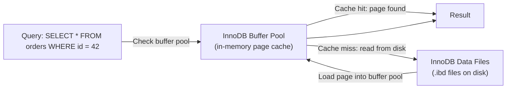

# How to Configure InnoDB Buffer Pool Size in MySQL

Author: [nawazdhandala](https://www.github.com/nawazdhandala)

Tags: MySQL, InnoDB, Buffer Pool, Performance, Tuning

Description: Learn how to properly size and configure the InnoDB buffer pool in MySQL for optimal performance, including multi-instance setup, warm-up, and monitoring.

---

## How the InnoDB Buffer Pool Works

The InnoDB buffer pool is the most important memory area in MySQL. It caches InnoDB data pages and index pages in memory, reducing disk I/O. When a query reads a row, InnoDB first checks the buffer pool; if the page is there (a cache hit), it reads from memory instead of disk.



The buffer pool uses an LRU (least recently used) list to manage page eviction when it is full. Pages accessed recently stay in the "new" sublist; pages not accessed are moved to the "old" sublist and eventually evicted.

## Sizing the Buffer Pool

The buffer pool should hold as much of your working dataset as possible. The general recommendation is:

```text
- Dedicated MySQL server: 70-80% of total RAM
- Shared server: 50-60% of total RAM
- Leave at least 1-2 GB for the OS and other MySQL memory areas
```

Example for a 32 GB server:

```ini
[mysqld]
innodb_buffer_pool_size = 24G
```

Check the current setting:

```sql
SHOW VARIABLES LIKE 'innodb_buffer_pool_size';
```

## Dynamic Resizing (MySQL 5.7.5+)

Resize the buffer pool at runtime without a restart:

```sql
-- Increase buffer pool to 24 GB online
SET GLOBAL innodb_buffer_pool_size = 25769803776;  -- 24 * 1024^3
```

Monitor the resize progress:

```sql
SHOW STATUS LIKE 'Innodb_buffer_pool_resize_status';
```

## Multiple Buffer Pool Instances

For servers with a buffer pool larger than 1 GB, split it into multiple instances to reduce lock contention:

```ini
[mysqld]
innodb_buffer_pool_size      = 24G
innodb_buffer_pool_instances = 8
```

MySQL recommends one instance per gigabyte. The rule:

```text
instances = MIN(buffer_pool_size_in_GB, 64)
```

Each instance manages its own LRU list and mutex, reducing contention on multi-core systems.

## Buffer Pool Warm-Up

After a MySQL restart, the buffer pool starts empty. Enable automatic dump and restore of the buffer pool state:

```ini
[mysqld]
innodb_buffer_pool_dump_at_shutdown = ON
innodb_buffer_pool_load_at_startup  = ON
innodb_buffer_pool_dump_pct         = 25  -- dump top 25% (most recently used pages)
```

Manually dump the buffer pool state:

```sql
SET GLOBAL innodb_buffer_pool_dump_now = ON;
```

Manually load from the dump:

```sql
SET GLOBAL innodb_buffer_pool_load_now = ON;
```

Monitor load progress:

```sql
SHOW STATUS LIKE 'Innodb_buffer_pool_load_status';
```

## Monitoring Buffer Pool Efficiency

Check the buffer pool hit rate:

```sql
SHOW GLOBAL STATUS LIKE 'Innodb_buffer_pool_read%';
```

Calculate the hit rate:

```sql
SELECT
    ROUND(
        (1 - (
            (SELECT variable_value FROM performance_schema.global_status WHERE variable_name = 'Innodb_buffer_pool_reads') /
            (SELECT variable_value FROM performance_schema.global_status WHERE variable_name = 'Innodb_buffer_pool_read_requests')
        )) * 100, 2
    ) AS buffer_pool_hit_rate_pct;
```

A hit rate below 99% may indicate the buffer pool is too small.

## Buffer Pool Page Status

```sql
SELECT pool_id,
       pool_size,
       free_buffers,
       database_pages,
       old_database_pages,
       modified_database_pages,
       hit_rate / 1000 AS hit_rate_pct
FROM   information_schema.INNODB_BUFFER_POOL_STATS;
```

## Key Buffer Pool Variables

```sql
SHOW VARIABLES LIKE 'innodb_buffer_pool%';
```

| Variable | Description |
|----------|-------------|
| `innodb_buffer_pool_size` | Total buffer pool memory |
| `innodb_buffer_pool_instances` | Number of pool instances |
| `innodb_buffer_pool_chunk_size` | Resize chunk size (128 MB default) |
| `innodb_old_blocks_pct` | Percentage for the "old" LRU sublist |
| `innodb_old_blocks_time` | Time before old block is moved to new |

## Tuning Old vs New Sublist Ratio

By default, 37% of the buffer pool is the "old" sublist. Adjust if full table scans thrash the cache:

```ini
[mysqld]
innodb_old_blocks_pct  = 37
innodb_old_blocks_time = 1000  -- milliseconds before page moves to new sublist
```

Increasing `innodb_old_blocks_time` protects frequently accessed pages from being evicted by a full table scan.

## Finding Tables Consuming Most Buffer Pool Pages

```sql
SELECT t.table_schema,
       t.table_name,
       COUNT(*) AS buffer_pool_pages,
       COUNT(*) * 16 / 1024 AS buffer_pool_mb
FROM   information_schema.INNODB_BUFFER_PAGE ibp
JOIN   information_schema.INNODB_TABLES t
       ON ibp.table_name = CONCAT(t.table_schema, '/', t.table_name)
GROUP  BY t.table_schema, t.table_name
ORDER  BY buffer_pool_pages DESC
LIMIT  20;
```

## Best Practices

- Set `innodb_buffer_pool_size` to 70-80% of available RAM on dedicated MySQL servers.
- Use multiple buffer pool instances (one per GB) on large-memory systems.
- Enable `innodb_buffer_pool_dump_at_shutdown` to speed up warm-up after restarts.
- Monitor the buffer pool hit rate; aim for 99%+.
- Watch `modified_database_pages` (dirty pages) - high values may indicate the flush rate cannot keep up.
- After sizing changes, monitor for 24-48 hours before concluding the size is correct.

## Summary

The InnoDB buffer pool is MySQL's primary performance lever. Sizing it to 70-80% of RAM on dedicated servers maximizes cache hit rates. Use multiple instances for large pools, enable dump/restore for fast warm-up after restarts, and monitor the hit rate regularly. Dynamic resizing in MySQL 5.7.5+ allows adjustments without server downtime.
